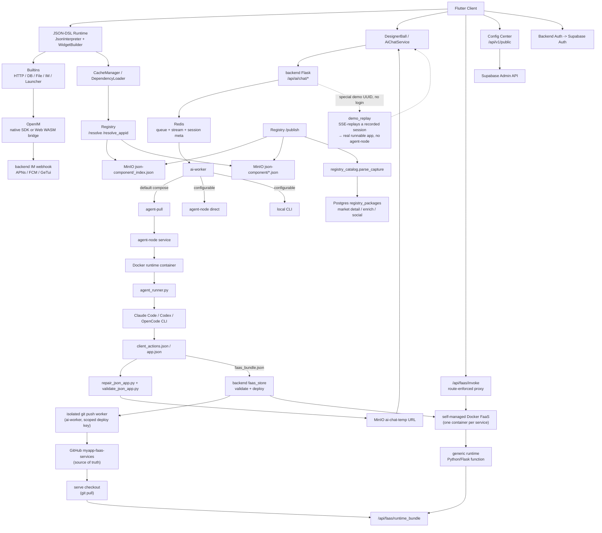

# MyApp

[中文](README.zh.md) · [English](README.md) · [Deutsch](README.de.md) · [Español](README.es.md) · [Français](README.fr.md) · [Português](README.pt.md) · **Català** · [हिन्दी](README.hi.md) · [한국어](README.ko.md) · [日本語](README.ja.md) · [Italiano](README.it.md)

<div align="center">

### Prou de vibe-*coding*. Llança vibe-*apps*.

**Descriu-la → una app full-stack (UI + backend real + base de dades) en marxa a totes les pantalles.**

**Sense base de codi. Sense compilació. Sense desplegament. Sense app store.**

</div>

> Tota la indústria encara discuteix com *escriure codi* amb IA. Nosaltres ens hem saltat el codi.
>
> El vibe coding — fins i tot els millors constructors d'apps amb IA (Lovable, Bolt, v0, Replit) — encara et lliura una **base de codi web** que has d'allotjar i mantenir. MyApp et lliura la **pròpia app en funcionament, nativa al telèfon en segons**: descrius el que vols, l'IA emet un front-end JSON-DSL **i**, quan l'app ho necessita, un backend Python/Flask real amb la seva pròpia base de dades Postgres aïllada — i després renderitza i executa tot el conjunt a l'instant dins d'un runtime multiplataforma precompilat. La *mateixa* frase pot engegar un **joc jugable** o un **fòrum amb backend real, amb inici de sessió, publicacions i respostes en fil** — en marxa a **iOS, Android, Web i escriptori a partir d'una sola descripció**. No hi ha cap projecte per obrir, res per compilar, res per desplegar.


<div align="center">


</div>

### From vibe *coding* to *no* coding

Vibe coding — even the best AI app builders — still keeps you in the loop: write commands, build, package, deploy, spot the bug, argue with the AI, loop back. We deleted the loop. You talk straight to the app on your phone — *"make this button green"* — and it changes. Nothing to compile, nothing to publish, no project to open.

<div align="center">


</div>

You end up arguing with the AI either way — so drop the toolchain and argue straight at the app in your hand.

<div align="center">


</div>


[](LICENSE)
[](https://flutter.dev)
[]()
[](JSON-DSL.md)

> **Estat de la plataforma**: ✅ Producció (iOS/Android/Web) • ⚠️ Experimental (macOS, només funcions bàsiques) • 🚧 Sense provar (Linux/Windows)

---

## Vibe *coding* vs. vibe *app*

|  | Vibe coding / constructors d'apps amb IA | **MyApp — una vibe app** |
|---|---|---|
| Què obtens | Una **base de codi** (React/Next + un backend) | Una **app en funcionament** |
| L'artefacte | Codi que has d'allotjar, mantenir i vigilar | Una configuració JSON — **sense codi a mantenir** |
| Pas de publicació | Compilar → desplegar → (revisió de l'app store) | **Cap.** Ja està en marxa. |
| On s'executa | Normalment una app web | **iOS · Android · Web · macOS · Linux · Windows** — una sola descripció |
| Backend | «Connecta Supabase tu mateix» | **Python/Flask + Postgres aïllat generats per IA**, desplegats per a tu |
| Abast | Formularis, taulers, CRUD | …**i xat en temps real, i jocs jugables** (Tetris, 2048, un joc de plataformes) des del *mateix* runtime |

Això no és un eslògan que no puguem sostenir. Continua llegint — les xifres del motor són més avall.

---

## Què és això?

Tres coses en un sol repositori:

1. **Un motor de UI dirigida pel servidor amb Flutter** (`lib/`) — interpreta una configuració JSON-DSL i la converteix en una app real, nativa i multiplataforma en temps d'execució. **91 tipus de widget, més de 100 funcions integrades, un motor d'expressions de 28 operadors i un motor de jocs 2D complet** — tot precompilat al client.
2. **Un generador full-stack amb IA** (`backend/`, `config_center/`) — l'IA genera el front-end JSON **i un backend FaaS associat + una base de dades Postgres aïllada** quan l'app ho necessita, a sobre d'autenticació (Supabase), IM (OpenIM), notificacions push (APNs + FCM), proxy de xat amb IA, registre de paquets i administració d'usuaris.
3. **Un ecosistema de paquets** (`templates/`) — més de 70 JSON-Apps d'exemple i llibreries reutilitzables (IM, jocs, perfil d'usuari, calculadora, taulers…) que pots instal·lar a sobre del runtime.

El nom **MyApp** és intencionat: cada usuari pot crear, instal·lar i operar «la meva app» a sobre del runtime compartit.

El cas d'ús estrella: **un usuari obre l'app → conversa amb l'IA → l'IA retorna un JSON-DSL (i un backend, si cal) → l'app el carrega i l'executa a l'instant** dins de les capacitats ja compilades al client. Sense compilació, sense revisió, sense esperar cap app store.

---

## Suport de plataformes

MyApp està construïda amb Flutter i admet múltiples plataformes amb diferents graus de completesa de funcions:

### ✅ Llest per a producció (totes les funcions)

- **iOS** — Suport complet, incloent IM, notificacions push, càmera, autenticació biomètrica i totes les capacitats natives
- **Android** — Suport complet, incloent IM, notificacions push, càmera, autenticació biomètrica i totes les capacitats natives
- **Web** — Suport complet amb IM mitjançant el pont WASM d'OpenIM (les notificacions push no estan disponibles)

### ⚠️ Experimental (funcions bàsiques)

- **macOS** — Provat i funcionant bé. El runtime JSON bàsic, la renderització de UI, l'autenticació, el xat amb IA, el selector de fitxers i l'autenticació biomètrica funcionen tots. El xat IM i les notificacions push no s'admeten a causa de limitacions dels SDK de tercers.

### 🚧 Sense provar (probablement funcionarà)

- **Linux** — Té configuració de compilació i hauria de funcionar per a les funcions bàsiques. El xat IM i les notificacions push no s'admeten.
- **Windows** — Té configuració de compilació i hauria de funcionar per a les funcions bàsiques. El xat IM i les notificacions push no s'admeten.

### Disponibilitat de funcions

| Funció | iOS | Android | Web | macOS | Linux | Windows |
|---------|-----|---------|-----|-------|-------|---------|
| Runtime JSON-DSL | ✅ | ✅ | ✅ | ✅ | ⚠️ | ⚠️ |
| Renderització de UI | ✅ | ✅ | ✅ | ✅ | ⚠️ | ⚠️ |
| Xarxa i emmagatzematge | ✅ | ✅ | ✅ | ✅ | ⚠️ | ⚠️ |
| Xat IM | ✅ | ✅ | ✅ | ❌ | ❌ | ❌ |
| Notificacions push | ✅ | ✅ | ❌ | ❌ | ❌ | ❌ |
| Càmera | ✅ | ✅ | ✅ | ⚠️ | ❌ | ❌ |
| Autenticació biomètrica | ✅ | ✅ | ❌ | ✅ | ❌ | ⚠️ |
| Jocs Flame | ✅ | ✅ | ✅ | ✅ | ⚠️ | ⚠️ |

**Llegenda**: ✅ Provat i funcionant • ⚠️ Sense provar però hauria de funcionar • ❌ No admès

La majoria d'apps JSON-DSL funcionen a totes les plataformes. Les funcions específiques de cada plataforma es degraden de manera elegant amb un missatge clar a l'usuari quan no estan disponibles.

---

## Per què és interessant?

- **Full-stack d'un sol cop — el factor diferencial.** La majoria de constructors d'apps amb IA (v0, Lovable, Bolt, …) et donen una *base de codi web* que encara has d'allotjar i mantenir. MyApp genera el front-end **i** un backend FaaS Python/Flask real — cadascun amb la seva pròpia base de dades Postgres aïllada, model de permisos per app i aïllament de dades per cada qui crida — i després executa tot el conjunt a l'instant. Sense projecte de backend separat, sense pas de desplegament, sense enviament a l'store.
- **Sense artefacte de codi.** El que es lliura és una configuració JSON que s'executa en un client precompilat, no una base de codi. Res per allotjar, res per mantenir, res que es trenqui a la pròxima actualització de dependències. Actualitza una app descrivint el canvi; estarà en marxa a tot arreu el pròxim cop que es carregui.
- **Genuïnament multiplataforma.** El *mateix* JSON-DSL es renderitza a iOS, Android, Web (provat en producció), macOS (experimental), Linux i Windows. La majoria d'eines d'«apps amb IA» et donen una app web; això et dóna nativa, a tot arreu, a partir d'una sola descripció.
- **Dirigida pel servidor** — lliura UI i comportament com a dades a través d'una frontera de runtime fixa i precompilada. Vegeu les [notes de compliment de l'App Store](docs/APP_STORE_COMPLIANCE.md). <sub>(aquestes notes es van escriure fa temps i potser no estan 100% actualitzades; faré tot el possible per publicar-la a les botigues)</sub>
- **Nativa d'IA** — el DSL està dissenyat per ser amigable amb els LLM. El xat amb IA inclòs executa múltiples proveïdors (DeepSeek, MiniMax, l'agregador Volcengine amb GLM / Kimi) a través de tres runtimes d'agent intercanviables (Claude Code, Codex, OpenCode), amb playbooks de generació i una passada d'auto-revisió visual durant l'execució per mantenir la sortida executable.
- **Tot inclòs** — IM amb push, proxy d'IA, registre de paquets, espais de noms, replicació, canvi d'entorn — tot connectat entre si. No «un altre framework low-code que defuig l'autenticació».
- **Auto-allotjable** — `myapp-ctl deploy` gestiona la pila de backend, el runtime d'agent, el registre, el centre de configuració i els secrets de servei des d'una sola CLI a nivell de host.

---

## Per què existeix això — una nota de l'autor

Si he de ser sincer, no m'agrada gens el hype actual al voltant de la IA — la discussió interminable, el màrqueting interminable. Però, m'agradi o no, aquesta onada no desapareixerà.

Així que, si hem d'abraçar l'AI coding, més val anar fins al final que quedar-se a mitges. Irònicament, és exactament per això que existeix aquest projecte. L'objectiu mai no ha estat perseguir la moda — era portar la idea fins a la seva conclusió lògica i preguntar: **si la IA és realment el futur del desenvolupament, com seria un flux de treball genuïnament AI-first?**

Aquest projecte és la meva resposta fins ara.

---

## Inici ràpid

### Utilitzar els clients allotjats

Si només vols provar MyApp i executar JSON Apps generats per IA:

1. Obre el client Web allotjat: <https://myapp-web.dapangyu.work/>
2. O instal·la l'iOS TestFlight Public Group 1: <https://testflight.apple.com/join/3Fk5Exnn>
3. O descarrega l'APK d'Android:
   <https://myapp-oss-endpoint.dapangyu.work/myapp-releases/android/apk/latest.apk>
4. Continua com a convidat per navegar/executar apps públiques, o inicia sessió per generar apps,
   utilitzar les funcions d'IM/perfil, publicar paquets i gestionar Agent Nodes privats.
5. Sense compte? Toca la bola flotant → **Demo** per veure com l'IA construeix una app
   de principi a fi i executar el resultat real, sense iniciar sessió.

La guia d'ús completa del producte és [docs/USER_GUIDE.md](docs/USER_GUIDE.md).

### Compilar el client des del codi font (5 minuts)

```bash
git clone <this-repository-url> ai-app
cd ai-app
flutter pub get
flutter run -d <ios|android|chrome>
```

La configuració per defecte apunta al backend allotjat. Per connectar-te a un backend privat,
importa el JSON d'entorn que imprimeix `myapp-ctl client-env`.

Per al suport d'IM a Flutter Web, els `web/openIM.wasm`, `web/sql-wasm.wasm`,
els workers i el paquet de pont registrats al codi són actius de runtime copiats de la
dependència fixada `@openim/wasm-client-sdk` a `web_openim_bridge/package-lock.json`.
En una màquina nova o en CI, regenera'ls abans de `flutter build web` si
falten o després de canviar la versió del SDK:

```bash
./scripts/build_web_openim.sh
flutter build web
```

Per a compilacions/execucions de Web, també pots fer servir l'script embolcall perquè els actius
Web d'OpenIM es comprovin primer i es regenerin quan calgui:

```bash
./scripts/flutter_web.sh run -d chrome
./scripts/flutter_web.sh build web
```

### Auto-allotjar la pila de backend completa (20 minuts)

```bash
./deploy/production/install_ctl.sh
myapp-ctl setup --host <public-ip-or-domain> --data-root /mnt/myapp
myapp-ctl deploy --pull
myapp-ctl client-env --terminal-qr
```

Executa aquestes ordres com a root, o amb permisos equivalents de Docker i d'escriptura a
`/etc/myapp`. La referència completa de desplegament i d'ordres de `myapp-ctl` és
[`deploy/production/README.md`](deploy/production/README.md).

La primera execució interactiva de `myapp-ctl` demana una vegada l'idioma de la CLI (`zh`, `en`,
`de`, `es`, `fr`, `pt`, `ca`, `hi`, `ko`, `ja`, `it`); els canvis posteriors es fan amb
`myapp-ctl config lang <lang>`. L'assistent de configuració
demana les credencials del proveïdor d'IA i la configuració opcional d'ASR, SMTP per correu, APNs, FCM i
GeTui. Un desplegament complet imprimeix el JSON d'entorn del client i el codi QR, i pot
crear/actualitzar un compte de prova interactiu `test@example.com`; torna a executar
`myapp-ctl client-env --terminal-qr` per mostrar-lo de nou.

Actualitza la CLI de control instal·lada i els fitxers de desplegament de producció des del checkout
de Git:

```bash
myapp-ctl update
```

Per a un host de desenvolupament/prova que compila imatges des d'aquest checkout:

```bash
myapp-ctl setup --host <public-ip-or-domain>
myapp-ctl deploy --build
```

Això arrenca la pila de backend de MyApp localment / en un VPS:
- Postgres de les JSON apps + Redis de sessions d'IA + App MinIO
- Agent node + runtime d'agent Ubuntu aïllat
- Backend de l'app + AI worker + Registre + Centre de configuració

Després del desplegament, el **Commutador d'entorn** integrat del client (toca la marca 7 vegades a la pàgina d'inici de sessió) et permet apuntar a la teva pròpia pila.

Vegeu [`deploy/production/README.md`](deploy/production/README.md) per a la guia
de desplegament autoritzada.

### Mapa de documentació

| Necessitat | Document |
|---|---|
| Utilitzar MyApp, generar apps, connectar un backend privat, depurar appid Web/JSON local | [docs/USER_GUIDE.md](docs/USER_GUIDE.md) |
| Instal·lar, actualitzar, operar, fer còpia de seguretat, restaurar o desinstal·lar la pila de backend | [deploy/production/README.md](deploy/production/README.md) |
| Entendre l'arquitectura actual de backend/agent-node | [backend/ARCHITECTURE.md](backend/ARCHITECTURE.md) |
| Entendre les fronteres de revisió/runtime de l'App Store | [docs/APP_STORE_COMPLIANCE.md](docs/APP_STORE_COMPLIANCE.md) |

---

## Arquitectura

El projecte ara s'acosta més a una petita plataforma d'apps que a una sola demo de Flutter.
El client Flutter és un runtime compilat; les JSON-APPs, els components, els actius, l'IM,
la generació amb IA i els **backends FaaS generats per IA** són servits tots per la pila de backend
— que pot funcionar tot junt en un sol host (backend + pila de Docker Compose
+ el runtime FaaS de Docker autogestionat, vegeu `docs/faas-docker-runtime.md`).



| Component | On | Què |
|---|---|---|
| Runtime Flutter | `lib/` | Client compilat multiplataforma: intèrpret JSON-DSL, widgets, àtoms de joc Flame, cau d'actius, canvi d'entorn, entrada d'IA, UI d'IM/multimèdia |
| Actius de runtime Web | `web/`, `web_openim_bridge/` | Pont WASM Web d'OpenIM i actius de compilació usats per Flutter Web |
| API de backend | `backend/app.py`, `backend/claude_chat.py` | API Flask per a xat amb IA amb autenticació, streaming SSE, càrrega de multimèdia, push, configuració de proveïdor i endpoints de backend orientats al client |
| Cua / Sessions d'IA | `backend/ai_session.py` + Redis | Metadades de tasques d'IA gairebé duradores, cua de workers acotada, flux d'esdeveniments SSE represable, estat d'avortament/reintent |
| Pool de workers d'IA | `backend/ai_worker_daemon.py`, `backend/ai_session.py`, `backend/agent_node_service.py`, `deploy/production/agent_runner.py` | Mou els treballs acceptats a través de Redis, per defecte usa l'execució en mode pull de l'agent-node, i també pot executar rutes directes d'agent-node o de CLI local segons `AI_WORKER_EXECUTION_BACKEND` |
| Backends FaaS | `backend/faas.py`, `backend/faas_store.py`, `backend/faas_push_worker.py`, `backend/faas_runtime_server.py` | Backends Python/Flask generats per IA: validació estricta del paquet, push worker de git aïllat → `myapp-faas-services` (font de veritat a GitHub), runtime de Docker autogestionat (un contenidor per servei, desplegament/enrutament/despertar en fred/escalat a zero propietat del pla de control — vegeu `docs/faas-docker-runtime.md`), proxy `/api/faas/invoke` amb enrutament forçat, quota per usuari + crear-vs-afegir |
| Registre | `backend/registry_server.py` | Registre de paquets per a JSON-APPs/components: `_index.json` + els fitxers de paquet de MinIO són la font de resolució en runtime; el `registry_packages` de Postgres és l'índex de mercat/detall/enriquiment/social |
| Emmagatzematge d'objectes | MinIO / OSS | Paquets JSON públics sota `json-component`, multimèdia d'apps, packs d'actius sota `json-app-assets`, URLs JSON temporals generats per IA, i un bucket públic `demo` d'apps demo fixes sense inici de sessió |
| OpenIM | `backend/openim/` | Pont de backend d'IM. Els clients natius usen el SDK Flutter/natiu d'OpenIM; el Web usa el pont del SDK WASM |
| Supabase | `deploy/production/supabase/` | Serveis auto-allotjats d'autenticació, base de dades i compatibles amb emmagatzematge configurats a través de secrets locals del host |
| Centre de configuració | `config_center/` | Indicadors de configuració remota i configuració del client específica de l'entorn |
| Plantilles / Llibreries | `templates/` | Apps d'exemple publicades i llibreries JSON reutilitzables: IM, launcher, xat OpenAI, jocs, controls, perfil, utilitats |
| Lloc web | `website/` | Lloc de màrqueting i demo amb TS/Vite, incloent la previsualització del client web incrustat |
| Pla de control | `deploy/production/`, `scripts/myapp_ctl/` | Gestió de `myapp-ctl` status/log/secret/domain/image/deploy per a hosts de prova i de producció |

Fluxos principals:

1. **Generació d'apps amb IA**: el client envia una tasca de xat -> el backend escriu la cua/metadades a Redis -> el valor per defecte actual de producció posa el treball a la ruta agent-pull -> un agent-node arrenca un contenidor de runtime aïllat -> `agent_runner.py` executa l'agent configurat (Claude Code / Codex / OpenCode) -> l'agent-node retorna esdeveniments/artefactes en streaming -> el backend valida/repara/puja el JSON generat -> el client rep un esdeveniment estructurat `json_app_ready` a través d'SSE represable.
2. **Instal·lació de paquets**: el client consulta el Registre amb paginació/cerca o `/resolve(_appid)` -> el Registre resol a través de `_index.json` i els fitxers de paquet de MinIO -> el client descarrega el JSON -> el carregador de dependències resol les llibreries i les guarda en cau localment. Els detalls de mercat, els resums, els m'agrada i les instal·lacions provenen de l'índex lateral `registry_packages` de Postgres.
3. **IM**: el mòbil usa la ruta del SDK natiu d'OpenIM; el Web usa `openim/wasm-client-sdk` a través de `web_openim_bridge`, amb compatibilitat a nivell de framework perquè les apps JSON d'IM cridin una sola forma d'API.
4. **Backend auto-allotjat**: `myapp-ctl secret` gestiona les credencials locals del host; `myapp-ctl deploy --pull` o `myapp-ctl deploy --build` arrenca la pila de backend i el runtime d'agent.

---

## El JSON-DSL

Una configuració de MyApp de 100 línies pot convertir-se en una app completa amb pantalles, navegació, crides de xarxa, animacions i widgets natius. El DSL està documentat a [JSON-DSL.md](JSON-DSL.md).

Exemple mínim:

```json
{
  "dsl": "3.3",
  "meta": { "name": "hello", "version": "1.0.0", "type": "app" },
  "global": { "count": 0 },
  "ui": {
    "screens": [{
      "name": "home",
      "body": {
        "type": "container",
        "layout": "column",
        "children": [
          { "type": "text", "value": "Counter: {{ global.count }}" },
          { "type": "button", "label": "+1", "action": {
            "call": "@set",
            "args": { "var": "global.count", "value": { "+": [{ "var": "global.count" }, 1] } }
          }}
        ]
      }
    }]
  }
}
```

Passa això a través del flux de generació amb IA, o fes `flutter run` i tria el fitxer JSON del disc.

---

## Funcions

### Motor
- **91 tipus de widget** — text / botó / entrada / llista / contenidor / imatge / vídeo / gràfic / mapa / webview / càmera / qr / tab_view / **una pila completa de jocs 2D Flame** (llenç de joc, palanca analògica, llenços de partícules/escenes projectades) / animacions (animated_*, Rive) / gestos avançats (contrasenya de gest, lliscar per verificar) / disposició de nivell sliver
- **Motor d'expressions JsonLogic amb 28 operadors personalitzats** (cadena / array / tipus / matemàtics)
- **Més de 100 funcions `@` integrades** — HTTP (tots els verbs + SSE), una capa de DB real (query/insert/update/delete + clau-valor + create_table), IM (amics / converses / historial / safata d'entrada), E/S de fitxers, autenticació biomètrica, porta-retalls, retorn hàptic, permisos, selecció d'imatges, temes, i18n, navegació, diàlegs, control de joc
- `@parallel` per a passos concurrents
- Les plantilles `{{ path }}` es resolen al tipus original (no convertit a cadena)
- Intercanvi en calent de configuració des de xarxa / disc / registre
- Porta d'autorització per app per a capacitats sensibles (token d'autenticació, perfil)
- **UI del client localitzada a 11 idiomes** (zh / en / de / es / fr / pt / ca / hi / ko / ja / it)

### Backend
- **Full-stack FaaS generat per IA** — l'IA emet un backend Python/Flask validat per cada «grup de servei» (1 servei de funció + DB Postgres opcional), desplegat a un runtime FaaS de Docker autogestionat (un contenidor per servei, escalat a zero + despertar en fred). Aïllament d'esquema per app, identitat pseudònima dins del grup no falsificable, accés a dades per cada qui crida intermediat pel backend (el codi de la funció mai no té una connexió a la DB), enduriment de contenidors i una política d'accés revocable de 3 nivells.
- Integració d'autenticació amb Supabase
- Xat amb IA amb cues d'àmbit de proveïdor i execució d'agent aïllada — proveïdors (DeepSeek, MiniMax, agregador Volcengine: GLM / Kimi) × tres runtimes d'agent (Claude Code, Codex, OpenCode), més playbooks de generació i una passada d'auto-revisió visual durant l'execució
- **Mode demo sense inici de sessió** — els usuaris no autenticats toquen la bola flotant → Demo, disparen una generació amb IA d'aspecte real que reprodueix per SSE una sessió gravada, i obtenen una app realment executable (sense agent-node, sense creació de FaaS) — una mostra instantània del flux complet — la demo és una **reproducció accelerada d'una execució de generació real enregistrada**; els seus textos multilingües es van **afegir en una localització posterior**
- Push agnòstic al canal (APNs + FCM, fàcil d'afegir-ne més)
- Registre de paquets amb espais de noms + semver + resolució de dependències
- **Mirall entre instàncies** — una instància auto-allotjada pot replicar paquets des de l'upstream (proxy de fitxers mandrós + sincronització d'índex cada 10 minuts)
- UI d'administració d'usuaris (rol / ban / restablir contrasenya)
- Registre d'auditoria

### Desplegament
- `myapp-ctl deploy` per a desplegament de backend a nivell de full-stack o de component
- `myapp-ctl secret` per a secrets locals del host de proveïdor, push, OSS i backend
- Agent-node basat en pull aïllat + runtime de Docker per als workers d'IA
- MinIO integrat per a càrregues de multimèdia
- Ordres de comprovacions de salut, registres, reinici, estat i inspecció d'agent

---

## Estat

| Àrea | Estat |
|---|---|
| Motor (Dart) | Producció. 64k LOC, 91 widgets, 100+ funcions integrades. Impulsant una app real. UI del client localitzada a 11 idiomes. |
| Backend (Python) | Producció. 32k LOC. Amb usuaris reals en funcionament. |
| Tests | Test de fum de widgets més una suite de regressió JSON (`templates/regression-test.json`). Les PRs que afegeixen cobertura són molt benvingudes. |
| Documentació | Mitjana (`JSON-DSL.md`, `deploy/production/README.md`, notes d'arquitectura de backend). En millora. |
| Estabilitat de l'API | DSL v3.4 — possibles canvis menors incompatibles fins a la v4. API HTTP de backend estable. |
| Allotjament públic? | Sí (subjecte a ús raonable, vegeu els Termes) |

---

## Com contribuir

Issues, PRs i discussions, tots benvinguts.

- Documentació a [`CLAUDE.md`](CLAUDE.md) (que també serveix com a instruccions per a Claude Code si fas servir IA per contribuir)
- Especificació del JSON-DSL a [`JSON-DSL.md`](JSON-DSL.md)
- Convencions de codi:
  - Els comentaris responen al *perquè*, no al *què* (el codi mostra el què)
  - Evita abstraccions especulatives; tres línies similars són millors que una interfície prematura
  - Per a canvis d'UI, prova el camí daurat *i* els casos límit en un navegador/simulador abans de donar per fet que està acabat

---

## Llicència

Apache License 2.0 — vegeu [LICENSE](LICENSE) i [NOTICE](NOTICE).

Pots:
- Usar això en productes comercials
- Bifurcar i modificar lliurement
- Auto-allotjar tota la pila

No pots:
- Usar el **nom o el logotip de "MyApp"** sense permís (per sol·licitar permís, [obre un issue](https://github.com/dapangyu-fish/ai-app/issues))
- Tergiversar l'origen del codi

Els paquets del mercat, els actius pujats i les apps JSON creades pels usuaris són propietat dels seus autors i estan llicenciats per ells tret que diguin explícitament el contrari.

---

## Agraïments

- [Flutter](https://flutter.dev) — framework d'UI
- [Supabase](https://supabase.com) — backend d'autenticació + DB + emmagatzematge
- [OpenIM](https://github.com/openimsdk) — SDK + servidor d'IM
- [Anthropic Claude Code CLI](https://docs.claude.com/en/docs/claude-code) — runtime de generació amb IA
- [JsonLogic](https://jsonlogic.com) — motor d'expressions
- [mx0c/super-mario-python](https://github.com/mx0c/super-mario-python) — Super Mario level data (Mario demo apps); Nintendo SMB IP is used for demo/educational purposes only
- [hanessn1/Contra](https://github.com/hanessn1/Contra) — MIT-licensed pygame game, fully ported as the Contra demo app (code re-implemented in JSON-DSL, assets from the repo); "Contra" is a Konami trademark — demo/educational use only

---

## Full de ruta (per ordre de prioritat)

- [ ] Publicar un vídeo demo viral de 60 segons (IA → configuració JSON → l'app s'executa a l'instant, sense compilació/desplegament)
- [ ] Nivell gratuït públic allotjat
- [ ] Enllaç per compartir l'app amb QR (obre l'app generada per IA mitjançant deep link)
- [ ] Afegir CI (GitHub Actions: pub get, analyze, build APK)
- [ ] Més JSON-APPs d'exemple (tasques, notes, seguidor de fitness)
- [x] Sistema de prompts v2: el prompt llarg de generació es divideix en un enrutador `index.md` + targetes per tasca (`backend/prompts/generation/`) amb pipelines en capes, més playbooks de generació (`docs/playbooks/`); la validació/reparació de JSON viu a les eines `validate_json_app.py` / `repair_json_app.py`
- [x] Generació multi-agent + multi-proveïdor: runtimes d'agent Claude Code / Codex / OpenCode × proveïdors DeepSeek / MiniMax / agregador-Volcengine (GLM, Kimi), seleccionables per sessió
- [x] Mode demo sense inici de sessió: reproducció per SSE de generacions gravades perquè els usuaris no autenticats obtinguin una app realment executable a l'instant (sense agent-node / FaaS)
- [ ] Afegir més runtimes d'agent / agregadors de proveïdor més enllà del conjunt actual de tres agents
- [ ] Suport d'àudio per a JSON-APPs (gravació, reproducció, càrrega i UI/accions d'àudio reutilitzables)
- [x] Suport FaaS: les converses d'IA creen funcions de backend Python/Flask, servides pel runtime FaaS de Docker autogestionat (un contenidor per servei, desplegament/enrutament/despertar en fred/escalat a zero propietat del pla de control) amb validació estricta del paquet, font de veritat a GitHub (`myapp-faas-services`), un push worker de git aïllat, quota per usuari + crear-vs-afegir, i un proxy d'invocació amb enrutament forçat
- [ ] Escalat horitzontal de FaaS: FaaS de Docker multi-node + enrutament secundari de backend (escalat horitzontal) i nodes faas privats d'usuari (reutilitzant el patró de registre d'agent-node)
- [ ] **Aïllament de push per JSON-APP + deep-link + autorització opcional**: sobre de missatge d'àmbit d'app (`app_id` + `route` de destinació + `params`) perquè una notificació pugui enrutar cap a una pantalla específica d'una JSON-APP; els destinataris s'han de subscriure per app/remitent/servei (desactivat per defecte, anti-abús); el tap d'enrutament obre l'app a la pantalla de destinació si està instal·lada, o si no una alternativa d'invitació del framework "instal·la A". Disseny: [docs/planning/push-jsonapp-isolation.md](docs/planning/push-jsonapp-isolation.md)
- [ ] DSL v4 (estabilitzar la finestra de canvis incompatibles)
- [ ] Més tests al voltant de l'intèrpret
- [ ] Rendiment: ajornar la interpretació de subarbres fora de pantalla

---

*Construït amb cura. Obert a comentaris.*
