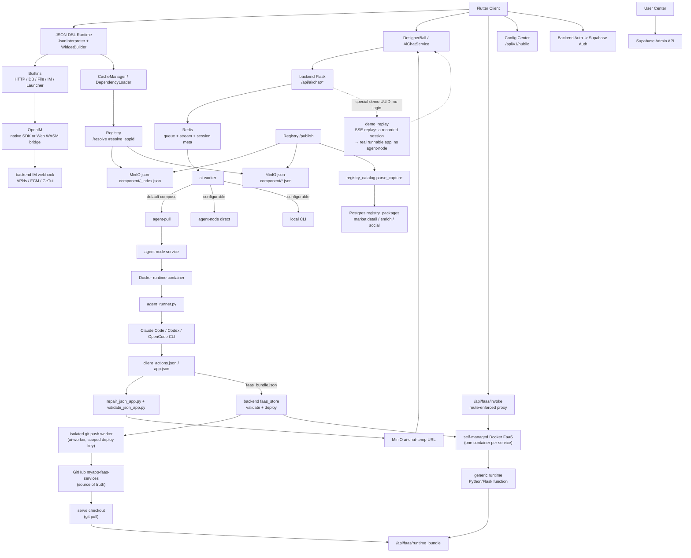

# MyApp

[中文](README.zh.md) · [English](README.md) · **Deutsch** · [Español](README.es.md) · [Français](README.fr.md) · [Português](README.pt.md) · [Català](README.ca.md) · [हिन्दी](README.hi.md) · [한국어](README.ko.md) · [日本語](README.ja.md) · [Italiano](README.it.md)

<div align="center">

### Schluss mit vibe-*coding*. Her mit vibe-*apps*.

**Beschreibe es → eine Full-Stack-App (UI + echtes Backend + Datenbank) läuft live auf jedem Bildschirm.**

**Keine Codebasis. Kein Build. Kein Deploy. Kein App Store.**

</div>

> Die ganze Branche streitet immer noch darüber, wie man mit KI *Code schreibt*. Wir haben den Code übersprungen.
>
> Vibe coding — selbst die besten KI-App-Builder (Lovable, Bolt, v0, Replit) — gibt dir am Ende immer noch eine **Web-Codebasis** in die Hand, die du hosten und warten musst. MyApp gibt dir die **laufende App selbst, nativ auf dem Handy in Sekunden** in die Hand: Du beschreibst, was du willst, die KI erzeugt ein JSON-DSL-Frontend **und**, wenn die App eines benötigt, ein echtes Python/Flask-Backend mit einer eigenen isolierten Postgres-Datenbank — und rendert und führt dann das Ganze sofort innerhalb einer vorkompilierten, plattformübergreifenden Laufzeitumgebung aus. Derselbe Satz kann ein **spielbares Spiel** hervorbringen oder ein **Forum mit echtem Backend, mit Login, Beiträgen und verschachtelten Antworten** — live auf **iOS, Android, Web und Desktop, aus einer einzigen Beschreibung**. Es gibt kein Projekt zu öffnen, nichts zu kompilieren, nichts zu deployen.


<div align="center">


</div>

### From vibe *coding* to *no* coding

Vibe coding — even the best AI app builders — still keeps you in the loop: write commands, build, package, deploy, spot the bug, argue with the AI, loop back. We deleted the loop. You talk straight to the app on your phone — *"make this button green"* — and it changes. Nothing to compile, nothing to publish, no project to open.

<div align="center">


</div>

You end up arguing with the AI either way — so drop the toolchain and argue straight at the app in your hand.

<div align="center">


</div>


[](LICENSE)
[](https://flutter.dev)
[]()
[](JSON-DSL.md)

> **Plattform-Status**: ✅ Produktiv (iOS/Android/Web) • ⚠️ Experimentell (macOS, nur Kernfunktionen) • 🚧 Ungetestet (Linux/Windows)

---

## Vibe *coding* vs. vibe *app*

|  | Vibe coding / KI-App-Builder | **MyApp — eine vibe app** |
|---|---|---|
| Was du bekommst | Eine **Codebasis** (React/Next + ein Backend) | Eine **laufende App** |
| Das Artefakt | Code, den du hostest, wartest und hütest | Eine JSON-Konfiguration — **kein Code zu warten** |
| Ship-Schritt | Build → Deploy → (App-Store-Prüfung) | **Keiner.** Sie läuft bereits. |
| Wo es läuft | Meist eine Web-App | **iOS · Android · Web · macOS · Linux · Windows** — eine Beschreibung |
| Backend | „Verdrahte Supabase selbst" | **KI-generiertes Python/Flask + isoliertes Postgres**, für dich deployt |
| Spektrum | Formulare, Dashboards, CRUD | …**und Echtzeit-Chat und spielbare Spiele** (Tetris, 2048, ein Jump ’n’ Run) aus *derselben* Laufzeitumgebung |

Das ist kein Slogan, den wir nicht belegen können. Lies weiter — die Engine-Zahlen folgen unten.

---

## Was ist das?

Drei Dinge in einem Repository:

1. **Eine Flutter Server-Driven-UI-Engine** (`lib/`) — interpretiert eine JSON-DSL-Konfiguration zur Laufzeit in eine echte, native, plattformübergreifende App. **91 Widget-Typen, über 100 eingebaute Funktionen, eine Ausdrucksengine mit 28 Operatoren und eine vollständige 2D-Spiel-Engine** — alles in den Client vorkompiliert.
2. **Ein Full-Stack-KI-Generator** (`backend/`, `config_center/`) — die KI generiert das JSON-Frontend **und ein passendes FaaS-Backend + eine isolierte Postgres-Datenbank**, wenn die App eines benötigt, auf Basis von Auth (Supabase), IM (OpenIM), Push (APNs + FCM), KI-Chat-Proxy, Paket-Registry und Nutzerverwaltung.
3. **Ein Paket-Ökosystem** (`templates/`) — über 70 Beispiel-JSON-Apps und wiederverwendbare Bibliotheken (IM, Spiele, Nutzerprofil, Taschenrechner, Dashboards …), die du auf der Laufzeitumgebung installieren kannst.

Der Name **MyApp** ist Absicht: Jeder Nutzer kann auf der gemeinsam genutzten Laufzeitumgebung „meine App" erstellen, installieren und betreiben.

Der wichtigste Anwendungsfall: **Ein Nutzer öffnet die App → chattet mit der KI → die KI liefert ein JSON-DSL zurück (und ein Backend, falls nötig) → die App lädt und führt es sofort aus** innerhalb der Fähigkeiten, die bereits in den Client kompiliert sind. Kein Build, keine Prüfung, kein Warten auf einen App Store.

---

## Plattform-Unterstützung

MyApp ist mit Flutter gebaut und unterstützt mehrere Plattformen mit unterschiedlicher Funktionsvollständigkeit:

### ✅ Produktionsreif (alle Funktionen)

- **iOS** — Volle Unterstützung inklusive IM, Push-Benachrichtigungen, Kamera, biometrischer Authentifizierung, allen nativen Fähigkeiten
- **Android** — Volle Unterstützung inklusive IM, Push-Benachrichtigungen, Kamera, biometrischer Authentifizierung, allen nativen Fähigkeiten
- **Web** — Volle Unterstützung mit IM über die OpenIM-WASM-Bridge (Push-Benachrichtigungen nicht verfügbar)

### ⚠️ Experimentell (Kernfunktionen)

- **macOS** — Getestet und funktioniert gut. Die JSON-Kernlaufzeit, UI-Rendering, Auth, KI-Chat, Dateiauswahl und biometrische Authentifizierung funktionieren alle. IM-Chat und Push-Benachrichtigungen werden aufgrund von Einschränkungen von Drittanbieter-SDKs nicht unterstützt.

### 🚧 Ungetestet (funktioniert wahrscheinlich)

- **Linux** — Hat eine Build-Konfiguration und sollte für Kernfunktionen funktionieren. IM-Chat und Push-Benachrichtigungen werden nicht unterstützt.
- **Windows** — Hat eine Build-Konfiguration und sollte für Kernfunktionen funktionieren. IM-Chat und Push-Benachrichtigungen werden nicht unterstützt.

### Funktionsverfügbarkeit

| Funktion | iOS | Android | Web | macOS | Linux | Windows |
|---------|-----|---------|-----|-------|-------|---------|
| JSON-DSL-Laufzeit | ✅ | ✅ | ✅ | ✅ | ⚠️ | ⚠️ |
| UI-Rendering | ✅ | ✅ | ✅ | ✅ | ⚠️ | ⚠️ |
| Netzwerk & Speicher | ✅ | ✅ | ✅ | ✅ | ⚠️ | ⚠️ |
| IM-Chat | ✅ | ✅ | ✅ | ❌ | ❌ | ❌ |
| Push-Benachrichtigungen | ✅ | ✅ | ❌ | ❌ | ❌ | ❌ |
| Kamera | ✅ | ✅ | ✅ | ⚠️ | ❌ | ❌ |
| Biometrische Authentifizierung | ✅ | ✅ | ❌ | ✅ | ❌ | ⚠️ |
| Flame-Spiele | ✅ | ✅ | ✅ | ✅ | ⚠️ | ⚠️ |

**Legende**: ✅ Getestet & funktionsfähig • ⚠️ Ungetestet, sollte aber funktionieren • ❌ Nicht unterstützt

Die meisten JSON-DSL-Apps funktionieren plattformübergreifend. Plattformspezifische Funktionen werden bei Nichtverfügbarkeit mit klarem Nutzer-Feedback elegant heruntergestuft.

---

## Warum ist das interessant?

- **Full-Stack in einem Schritt — der entscheidende Unterschied.** Die meisten KI-App-Builder (v0, Lovable, Bolt, …) generieren *Frontend*-Code, den du immer noch an ein Backend anbinden und selbst deployen musst. MyApp generiert das Frontend **und** ein echtes Python/Flask-FaaS-Backend — jeweils mit einer eigenen isolierten Postgres-Datenbank, einem App-spezifischen Berechtigungsmodell und Datenisolierung pro Aufrufer — und führt dann das Ganze sofort aus. Kein separates Backend-Projekt, kein Deploy-Schritt, keine Store-Einreichung.
- **Kein Code-Artefakt.** Das Lieferergebnis ist eine JSON-Konfiguration, die in einem vorkompilierten Client läuft, keine Codebasis. Nichts zu hosten, nichts zu warten, nichts, das beim nächsten Dependency-Update kaputtgeht. Aktualisiere eine App, indem du die Änderung beschreibst; sie ist beim nächsten Laden überall live.
- **Echt plattformübergreifend.** *Dasselbe* JSON-DSL rendert auf iOS, Android, Web (produktionserprobt), macOS (experimentell), Linux und Windows. Die meisten „KI-App"-Tools geben dir eine Web-App; dies gibt dir nativ, überall, aus einer einzigen Beschreibung.
- **Server-driven** — liefere UI und Verhalten als Daten durch eine feste, vorkompilierte Laufzeitgrenze. Siehe [Hinweise zur App-Store-Konformität](docs/APP_STORE_COMPLIANCE.md). <sub>(diese Hinweise sind schon älter und womöglich nicht mehr zu 100 % aktuell; ich gebe mein Bestes, die App in die Stores zu bringen)</sub>
- **KI-nativ** — die DSL ist darauf ausgelegt, LLM-freundlich zu sein. Der enthaltene KI-Chat betreibt mehrere Anbieter (DeepSeek, MiniMax, Volcengine-Aggregator mit GLM / Kimi) über drei austauschbare Agent-Laufzeitumgebungen (Claude Code, Codex, OpenCode) — mit Generierungs-Playbooks und einer visuellen Selbstüberprüfung während des Laufs, damit die Ausgabe lauffähig bleibt.
- **Batteries included** — IM mit Push, KI-Proxy, Paket-Registry, Namespaces, Spiegelung, Nutzerzentrum, Umgebungswechsel — alles miteinander verdrahtet. Nicht „noch ein Low-Code-Framework, das sich um Auth herumdrückt".
- **Selbst hostbar** — `myapp-ctl deploy` verwaltet den Backend-Stack, die Agent-Laufzeitumgebung, die Registry, das Config-Center und die Service-Secrets über eine einzige CLI auf Host-Ebene.

---

## Schnellstart

### Die gehosteten Clients verwenden

Wenn du MyApp nur ausprobieren und KI-generierte JSON-Apps ausführen möchtest:

1. Öffne den gehosteten Web-Client: <https://myapp-web.dapangyu.work/>
2. Oder installiere die iOS-TestFlight-Public-Group 1: <https://testflight.apple.com/join/3Fk5Exnn>
3. Oder lade das Android-APK herunter:
   <https://myapp-oss-endpoint.dapangyu.work/myapp-releases/android/apk/latest.apk>
4. Fahre als Gast fort, um öffentliche Apps zu durchsuchen/auszuführen, oder melde dich an, um Apps zu generieren,
   IM-/Profilfunktionen zu nutzen, Pakete zu veröffentlichen und private Agent Nodes zu verwalten.
5. Kein Konto? Tippe auf den Schwebeball → **Demo**, um zu beobachten, wie die KI eine App
   von Anfang bis Ende baut und das echte Ergebnis ausführt, ohne dich anzumelden.

Die vollständige Anleitung zur Produktnutzung findest du unter [docs/USER_GUIDE.md](docs/USER_GUIDE.md).

### Den Client aus dem Quellcode bauen (5 Minuten)

```bash
git clone <this-repository-url> ai-app
cd ai-app
flutter pub get
flutter run -d <ios|android|chrome>
```

Die Standardkonfiguration zeigt auf das gehostete Backend. Um ein privates Backend anzubinden,
importiere das von `myapp-ctl client-env` ausgegebene Umgebungs-JSON.

Für IM-Unterstützung in Flutter Web sind die eingecheckten `web/openIM.wasm`, `web/sql-wasm.wasm`,
Worker und das Bridge-Bundle Laufzeit-Assets, die aus der angepinnten
`@openim/wasm-client-sdk`-Abhängigkeit in `web_openim_bridge/package-lock.json` kopiert wurden.
Auf einer frischen Maschine oder in CI musst du sie vor `flutter build web` neu generieren, falls sie
fehlen oder nachdem du die SDK-Version geändert hast:

```bash
./scripts/build_web_openim.sh
flutter build web
```

Für Web-Builds/-Läufe kannst du auch das Wrapper-Skript verwenden, sodass die OpenIM-Web-
Assets zuerst geprüft und bei Bedarf neu generiert werden:

```bash
./scripts/flutter_web.sh run -d chrome
./scripts/flutter_web.sh build web
```

### Den vollständigen Backend-Stack selbst hosten (20 Minuten)

```bash
./deploy/production/install_ctl.sh
myapp-ctl setup --host <public-ip-or-domain> --data-root /mnt/myapp
myapp-ctl deploy --pull
myapp-ctl client-env --terminal-qr
```

Führe diese Befehle als root aus oder mit gleichwertigen Docker- und Schreibrechten für `/etc/myapp`.
Die vollständige Referenz zum Deployment und zu den `myapp-ctl`-Befehlen findest du unter
[`deploy/production/README.md`](deploy/production/README.md).

Der erste interaktive `myapp-ctl`-Lauf fragt einmalig nach einer CLI-Sprache (`zh`, `en`,
`de`, `es`, `fr`, `pt`, `ca`, `hi`, `ko`, `ja`, `it`); spätere Änderungen erfolgen über
`myapp-ctl config lang <lang>`. Der Setup-Assistent
fragt nach KI-Anbieter-Zugangsdaten und optionaler ASR-, SMTP-E-Mail-, APNs-, FCM- und
GeTui-Konfiguration. Ein vollständiges Deploy gibt das Client-Umgebungs-JSON und einen QR-Code aus und kann
ein interaktives `test@example.com`-Testkonto erstellen/aktualisieren; führe
`myapp-ctl client-env --terminal-qr` erneut aus, um es wieder anzuzeigen.

Aktualisiere die installierte Control-CLI und die Production-Deploy-Dateien aus dem Git-
Checkout:

```bash
myapp-ctl update
```

Für einen Entwicklungs-/Test-Host, der Images aus diesem Checkout baut:

```bash
myapp-ctl setup --host <public-ip-or-domain>
myapp-ctl deploy --build
```

Dies startet den MyApp-Backend-Stack lokal / auf einem VPS:
- JSON-App-Postgres + KI-Session-Redis + App-MinIO
- Agent-Node + isolierte Ubuntu-Agent-Laufzeitumgebung
- App-Backend + KI-Worker + Registry + Config-Center + User-Center

Nach dem Deploy lässt dich der eingebaute **Umgebungswechsler** des Clients (7-mal auf das Markenlogo auf der Login-Seite tippen) auf deinen eigenen Stack zeigen.

Siehe [`deploy/production/README.md`](deploy/production/README.md) für die
maßgebliche Deployment-Anleitung.

### Dokumentationsübersicht

| Anliegen | Dokument |
|---|---|
| MyApp nutzen, Apps generieren, ein privates Backend anbinden, Web-appid/lokales JSON debuggen | [docs/USER_GUIDE.md](docs/USER_GUIDE.md) |
| Den Backend-Stack installieren, aktualisieren, betreiben, sichern, wiederherstellen oder deinstallieren | [deploy/production/README.md](deploy/production/README.md) |
| Die aktuelle Backend-/Agent-Node-Architektur verstehen | [backend/ARCHITECTURE.md](backend/ARCHITECTURE.md) |
| App-Store-Prüfungs-/Laufzeitgrenzen verstehen | [docs/APP_STORE_COMPLIANCE.md](docs/APP_STORE_COMPLIANCE.md) |

---

## Architektur

Das Projekt ähnelt mittlerweile eher einer kleinen App-Plattform als einer einzelnen Flutter-Demo.
Der Flutter-Client ist eine kompilierte Laufzeitumgebung; JSON-APPs, Komponenten, Assets, IM,
KI-Generierung und **KI-generierte FaaS-Backends** werden alle vom Backend-Stack bereitgestellt
— der All-in-One auf einem einzigen Host laufen kann (Backend + Docker-Compose-Stack
+ die selbstverwaltete Docker-FaaS-Laufzeitumgebung, siehe `docs/faas-docker-runtime.md`).



| Komponente | Wo | Was |
|---|---|---|
| Flutter Runtime | `lib/` | Plattformübergreifender kompilierter Client: JSON-DSL-Interpreter, Widgets, Flame-Spiel-Atome, Asset-Cache, Umgebungswechsel, KI-Einstieg, IM-/Medien-UI |
| Web Runtime Assets | `web/`, `web_openim_bridge/` | OpenIM-Web-WASM-Bridge und Build-Assets, die von Flutter Web genutzt werden |
| Backend API | `backend/app.py`, `backend/claude_chat.py` | Flask-API für auth-geschützten KI-Chat, SSE-Streaming, Medien-Upload, Push, Anbieter-Konfiguration und client-seitige Backend-Endpunkte |
| AI Queue / Sessions | `backend/ai_session.py` + Redis | Halbwegs persistente KI-Task-Metadaten, begrenzte Worker-Queue, fortsetzbarer SSE-Event-Stream, Abbruch-/Wiederholungs-Status |
| AI Worker Pool | `backend/ai_worker_daemon.py`, `backend/ai_session.py`, `backend/agent_node_service.py`, `deploy/production/agent_runner.py` | Bewegt angenommene Jobs durch Redis, nutzt standardmäßig die Pull-Mode-Agent-Node-Ausführung und kann je nach `AI_WORKER_EXECUTION_BACKEND` auch direkte Agent-Node- oder lokale CLI-Pfade ausführen |
| FaaS Backends | `backend/faas.py`, `backend/faas_store.py`, `backend/faas_push_worker.py`, `backend/faas_runtime_server.py` | KI-generierte Python/Flask-Backends: strenge Bundle-Validierung, isolierter Git-Push-Worker → `myapp-faas-services` (GitHub als Quelle der Wahrheit), selbstverwaltete Docker-Laufzeitumgebung (ein Container pro Service, vom Control-Plane verwaltetes Deploy/Routing/Cold-Wake/Scale-to-Zero — siehe `docs/faas-docker-runtime.md`), route-erzwungener `/api/faas/invoke`-Proxy, Kontingent pro Nutzer + Create-vs-Append |
| Registry | `backend/registry_server.py` | Paket-Registry für JSON-APPs/Komponenten: `_index.json` + MinIO-Paketdateien sind die Laufzeit-Resolve-Quelle; Postgres `registry_packages` ist der Markt-/Detail-/Anreicherungs-/Social-Index |
| Object Storage | MinIO / OSS | Öffentliche JSON-Pakete unter `json-component`, App-Medien, Asset-Packs unter `json-app-assets`, temporäre KI-generierte JSON-URLs und ein öffentlicher `demo`-Bucket mit festen Zero-Login-Demo-Apps |
| OpenIM | `backend/openim/` | IM-Backend-Bridge. Native Clients nutzen das OpenIM-Flutter-/Native-SDK; Web nutzt die WASM-SDK-Bridge |
| Supabase | `deploy/production/supabase/` | Selbst gehostete Auth-, Datenbank- und speicherkompatible Dienste, konfiguriert über host-lokale Secrets |
| Config Center | `config_center/` | Remote-Konfigurations-Flags und umgebungsspezifische Client-Konfiguration |
| Templates / Libraries | `templates/` | Veröffentlichte Beispiel-Apps und wiederverwendbare JSON-Bibliotheken: IM, Launcher, OpenAI-Chat, Spiele, Steuerelemente, Profil, Hilfsprogramme |
| Website | `website/` | TS/Vite-Marketing- und Demo-Site, inklusive der eingebetteten Web-Client-Vorschau |
| Control Plane | `deploy/production/`, `scripts/myapp_ctl/` | `myapp-ctl` status/log/secret/domain/image/deploy-Verwaltung für Test- und Produktions-Hosts |

Kernabläufe:

1. **KI-App-Generierung**: Client sendet eine Chat-Aufgabe -> Backend schreibt Queue/Meta nach Redis -> der aktuelle Produktions-Standard legt den Job auf den Agent-Pull-Pfad -> ein Agent-Node startet einen isolierten Laufzeit-Container -> `agent_runner.py` führt den konfigurierten Agenten aus (Claude Code / Codex / OpenCode) -> der Agent-Node streamt Events/Artefakte zurück -> das Backend validiert/repariert/lädt das generierte JSON hoch -> der Client empfängt ein strukturiertes `json_app_ready`-Event über fortsetzbares SSE.
2. **Paketinstallation**: Client fragt die Registry mit Paginierung/Suche oder `/resolve(_appid)` ab -> die Registry löst über `_index.json` und MinIO-Paketdateien auf -> der Client lädt das JSON herunter -> der Dependency-Loader löst Bibliotheken auf und cached sie lokal. Marktdetails, Zusammenfassungen, Likes und Installationen kommen aus dem seitlichen Postgres-`registry_packages`-Index.
3. **IM**: Mobil nutzt den nativen OpenIM-SDK-Pfad; Web nutzt `openim/wasm-client-sdk` über `web_openim_bridge`, mit Framework-Kompatibilität, sodass JSON-IM-Apps eine einheitliche API-Form aufrufen.
4. **Backend selbst hosten**: `myapp-ctl secret` verwaltet host-lokale Zugangsdaten; `myapp-ctl deploy --pull` oder `myapp-ctl deploy --build` startet den Backend-Stack und die Agent-Laufzeitumgebung.

---

## Das JSON-DSL

Eine 100 Zeilen lange MyApp-Konfiguration kann zu einer vollständigen App mit Bildschirmen, Navigation, Netzwerkaufrufen, Animationen und nativen Widgets werden. Die DSL ist in [JSON-DSL.md](JSON-DSL.md) dokumentiert.

Minimales Beispiel:

```json
{
  "dsl": "3.3",
  "meta": { "name": "hello", "version": "1.0.0", "type": "app" },
  "global": { "count": 0 },
  "ui": {
    "screens": [{
      "name": "home",
      "body": {
        "type": "container",
        "layout": "column",
        "children": [
          { "type": "text", "value": "Counter: {{ global.count }}" },
          { "type": "button", "label": "+1", "action": {
            "call": "@set",
            "args": { "var": "global.count", "value": { "+": [{ "var": "global.count" }, 1] } }
          }}
        ]
      }
    }]
  }
}
```

Übergib dies über den KI-Generierungsablauf, oder führe `flutter run` aus und wähle die JSON-Datei von der Festplatte.

---

## Funktionen

### Engine
- **91 Widget-Typen** — text / button / input / list / container / image / video / chart / map / webview / camera / qr / tab_view / **ein vollständiger Flame-2D-Spiel-Stack** (Spiel-Canvas, Analog-Stick, Canvases für Partikel/projizierte Szenen) / Animationen (animated_*, Rive) / fortgeschrittene Gesten (Gesten-Passwort, Slide-to-Verify) / Layout auf Sliver-Niveau
- **JsonLogic-Ausdrucksengine mit 28 benutzerdefinierten Operatoren** (String / Array / Typ / Mathematik)
- **Über 100 eingebaute `@`-Funktionen** — HTTP (alle Verben + SSE), eine echte DB-Schicht (query/insert/update/delete + Key-Value + create_table), IM (Freunde / Unterhaltungen / Verlauf / Posteingang), Datei-I/O, biometrische Authentifizierung, Zwischenablage, Haptik, Berechtigungen, Bildauswahl, Theming, i18n, Navigation, Dialoge, Spielsteuerung
- `@parallel` für nebenläufige Schritte
- Templates `{{ path }}` werden zum ursprünglichen Typ aufgelöst (nicht in String umgewandelt)
- Hot-Swap der Konfiguration aus Netzwerk / Festplatte / Registry
- App-spezifisches Autorisierungs-Gate für sensible Fähigkeiten (Auth-Token, Profil)
- **Client-UI in 11 Sprachen lokalisiert** (zh / en / de / es / fr / pt / ca / hi / ko / ja / it)

### Backend
- **KI-generierter FaaS-Full-Stack** — die KI erzeugt pro „Service-Gruppe" ein validiertes Python/Flask-Backend (1 Funktionsdienst + optionale Postgres-DB), deployt auf eine selbstverwaltete Docker-FaaS-Laufzeitumgebung (ein Container pro Service, Scale-to-Zero + Cold-Wake). Schema-Isolierung pro App, nicht fälschbare gruppeninterne pseudonyme Identität, backend-vermittelter Datenzugriff pro Aufrufer (der Funktionscode hält nie eine DB-Verbindung), Container-Härtung und eine widerrufbare 3-stufige Zugriffsrichtlinie.
- Supabase-Auth-Integration
- KI-Chat mit anbieterspezifischen Queues und isolierter Agent-Ausführung — Anbieter (DeepSeek, MiniMax, Volcengine-Aggregator: GLM / Kimi) × drei Agent-Laufzeitumgebungen (Claude Code, Codex, OpenCode), plus Generierungs-Playbooks und eine visuelle Selbstüberprüfung während des Laufs
- **Zero-Login-Demo-Modus** — nicht authentifizierte Nutzer tippen auf den Schwebeball → Demo, lösen eine echt wirkende KI-Generierung aus, die eine aufgezeichnete Session per SSE wiedergibt, und erhalten eine tatsächlich lauffähige App (kein Agent-Node, keine FaaS-Erstellung) — ein sofortiger Vorgeschmack auf den vollständigen Ablauf — die Demo ist eine **beschleunigte Wiedergabe eines echten, aufgezeichneten Generierungslaufs**; die mehrsprachigen Texte wurden **später bei der Lokalisierung ergänzt**
- Kanalunabhängiger Push (APNs + FCM, leicht erweiterbar)
- Paket-Registry mit Namespaces + Semver + Abhängigkeitsauflösung
- **Instanzübergreifende Spiegelung** — eine selbst gehostete Instanz kann Pakete von Upstream spiegeln (Lazy-File-Proxy + 10-Minuten-Index-Synchronisation)
- Nutzer-Admin-UI (Rolle / Sperre / Passwort zurücksetzen)
- Audit-Log

### Deploy
- `myapp-ctl deploy` für Full-Stack- oder komponentenbasiertes Backend-Deployment
- `myapp-ctl secret` für host-lokale Anbieter-, Push-, OSS- und Backend-Secrets
- Isolierter Pull-basierter Agent-Node + Docker-Laufzeitumgebung für KI-Worker
- Eingebautes MinIO für Medien-Uploads
- Healthchecks, Logs, Restart, Status und Agent-Inspektionsbefehle

---

## Status

| Bereich | Zustand |
|---|---|
| Engine (Dart) | Produktiv. 64k LOC, 91 Widgets, über 100 Builtins. Treibt eine echte App an. Client-UI in 11 Sprachen lokalisiert. |
| Backend (Python) | Produktiv. 32k LOC. Mit echten Nutzern im Einsatz. |
| Tests | Widget-Smoke-Test plus JSON-Regressions-Suite (`templates/regression-test.json`). PRs, die die Abdeckung erweitern, sind sehr willkommen. |
| Docs | Mittel (`JSON-DSL.md`, `deploy/production/README.md`, Backend-Architektur-Notizen). Wird verbessert. |
| API-Stabilität | DSL v3.4 — kleinere Breaking Changes bis v4 möglich. Backend-HTTP-API stabil. |
| Öffentlich gehostet? | Ja (vorbehaltlich fairer Nutzung, siehe Nutzungsbedingungen) |

---

## Mitwirken

Issues, PRs und Diskussionen sind alle willkommen.

- Dokumentation in [`CLAUDE.md`](CLAUDE.md) (dient auch als Anweisungen für Claude Code, falls du mit KI beitragen möchtest)
- JSON-DSL-Spezifikation in [`JSON-DSL.md`](JSON-DSL.md)
- Code-Konventionen:
  - Kommentare beantworten das *Warum*, nicht das *Was* (der Code zeigt das Was)
  - Vermeide spekulative Abstraktionen; drei ähnliche Zeilen sind besser als ein verfrühtes Interface
  - Teste bei UI-Änderungen den Golden Path *und* Edge Cases in einem Browser/Simulator, bevor du es als fertig erklärst

---

## Lizenz

Apache License 2.0 — siehe [LICENSE](LICENSE) und [NOTICE](NOTICE).

Du darfst:
- Dies in kommerziellen Produkten verwenden
- Frei forken und modifizieren
- Den gesamten Stack selbst hosten

Du darfst nicht:
- Den **„MyApp"-Namen oder das Logo** ohne Erlaubnis verwenden (um Erlaubnis anzufragen, [ein Issue öffnen](https://github.com/dapangyu-fish/ai-app/issues))
- Die Herkunft des Codes falsch darstellen

Marktplatz-Pakete, hochgeladene Assets und von Nutzern erstellte JSON-Apps sind Eigentum ihrer Autoren und
werden von diesen lizenziert, sofern nicht ausdrücklich anders angegeben.

---

## Danksagungen

- [Flutter](https://flutter.dev) — UI-Framework
- [Supabase](https://supabase.com) — Auth + DB + Storage-Backend
- [OpenIM](https://github.com/openimsdk) — IM-SDK + Server
- [Anthropic Claude Code CLI](https://docs.claude.com/en/docs/claude-code) — KI-Generierungs-Laufzeitumgebung
- [JsonLogic](https://jsonlogic.com) — Ausdrucksengine

---

## Roadmap (nach Priorität geordnet)

- [ ] Ein 60-sekündiges virales Demo-Video veröffentlichen (KI → JSON-Konfiguration → App läuft sofort, kein Build/Deploy)
- [ ] Öffentlich gehostete kostenlose Stufe
- [ ] App-Share-Link mit QR (KI-generierte App über Deep-Link öffnen)
- [ ] CI hinzufügen (GitHub Actions: pub get, analyze, APK bauen)
- [ ] Weitere Beispiel-JSON-APPs (Todo, Notizen, Fitness-Tracker)
- [x] Prompt-System v2: der lange Generierungs-Prompt ist in einen `index.md`-Router + aufgabenspezifische Karten (`backend/prompts/generation/`) mit geschichteten Pipelines aufgeteilt, plus Generierungs-Playbooks (`docs/playbooks/`); JSON-Validierung/-Reparatur liegt im `validate_json_app.py` / `repair_json_app.py`-Tooling
- [x] Multi-Agent + Multi-Provider-Generierung: Claude Code / Codex / OpenCode-Agent-Laufzeitumgebungen × DeepSeek / MiniMax / Volcengine-Aggregator (GLM, Kimi)-Anbieter, pro Session wählbar
- [x] Zero-Login-Demo-Modus: SSE-Wiedergabe aufgezeichneter Generierungen, sodass nicht authentifizierte Nutzer sofort eine echte lauffähige App erhalten (kein Agent-Node / FaaS)
- [ ] Weitere Agent-Laufzeitumgebungen / Anbieter-Aggregatoren über den aktuellen Drei-Agent-Satz hinaus hinzufügen
- [ ] Audio-Unterstützung für JSON-APPs (Aufnahme, Wiedergabe, Upload und wiederverwendbare Audio-UI/-Aktionen)
- [x] FaaS-Unterstützung: KI-Konversationen erstellen Python/Flask-Backend-Funktionen, bereitgestellt von der selbstverwalteten Docker-FaaS-Laufzeitumgebung (ein Container pro Service, vom Control-Plane verwaltetes Deploy/Routing/Cold-Wake/Scale-to-Zero) mit strenger Bundle-Validierung, GitHub als Quelle der Wahrheit (`myapp-faas-services`), einem isolierten Git-Push-Worker, Kontingent pro Nutzer + Create-vs-Append und einem route-erzwungenen Invoke-Proxy
- [ ] FaaS-Scale-Out: Multi-Node-Docker-FaaS + sekundäres Backend-Routing (horizontale Skalierung) und nutzerprivate FaaS-Nodes (unter Wiederverwendung des Agent-Node-Registry-Musters)
- [ ] **Push-Isolierung pro JSON-APP + Deep-Link + Opt-in-Autorisierung**: app-spezifischer Nachrichten-Envelope (`app_id` + Ziel-`route` + `params`), sodass eine Benachrichtigung in einen bestimmten JSON-APP-Bildschirm geleitet werden kann; Empfänger müssen pro App/Sender/Service zustimmen (standardmäßig aus, Anti-Missbrauch); Tap-Routing öffnet die App auf dem Zielbildschirm, falls installiert, andernfalls ein Framework-„Installiere A"-Einladungs-Fallback. Design: [docs/planning/push-jsonapp-isolation.md](docs/planning/push-jsonapp-isolation.md)
- [ ] DSL v4 (Breaking-Change-Fenster stabilisieren)
- [ ] Mehr Tests rund um den Interpreter
- [ ] Performance: Interpretation von außerhalb des Bildschirms liegenden Teilbäumen aufschieben

---

*Mit Sorgfalt gebaut. Offen für Feedback.*
