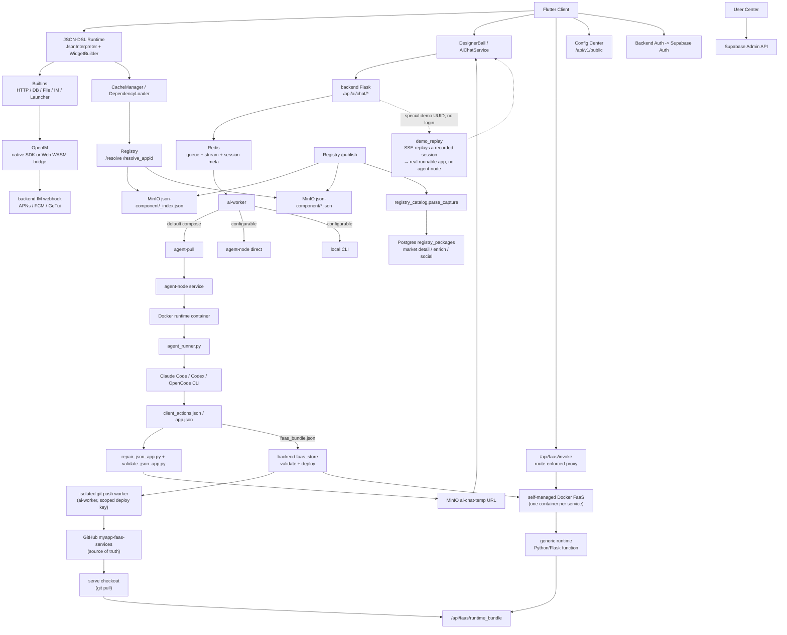

# MyApp

[中文](README.zh.md) · [English](README.md) · [Deutsch](README.de.md) · **Español**

> **La IA describe → app full-stack (UI + backend + base de datos) → ejecutándose al instante en el teléfono del usuario. Sin paso de compilación, sin revisión de tienda de aplicaciones.**
>
> Un runtime de Flutter que interpreta JSON-DSL en UI nativa + lógica de negocio. Los usuarios le dicen a la IA lo que quieren; la IA emite el front-end JSON **y, cuando la app lo necesita, un backend real de Python/Flask con su propia base de datos Postgres aislada**, para luego renderizarlo y ejecutarlo al instante dentro de un conjunto de capacidades precompiladas. Otros constructores de apps con IA te entregan código de front-end que tú mismo tienes que cablear y desplegar; MyApp entrega toda la pila, ya en ejecución.

[](LICENSE)
[](https://flutter.dev)
[]()

> **Estado de la plataforma**: ✅ Producción (iOS/Android/Web) • ⚠️ Experimental (macOS, solo funciones principales) • 🚧 Sin probar (Linux/Windows)

---

## ¿Qué es esto?

Tres cosas en un solo repositorio:

1. **Un motor de UI dirigida por servidor (Server-Driven UI) en Flutter** (`lib/`) — renderiza cualquier configuración JSON-DSL en una app multiplataforma real en tiempo de ejecución
2. **Un generador full-stack con IA** (`backend/`, `user_center/`, `config_center/`) — la IA genera el front-end JSON **y un backend FaaS correspondiente + una base de datos Postgres aislada** cuando la app lo necesita, sobre autenticación (Supabase), IM (OpenIM), notificaciones push (APNs + FCM), proxy de chat de IA, registro de paquetes y administración de usuarios
3. **Un ecosistema de paquetes** (`templates/`) — JSON-APPs de ejemplo (IM, juegos, perfil de usuario, calculadora…) que puedes instalar sobre el runtime

El nombre **MyApp** es intencional: cada usuario puede crear, instalar y operar «mi app» sobre el runtime compartido.

El caso de uso estrella: **un usuario abre la app → chatea con la IA (la generación suele tardar de 10 a 20 minutos) → la IA devuelve un JSON-DSL → la app lo carga y lo ejecuta al instante** dentro de las capacidades ya compiladas en el cliente.

---

## Compatibilidad de plataformas

MyApp está construido con Flutter y es compatible con múltiples plataformas con distintos grados de completitud de funciones:

### ✅ Listo para producción (todas las funciones)

- **iOS** — Soporte completo, incluyendo IM, notificaciones push, cámara, autenticación biométrica y todas las capacidades nativas
- **Android** — Soporte completo, incluyendo IM, notificaciones push, cámara, autenticación biométrica y todas las capacidades nativas
- **Web** — Soporte completo con IM mediante el puente WASM de OpenIM (las notificaciones push no están disponibles)

### ⚠️ Experimental (funciones principales)

- **macOS** — Probado y funcionando bien. El runtime JSON principal, el renderizado de UI, la autenticación, el chat de IA, el selector de archivos y la autenticación biométrica funcionan todos. El chat IM y las notificaciones push no son compatibles debido a limitaciones de los SDK de terceros.

### 🚧 Sin probar (probablemente funcione)

- **Linux** — Tiene configuración de compilación y debería funcionar para las funciones principales. El chat IM y las notificaciones push no son compatibles.
- **Windows** — Tiene configuración de compilación y debería funcionar para las funciones principales. El chat IM y las notificaciones push no son compatibles.

### Disponibilidad de funciones

| Función | iOS | Android | Web | macOS | Linux | Windows |
|---------|-----|---------|-----|-------|-------|---------|
| Runtime JSON-DSL | ✅ | ✅ | ✅ | ✅ | ⚠️ | ⚠️ |
| Renderizado de UI | ✅ | ✅ | ✅ | ✅ | ⚠️ | ⚠️ |
| Red y almacenamiento | ✅ | ✅ | ✅ | ✅ | ⚠️ | ⚠️ |
| Chat IM | ✅ | ✅ | ✅ | ❌ | ❌ | ❌ |
| Notificaciones push | ✅ | ✅ | ❌ | ❌ | ❌ | ❌ |
| Cámara | ✅ | ✅ | ✅ | ⚠️ | ❌ | ❌ |
| Autenticación biométrica | ✅ | ✅ | ❌ | ✅ | ❌ | ⚠️ |
| Juegos Flame | ✅ | ✅ | ✅ | ✅ | ⚠️ | ⚠️ |

**Leyenda**: ✅ Probado y funcionando • ⚠️ Sin probar pero debería funcionar • ❌ No compatible

La mayoría de las apps JSON-DSL funcionan en todas las plataformas. Las funciones específicas de cada plataforma se degradan con elegancia, ofreciendo retroalimentación clara al usuario cuando no están disponibles.

---

## ¿Por qué es interesante?

- **Full-stack de una sola vez: el factor diferenciador.** La mayoría de los constructores de apps con IA (v0, Lovable, Bolt, …) generan código de *front-end* que aún tienes que cablear a un backend y desplegar tú mismo. MyApp genera el front-end **y** un backend FaaS real de Python/Flask, cada uno con su propia base de datos Postgres aislada, un modelo de permisos por app y aislamiento de datos por cada llamador, para luego ejecutarlo todo al instante. Sin proyecto de backend separado, sin paso de despliegue, sin envío a la tienda.
- **Dirigido por servidor** — entrega la UI y el comportamiento como datos a través de un límite de runtime fijo y precompilado. Consulta las [notas de cumplimiento de App Store](docs/APP_STORE_COMPLIANCE.md).
- **Nativo de IA** — el DSL está diseñado para ser amigable con los LLM. El chat de IA incluido ejecuta múltiples proveedores (DeepSeek, MiniMax, el agregador Volcengine con GLM / Kimi) a través de tres runtimes de agente conectables (Claude Code, Codex, OpenCode), y genera apps que realmente se renderizan, con playbooks de generación y una pasada de autorrevisión visual durante la ejecución para mantener la salida ejecutable.
- **Con todo incluido** — IM con push, proxy de IA, registro de paquetes, espacios de nombres, replicación (mirroring), centro de usuarios, cambio de entornos: todo cableado entre sí. No es «otro framework low-code más que delega la autenticación».
- **Autoalojable** — `myapp-ctl deploy` gestiona la pila del backend, el runtime de agentes, el registro, el centro de configuración y los secretos de los servicios desde una única CLI a nivel de host.
- **Multiplataforma** — el mismo JSON-DSL se renderiza en iOS, Android, Web (probado en producción), macOS (probado de forma experimental), Linux y Windows. Las funciones principales funcionan en todas las plataformas; las funciones específicas de cada plataforma (IM, push) se degradan con elegancia en las plataformas no compatibles.

---

## Inicio rápido

### Usa los clientes alojados

Si solo quieres probar MyApp y ejecutar JSON Apps generadas por IA:

1. Abre el cliente Web alojado: <https://myapp-web.dapangyu.work/>
2. O instala el Grupo Público 1 de TestFlight de iOS: <https://testflight.apple.com/join/3Fk5Exnn>
3. O descarga el APK de Android:
   <https://myapp-oss-endpoint.dapangyu.work/myapp-releases/android/apk/latest.apk>
4. Continúa como invitado para explorar/ejecutar apps públicas, o inicia sesión para generar apps,
   usar las funciones de IM/perfil, publicar paquetes y gestionar Agent Nodes privados.
5. ¿No tienes cuenta? Toca el botón flotante → **Demo** para ver cómo la IA construye una app
   de principio a fin y ejecutar el resultado real, sin iniciar sesión.

La guía de uso completa del producto está en [docs/USER_GUIDE.md](docs/USER_GUIDE.md).

### Compila el cliente desde el código fuente (5 minutos)

```bash
git clone <this-repository-url> ai-app
cd ai-app
flutter pub get
flutter run -d <ios|android|chrome>
```

La configuración predeterminada apunta al backend alojado. Para conectar un backend privado,
importa el JSON de entorno impreso por `myapp-ctl client-env`.

Para el soporte de IM en Flutter Web, los archivos incluidos `web/openIM.wasm`, `web/sql-wasm.wasm`,
los workers y el paquete del puente son recursos de runtime copiados de la dependencia fijada
`@openim/wasm-client-sdk` en `web_openim_bridge/package-lock.json`.
En una máquina nueva o en CI, regenéralos antes de `flutter build web` si
faltan o tras cambiar la versión del SDK:

```bash
./scripts/build_web_openim.sh
flutter build web
```

Para compilaciones/ejecuciones de Web, también puedes usar el script envoltorio para que los recursos
de OpenIM Web se comprueben primero y se regeneren cuando sea necesario:

```bash
./scripts/flutter_web.sh run -d chrome
./scripts/flutter_web.sh build web
```

### Autoaloja la pila completa del backend (20 minutos)

```bash
./deploy/production/install_ctl.sh
myapp-ctl setup --host <public-ip-or-domain> --data-root /mnt/myapp
myapp-ctl deploy --pull
myapp-ctl client-env --terminal-qr
```

Ejecuta estos comandos como root, o con permisos equivalentes de Docker y de escritura en `/etc/myapp`.
La referencia completa de despliegue y de comandos de `myapp-ctl` está en
[`deploy/production/README.md`](deploy/production/README.md).

La primera ejecución interactiva de `myapp-ctl` pregunta una vez por el idioma de la CLI (`zh`, `en`,
`de`, `es`, `fr`, `pt`, `ca`, `hi`, `ko`, `ja`, `it`); los cambios posteriores usan
`myapp-ctl config lang <lang>`. El asistente de configuración
pregunta por las credenciales del proveedor de IA y, opcionalmente, por la configuración de ASR, correo SMTP, APNs, FCM y
GeTui. Un despliegue completo imprime el JSON de entorno del cliente y el QR, y puede
crear/actualizar una cuenta de prueba interactiva `test@example.com`; vuelve a ejecutar
`myapp-ctl client-env --terminal-qr` para mostrarlo de nuevo.

Actualiza la CLI de control instalada y los archivos de despliegue de producción desde el
checkout de Git:

```bash
myapp-ctl update
```

Para un host de desarrollo/pruebas que compila imágenes desde este checkout:

```bash
myapp-ctl setup --host <public-ip-or-domain>
myapp-ctl deploy --build
```

Esto arranca la pila del backend de MyApp localmente / en un VPS:
- Postgres de las JSON apps + Redis de sesiones de IA + App MinIO
- Agent node + runtime de agente Ubuntu aislado
- Backend de la app + AI worker + Registry + Config center + User center

Tras el despliegue, el **Conmutador de entornos** integrado del cliente (toca la marca 7 veces en la página de inicio de sesión) te permite apuntar a tu propia pila.

Consulta [`deploy/production/README.md`](deploy/production/README.md) para la
guía de despliegue autoritativa.

### Mapa de documentación

| Necesidad | Documento |
|---|---|
| Usar MyApp, generar apps, conectar un backend privado, depurar appid/JSON local en Web | [docs/USER_GUIDE.md](docs/USER_GUIDE.md) |
| Instalar, actualizar, operar, respaldar, restaurar o desinstalar la pila del backend | [deploy/production/README.md](deploy/production/README.md) |
| Entender la arquitectura actual del backend/agent-node | [backend/ARCHITECTURE.md](backend/ARCHITECTURE.md) |
| Entender los límites de revisión/runtime de App Store | [docs/APP_STORE_COMPLIANCE.md](docs/APP_STORE_COMPLIANCE.md) |

---

## Arquitectura

El proyecto se acerca ahora más a una pequeña plataforma de apps que a una única demo de Flutter.
El cliente Flutter es un runtime compilado; las JSON-APPs, los componentes, los recursos, el IM,
la generación con IA y los **backends FaaS generados por IA** son servidos todos por la pila del backend,
que puede ejecutarse todo-en-uno en un único host (backend + pila de Docker Compose
+ el runtime FaaS de Docker autogestionado, consulta `docs/faas-docker-runtime.md`).



| Componente | Dónde | Qué |
|---|---|---|
| Flutter Runtime | `lib/` | Cliente compilado multiplataforma: intérprete JSON-DSL, widgets, átomos de juego Flame, caché de recursos, cambio de entornos, entrada de IA, UI de IM/medios |
| Recursos de runtime Web | `web/`, `web_openim_bridge/` | Puente WASM de OpenIM Web y recursos de compilación usados por Flutter Web |
| API del backend | `backend/app.py`, `backend/claude_chat.py` | API Flask para chat de IA con autenticación, streaming SSE, subida de medios, push, configuración de proveedores y endpoints del backend orientados al cliente |
| Cola / Sesiones de IA | `backend/ai_session.py` + Redis | Metadatos de tareas de IA con cierta durabilidad, cola de workers acotada, flujo de eventos SSE reanudable, estado de aborto/reintento |
| Pool de workers de IA | `backend/ai_worker_daemon.py`, `backend/ai_session.py`, `backend/agent_node_service.py`, `deploy/production/agent_runner.py` | Mueve los trabajos aceptados a través de Redis, usa por defecto la ejecución de agent-node en modo pull, y también puede ejecutar rutas de agent-node directo o de CLI local según `AI_WORKER_EXECUTION_BACKEND` |
| Backends FaaS | `backend/faas.py`, `backend/faas_store.py`, `backend/faas_push_worker.py`, `backend/faas_runtime_server.py` | Backends de Python/Flask generados por IA: validación estricta de bundles, worker aislado de git push → `myapp-faas-services` (fuente de verdad en GitHub), runtime Docker autogestionado (un contenedor por servicio, con deploy/route/cold-wake/scale-to-zero a cargo del plano de control, consulta `docs/faas-docker-runtime.md`), proxy `/api/faas/invoke` con rutas forzadas, cuota por usuario + create-vs-append |
| Registry | `backend/registry_server.py` | Registro de paquetes para JSON-APPs/componentes: `_index.json` + los archivos de paquete de MinIO son la fuente de resolución en runtime; el Postgres `registry_packages` es el índice de mercado/detalle/enriquecimiento/social |
| Almacenamiento de objetos | MinIO / OSS | Paquetes JSON públicos bajo `json-component`, medios de apps, packs de recursos bajo `json-app-assets`, URLs de JSON temporales generadas por IA, y un bucket `demo` público de apps demo fijas sin inicio de sesión |
| OpenIM | `backend/openim/` | Puente del backend de IM. Los clientes nativos usan el SDK Flutter/nativo de OpenIM; la Web usa el puente del SDK WASM |
| Supabase | `deploy/production/supabase/` | Servicios autoalojados de autenticación, base de datos y compatibles con almacenamiento, configurados mediante secretos locales del host |
| Config Center | `config_center/` | Banderas de configuración remota y configuración del cliente específica del entorno |
| User Center | `user_center/` | UI de administración para roles de usuario, baneos, flujos de restablecimiento y operaciones de cuenta |
| Plantillas / Bibliotecas | `templates/` | Apps de ejemplo publicadas y bibliotecas JSON reutilizables: IM, lanzador, chat de OpenAI, juegos, controles, perfil, utilidades |
| Sitio web | `website/` | Sitio de marketing y demo en TS/Vite, incluida la vista previa integrada del cliente web |
| Plano de control | `deploy/production/`, `scripts/myapp_ctl/` | Gestión de `myapp-ctl` para status/log/secret/domain/image/deploy en hosts de prueba y producción |

Flujos principales:

1. **Generación de apps con IA**: el cliente envía una tarea de chat -> el Backend escribe la cola/metadatos en Redis -> el valor predeterminado actual de producción coloca el trabajo en la ruta agent-pull -> un agent-node inicia un contenedor de runtime aislado -> `agent_runner.py` ejecuta el agente configurado (Claude Code / Codex / OpenCode) -> el agent-node transmite eventos/artefactos de vuelta -> el backend valida/repara/sube el JSON generado -> el cliente recibe un evento estructurado `json_app_ready` a través de SSE reanudable.
2. **Instalación de paquetes**: el cliente consulta el Registry con paginación/búsqueda o `/resolve(_appid)` -> el Registry resuelve a través de `_index.json` y los archivos de paquete de MinIO -> el cliente descarga el JSON -> el cargador de dependencias resuelve las bibliotecas y las almacena en caché localmente. Los detalles de mercado, resúmenes, «me gusta» e instalaciones provienen del índice lateral Postgres `registry_packages`.
3. **IM**: el móvil usa la ruta del SDK nativo de OpenIM; la Web usa `openim/wasm-client-sdk` a través de `web_openim_bridge`, con compatibilidad a nivel de framework para que las apps JSON de IM llamen a una única forma de API.
4. **Backend autoalojado**: `myapp-ctl secret` gestiona las credenciales locales del host; `myapp-ctl deploy --pull` o `myapp-ctl deploy --build` inicia la pila del backend y el runtime de agentes.

---

## El JSON-DSL

Una configuración MyApp de 100 líneas puede convertirse en una app completa con pantallas, navegación, llamadas de red, animaciones y widgets nativos. El DSL está documentado en [JSON-DSL.md](JSON-DSL.md).

Ejemplo mínimo:

```json
{
  "dsl": "3.3",
  "meta": { "name": "hello", "version": "1.0.0", "type": "app" },
  "global": { "count": 0 },
  "ui": {
    "screens": [{
      "name": "home",
      "body": {
        "type": "container",
        "layout": "column",
        "children": [
          { "type": "text", "value": "Counter: {{ global.count }}" },
          { "type": "button", "label": "+1", "action": {
            "call": "@set",
            "args": { "var": "global.count", "value": { "+": [{ "var": "global.count" }, 1] } }
          }}
        ]
      }
    }]
  }
}
```

Pásalo a través del flujo de generación con IA, o ejecuta `flutter run` y elige el archivo JSON desde el disco.

---

## Funciones

### Motor
- Más de 30 widgets (text / button / input / list / image / video / chart / map / webview / camera / qr / burbuja de chat / …)
- Motor de expresiones JsonLogic con 15 operadores personalizados
- Más de 30 funciones integradas (HTTP, JSON, cadenas, arrays, control de flujo, retroalimentación de UI)
- `@parallel` para pasos concurrentes
- Las plantillas `{{ path }}` se resuelven al tipo original (no convertidas a cadena)
- Intercambio en caliente de la configuración desde red / disco / registro
- Motor de juegos 2D Flame (sprites, física, mapas Tiled)
- Puerta de autorización por app para capacidades sensibles (token de autenticación, perfil)

### Backend
- **Full-stack FaaS generado por IA** — la IA emite un backend de Python/Flask validado por «grupo de servicio» (1 servicio de función + base de datos Postgres opcional), desplegado en un runtime FaaS de Docker autogestionado (un contenedor por servicio, scale-to-zero + cold-wake). Aislamiento de esquema por app, identidad pseudónima intragrupo no falsificable, acceso a datos por cada llamador mediado por el backend (el código de la función nunca mantiene una conexión a la base de datos), endurecimiento de contenedores y una política de acceso revocable de 3 niveles.
- Integración de autenticación con Supabase
- Chat de IA con colas por proveedor y ejecución de agente aislada — proveedores (DeepSeek, MiniMax, el agregador Volcengine: GLM / Kimi) × tres runtimes de agente (Claude Code, Codex, OpenCode), más playbooks de generación y una pasada de autorrevisión visual durante la ejecución
- **Modo demo sin inicio de sesión** — los usuarios no autenticados tocan el botón flotante → Demo, lanzan una generación de IA de aspecto real que reproduce vía SSE una sesión grabada, y obtienen una app realmente ejecutable (sin agent-node, sin creación de FaaS) — una muestra instantánea del flujo completo
- Push agnóstico al canal (APNs + FCM, fácil de ampliar)
- Registro de paquetes con espacios de nombres + semver + resolución de dependencias
- **Replicación entre instancias** — una instancia autoalojada puede replicar (mirror) paquetes desde un upstream (proxy de archivos perezoso + sincronización de índice cada 10 minutos)
- UI de administración de usuarios (rol / baneo / restablecer contraseña)
- Registro de auditoría

### Despliegue
- `myapp-ctl deploy` para despliegue de backend full-stack o a nivel de componente
- `myapp-ctl secret` para secretos de proveedor, push, OSS y backend locales del host
- Agent-node aislado basado en pull + runtime Docker para los workers de IA
- MinIO integrado para subidas de medios
- Comandos de comprobaciones de salud, logs, reinicio, estado e inspección de agentes

---

## Estado

| Área | Estado |
|---|---|
| Motor (Dart) | Producción. 65k LOC. Impulsando una app real. UI del cliente localizada a 11 idiomas. |
| Backend (Python) | Producción. 32k LOC. Con usuarios reales. |
| Pruebas | Prueba de humo de widgets más una suite de regresión JSON (`templates/regression-test.json`). Los PR que añadan cobertura son muy bienvenidos. |
| Documentación | Media (`JSON-DSL.md`, `deploy/production/README.md`, notas de arquitectura del backend). En mejora. |
| Estabilidad de la API | DSL v3.3 — posibles cambios menores incompatibles hasta v4. API HTTP del backend estable. |
| ¿Alojado públicamente? | Sí (sujeto a uso razonable, consulta los Términos) |

---

## Contribuir

Los issues, PR y debates son todos bienvenidos.

- Documentación en [`CLAUDE.md`](CLAUDE.md) (que también sirve como instrucciones para Claude Code si usas IA para contribuir)
- Especificación de JSON-DSL en [`JSON-DSL.md`](JSON-DSL.md)
- Convenciones de código:
  - Los comentarios responden al *por qué*, no al *qué* (el código muestra el qué)
  - Evita abstracciones especulativas; tres líneas similares son mejores que una interfaz prematura
  - Para cambios de UI, prueba el camino feliz *y* los casos límite en un navegador/simulador antes de darlo por terminado

---

## Licencia

Apache License 2.0 — consulta [LICENSE](LICENSE) y [NOTICE](NOTICE).

Puedes:
- Usar esto en productos comerciales
- Hacer fork y modificar libremente
- Autoalojar toda la pila

No puedes:
- Usar el **nombre o el logotipo de «MyApp»** sin permiso (para solicitar permiso, [abre un issue](https://github.com/dapangyu-fish/ai-app/issues))
- Tergiversar el origen del código

Los paquetes del mercado, los recursos subidos y las apps JSON creadas por los usuarios son propiedad de sus autores y están licenciados por ellos, a menos que indiquen explícitamente lo contrario.

---

## Agradecimientos

- [Flutter](https://flutter.dev) — framework de UI
- [Supabase](https://supabase.com) — backend de autenticación + BD + almacenamiento
- [OpenIM](https://github.com/openimsdk) — SDK + servidor de IM
- [Anthropic Claude Code CLI](https://docs.claude.com/en/docs/claude-code) — runtime de generación con IA
- [JsonLogic](https://jsonlogic.com) — motor de expresiones

---

## Hoja de ruta (en orden de prioridad)

- [ ] Lanzar un vídeo demo viral de 60 segundos (IA → configuración JSON en ~10-20 min → la app se ejecuta al instante)
- [ ] Nivel gratuito alojado públicamente
- [ ] Enlace de compartición de app con QR (abrir una app generada por IA mediante deep link)
- [ ] Añadir CI (GitHub Actions: pub get, analyze, build APK)
- [ ] Más JSON-APPs de ejemplo (lista de tareas, notas, rastreador de fitness)
- [x] Sistema de prompts v2: el largo prompt de generación se divide en un enrutador `index.md` + tarjetas por tarea (`backend/prompts/generation/`) con pipelines por capas, más playbooks de generación (`docs/playbooks/`); la validación/reparación de JSON vive en las herramientas `validate_json_app.py` / `repair_json_app.py`
- [x] Generación multiagente + multiproveedor: runtimes de agente Claude Code / Codex / OpenCode × proveedores DeepSeek / MiniMax / agregador Volcengine (GLM, Kimi), seleccionables por sesión
- [x] Modo demo sin inicio de sesión: reproducción vía SSE de generaciones grabadas para que los usuarios no autenticados obtengan una app real ejecutable al instante (sin agent-node / FaaS)
- [ ] Añadir más runtimes de agente / agregadores de proveedores más allá del conjunto actual de tres agentes
- [ ] Soporte de audio para las JSON-APPs (grabación, reproducción, subida y UI/acciones de audio reutilizables)
- [x] Soporte FaaS: las conversaciones de IA crean funciones de backend de Python/Flask, servidas por el runtime FaaS de Docker autogestionado (un contenedor por servicio, con deploy/route/cold-wake/scale-to-zero a cargo del plano de control) con validación estricta de bundles, fuente de verdad en GitHub (`myapp-faas-services`), un worker aislado de git push, cuota por usuario + create-vs-append, y un proxy de invocación con rutas forzadas
- [ ] Escalado horizontal de FaaS: FaaS de Docker multinodo + enrutamiento secundario del backend (escalado horizontal) y nodos faas privados del usuario (reutilizando el patrón del registro de agent-node)
- [ ] **Aislamiento de push por JSON-APP + deep-link + autorización opt-in**: sobre de mensaje con ámbito de app (`app_id` + `route` de destino + `params`) para que una notificación pueda enrutarse a una pantalla específica de una JSON-APP; los destinatarios deben optar por participar por app/remitente/servicio (desactivado por defecto, anti-abuso); el enrutamiento por toque abre la app en la pantalla de destino si está instalada, o si no, un mecanismo alternativo de invitación del framework para «instalar A». Diseño: [docs/planning/push-jsonapp-isolation.md](docs/planning/push-jsonapp-isolation.md)
- [ ] DSL v4 (estabilizar la ventana de cambios incompatibles)
- [ ] Más pruebas en torno al intérprete
- [ ] Rendimiento: posponer la interpretación de subárboles fuera de pantalla

---

*Construido con cuidado. Abierto a comentarios.*
