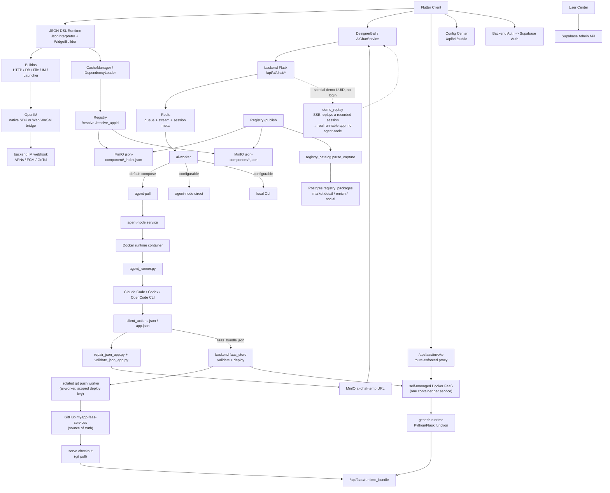

# MyApp

[中文](README.zh.md) · [English](README.md) · [Deutsch](README.de.md) · [Español](README.es.md) · **Français** · [Português](README.pt.md) · [Català](README.ca.md) · [हिन्दी](README.hi.md) · [한국어](README.ko.md) · [日本語](README.ja.md) · [Italiano](README.it.md)

<div align="center">

### Arrêtez le vibe-*coding*. Livrez des vibe-*apps*.

**Décrivez-la → une application full-stack (UI + vrai backend + base de données) prend vie sur tous les écrans.**

**Pas de base de code. Pas de build. Pas de déploiement. Pas d'app store.**

</div>

> Toute l'industrie débat encore de la façon d'*écrire du code* avec l'IA. Nous, nous avons fait l'impasse sur le code.
>
> Le vibe coding — même les meilleurs générateurs d'applications par IA (Lovable, Bolt, v0, Replit) — vous remet toujours une **base de code** à câbler, héberger et livrer. MyApp vous remet l'**application qui tourne** : vous décrivez ce que vous voulez, l'IA produit un front-end JSON-DSL **et**, lorsque l'application en a besoin, un véritable backend Python/Flask avec sa propre base de données Postgres isolée — puis rend et exécute le tout instantanément à l'intérieur d'un runtime précompilé et multiplateforme. La *même* phrase peut faire surgir un **jeu jouable** ou un **forum doté d'un vrai backend, avec connexion, publications et réponses imbriquées** — en ligne sur **iOS, Android, Web et desktop à partir d'une seule description**. Aucun projet à ouvrir, rien à compiler, rien à déployer.


<div align="center">


</div>

### From vibe *coding* to *no* coding

Vibe coding — even the best AI app builders — still keeps you in the loop: write commands, build, package, deploy, spot the bug, argue with the AI, loop back. We deleted the loop. You talk straight to the app on your phone — *"make this button green"* — and it changes. Nothing to compile, nothing to publish, no project to open.

<div align="center">


</div>

You end up arguing with the AI either way — so drop the toolchain and argue straight at the app in your hand.

<div align="center">


</div>


[](LICENSE)
[](https://flutter.dev)
[]()
[](JSON-DSL.md)

> **État des plateformes** : ✅ Production (iOS/Android/Web) • ⚠️ Expérimental (macOS, fonctionnalités de base uniquement) • 🚧 Non testé (Linux/Windows)

---

## Vibe *coding* vs. vibe *app*

|  | Vibe coding / générateurs d'applications par IA | **MyApp — une vibe app** |
|---|---|---|
| Ce que vous obtenez | Une **base de code** (React/Next + un backend) | Une **application qui tourne** |
| L'artefact | Du code à héberger, maintenir et surveiller | Une config JSON — **aucun code à maintenir** |
| Étape de livraison | Build → déploiement → (validation par l'app store) | **Aucune.** Elle est déjà en ligne. |
| Où ça tourne | En général une application web | **iOS · Android · Web · macOS · Linux · Windows** — une seule description |
| Backend | « Câblez Supabase vous-même » | **Python/Flask généré par IA + Postgres isolé**, déployé pour vous |
| Éventail | Formulaires, tableaux de bord, CRUD | …**et chat en temps réel, et jeux jouables** (Tetris, 2048, un jeu de plateforme) depuis le *même* runtime |

Ce n'est pas un slogan en l'air. Continuez à lire — les chiffres du moteur sont juste en dessous.

---

## Qu'est-ce que c'est ?

Trois choses dans un seul dépôt :

1. **Un moteur Flutter Server-Driven UI** (`lib/`) — interprète une configuration JSON-DSL en une application réelle, native et multiplateforme à l'exécution. **91 types de widgets, plus de 100 fonctions intégrées, un moteur d'expressions à 28 opérateurs et un moteur de jeu 2D complet** — le tout précompilé dans le client.
2. **Un générateur full-stack par IA** (`backend/`, `user_center/`, `config_center/`) — l'IA génère le front-end JSON **et un backend FaaS correspondant + une base de données Postgres isolée** lorsque l'application en a besoin, par-dessus l'authentification (Supabase), la messagerie instantanée (OpenIM), les notifications push (APNs + FCM), le proxy de chat IA, le registre de paquets et l'administration des utilisateurs.
3. **Un écosystème de paquets** (`templates/`) — plus de 70 exemples de JSON-Apps et de bibliothèques réutilisables (messagerie, jeux, profil utilisateur, calculatrice, tableaux de bord…) que vous pouvez installer par-dessus le runtime.

Le nom **MyApp** est intentionnel : chaque utilisateur peut créer, installer et exploiter « mon application » par-dessus le runtime partagé.

Le cas d'usage phare : **un utilisateur ouvre l'application → discute avec l'IA → l'IA renvoie un JSON-DSL (et un backend, si nécessaire) → l'application le charge et l'exécute instantanément** à l'intérieur des capacités déjà compilées dans le client. Pas de build, pas de validation, pas d'attente d'un app store.

---

## Prise en charge des plateformes

MyApp est construit avec Flutter et prend en charge plusieurs plateformes avec différents niveaux de complétude des fonctionnalités :

### ✅ Prêt pour la production (toutes les fonctionnalités)

- **iOS** — Prise en charge complète, y compris la messagerie instantanée, les notifications push, la caméra, l'authentification biométrique et toutes les capacités natives
- **Android** — Prise en charge complète, y compris la messagerie instantanée, les notifications push, la caméra, l'authentification biométrique et toutes les capacités natives
- **Web** — Prise en charge complète avec messagerie instantanée via le pont OpenIM WASM (les notifications push ne sont pas disponibles)

### ⚠️ Expérimental (fonctionnalités de base)

- **macOS** — Testé et fonctionnant bien. Le runtime JSON de base, le rendu de l'UI, l'authentification, le chat IA, le sélecteur de fichiers et l'authentification biométrique fonctionnent tous. La messagerie instantanée et les notifications push ne sont pas prises en charge en raison des limitations des SDK tiers.

### 🚧 Non testé (devrait probablement fonctionner)

- **Linux** — Dispose d'une configuration de compilation et devrait fonctionner pour les fonctionnalités de base. La messagerie instantanée et les notifications push ne sont pas prises en charge.
- **Windows** — Dispose d'une configuration de compilation et devrait fonctionner pour les fonctionnalités de base. La messagerie instantanée et les notifications push ne sont pas prises en charge.

### Disponibilité des fonctionnalités

| Fonctionnalité | iOS | Android | Web | macOS | Linux | Windows |
|---------|-----|---------|-----|-------|-------|---------|
| Runtime JSON-DSL | ✅ | ✅ | ✅ | ✅ | ⚠️ | ⚠️ |
| Rendu de l'UI | ✅ | ✅ | ✅ | ✅ | ⚠️ | ⚠️ |
| Réseau et stockage | ✅ | ✅ | ✅ | ✅ | ⚠️ | ⚠️ |
| Messagerie instantanée | ✅ | ✅ | ✅ | ❌ | ❌ | ❌ |
| Notifications push | ✅ | ✅ | ❌ | ❌ | ❌ | ❌ |
| Caméra | ✅ | ✅ | ✅ | ⚠️ | ❌ | ❌ |
| Authentification biométrique | ✅ | ✅ | ❌ | ✅ | ❌ | ⚠️ |
| Jeux Flame | ✅ | ✅ | ✅ | ✅ | ⚠️ | ⚠️ |

**Légende** : ✅ Testé et fonctionnel • ⚠️ Non testé mais devrait fonctionner • ❌ Non pris en charge

La plupart des applications JSON-DSL fonctionnent sur toutes les plateformes. Les fonctionnalités spécifiques à une plateforme se dégradent élégamment avec un retour utilisateur clair lorsqu'elles ne sont pas disponibles.

---

## Pourquoi est-ce intéressant ?

- **Full-stack en une seule fois — l'élément différenciateur.** La plupart des générateurs d'applications par IA (v0, Lovable, Bolt, …) génèrent du code *front-end* que vous devez encore câbler à un backend et déployer vous-même. MyApp génère le front-end **et** un véritable backend FaaS Python/Flask — chacun avec sa propre base de données Postgres isolée, un modèle de permissions par application et une isolation des données par appelant — puis exécute le tout instantanément. Aucun projet backend séparé, aucune étape de déploiement, aucune soumission à un store.
- **Aucun artefact de code.** Le livrable est une config JSON qui s'exécute dans un client précompilé, pas une base de code. Rien à héberger, rien à maintenir, rien qui casse à la prochaine montée de version d'une dépendance. Mettez à jour une application en décrivant le changement ; elle est en ligne partout dès le prochain chargement.
- **Véritablement multiplateforme.** Le *même* JSON-DSL se rend sur iOS, Android, Web (testé en production), macOS (expérimental), Linux et Windows. La plupart des outils « d'applications par IA » vous donnent une application web ; celui-ci vous donne du natif, partout, à partir d'une seule description.
- **Piloté par le serveur** — diffusez l'UI et le comportement sous forme de données à travers une frontière de runtime précompilée et fixe. Voir les [notes de conformité avec les app stores](docs/APP_STORE_COMPLIANCE.md).
- **Pensé pour l'IA** — le DSL est conçu pour être convivial pour les LLM. Le chat IA inclus exécute plusieurs fournisseurs (DeepSeek, MiniMax, l'agrégateur Volcengine avec GLM / Kimi) à travers trois runtimes d'agents enfichables (Claude Code, Codex, OpenCode), avec des playbooks de génération et une passe d'auto-révision visuelle en cours d'exécution pour que la sortie reste exécutable.
- **Tout inclus** — messagerie instantanée avec notifications push, proxy IA, registre de paquets, espaces de noms, mise en miroir, centre utilisateur, changement d'environnement — tout est câblé ensemble. Pas « encore un énième framework low-code qui esquive l'authentification ».
- **Auto-hébergeable** — `myapp-ctl deploy` gère la pile backend, le runtime d'agents, le registre, le centre de configuration et les secrets de service depuis une CLI unique au niveau de l'hôte.

---

## Démarrage rapide

### Utiliser les clients hébergés

Si vous voulez seulement essayer MyApp et exécuter des JSON Apps générées par IA :

1. Ouvrez le client Web hébergé : <https://myapp-web.dapangyu.work/>
2. Ou installez le groupe public TestFlight iOS n° 1 : <https://testflight.apple.com/join/3Fk5Exnn>
3. Ou téléchargez l'APK Android :
   <https://myapp-oss-endpoint.dapangyu.work/myapp-releases/android/apk/latest.apk>
4. Continuez en tant qu'invité pour parcourir/exécuter des applications publiques, ou connectez-vous pour générer des applications,
   utiliser les fonctionnalités de messagerie/profil, publier des paquets et gérer des Agent Nodes privés.
5. Pas de compte ? Appuyez sur la boule flottante → **Demo** pour regarder l'IA construire une application
   de bout en bout et en exécuter le véritable résultat, sans vous connecter.

Le guide d'utilisation complet du produit est [docs/USER_GUIDE.md](docs/USER_GUIDE.md).

### Compiler le client depuis les sources (5 minutes)

```bash
git clone <this-repository-url> ai-app
cd ai-app
flutter pub get
flutter run -d <ios|android|chrome>
```

La configuration par défaut pointe vers le backend hébergé. Pour vous connecter à un backend privé,
importez le JSON d'environnement affiché par `myapp-ctl client-env`.

Pour la prise en charge de la messagerie instantanée sur Flutter Web, les fichiers `web/openIM.wasm`, `web/sql-wasm.wasm`,
les workers et le bundle du pont qui sont archivés sont des ressources d'exécution copiées depuis la dépendance
`@openim/wasm-client-sdk` épinglée dans `web_openim_bridge/package-lock.json`.
Sur une machine vierge ou en CI, régénérez-les avant `flutter build web` s'ils
sont manquants ou après un changement de version du SDK :

```bash
./scripts/build_web_openim.sh
flutter build web
```

Pour les compilations/exécutions Web, vous pouvez également utiliser le script wrapper afin que les ressources Web OpenIM
soient d'abord vérifiées et régénérées si nécessaire :

```bash
./scripts/flutter_web.sh run -d chrome
./scripts/flutter_web.sh build web
```

### Auto-héberger la pile backend complète (20 minutes)

```bash
./deploy/production/install_ctl.sh
myapp-ctl setup --host <public-ip-or-domain> --data-root /mnt/myapp
myapp-ctl deploy --pull
myapp-ctl client-env --terminal-qr
```

Exécutez ces commandes en tant que root, ou avec des permissions Docker et d'écriture sur `/etc/myapp`
équivalentes. La référence complète du déploiement et des commandes `myapp-ctl` se trouve dans
[`deploy/production/README.md`](deploy/production/README.md).

La première exécution interactive de `myapp-ctl` demande une fois la langue de la CLI (`zh`, `en`,
`de`, `es`, `fr`, `pt`, `ca`, `hi`, `ko`, `ja`, `it`) ; les changements ultérieurs utilisent
`myapp-ctl config lang <lang>`. L'assistant de configuration
demande les identifiants du fournisseur d'IA et, en option, la configuration ASR, e-mail SMTP, APNs, FCM et
GeTui. Un déploiement complet affiche le JSON d'environnement client et le QR, et peut
créer/mettre à jour un compte de test interactif `test@example.com` ; relancez
`myapp-ctl client-env --terminal-qr` pour l'afficher à nouveau.

Mettez à jour la CLI de contrôle installée et les fichiers de déploiement de production depuis le
checkout Git :

```bash
myapp-ctl update
```

Pour un hôte de développement/test qui compile les images depuis ce checkout :

```bash
myapp-ctl setup --host <public-ip-or-domain>
myapp-ctl deploy --build
```

Cela démarre la pile backend MyApp localement / sur un VPS :
- Postgres de l'application JSON + Redis des sessions IA + App MinIO
- Agent node + runtime d'agent Ubuntu isolé
- Backend de l'application + worker IA + Registry + centre de configuration + centre utilisateur

Après le déploiement, le **sélecteur d'environnement** intégré au client (appuyez 7 fois sur la marque sur la page de connexion) vous permet de pointer vers votre propre pile.

Voir [`deploy/production/README.md`](deploy/production/README.md) pour le
guide de déploiement de référence.

### Carte de la documentation

| Besoin | Document |
|---|---|
| Utiliser MyApp, générer des applications, se connecter à un backend privé, déboguer l'appid Web/le JSON local | [docs/USER_GUIDE.md](docs/USER_GUIDE.md) |
| Installer, mettre à jour, exploiter, sauvegarder, restaurer ou désinstaller la pile backend | [deploy/production/README.md](deploy/production/README.md) |
| Comprendre l'architecture actuelle du backend/agent-node | [backend/ARCHITECTURE.md](backend/ARCHITECTURE.md) |
| Comprendre les frontières de validation par les app stores/du runtime | [docs/APP_STORE_COMPLIANCE.md](docs/APP_STORE_COMPLIANCE.md) |

---

## Architecture

Le projet est désormais plus proche d'une petite plateforme applicative que d'une simple démo Flutter.
Le client Flutter est un runtime compilé ; les JSON-APPs, les composants, les ressources, la messagerie instantanée,
la génération par IA et les **backends FaaS générés par IA** sont tous servis par la pile backend
— qui peut tourner tout-en-un sur un seul hôte (backend + pile Docker Compose
+ le runtime FaaS Docker autogéré, voir `docs/faas-docker-runtime.md`).



| Composant | Emplacement | Description |
|---|---|---|
| Runtime Flutter | `lib/` | Client compilé multiplateforme : interpréteur JSON-DSL, widgets, atomes de jeu Flame, cache de ressources, changement d'environnement, point d'entrée IA, UI de messagerie/médias |
| Ressources du runtime Web | `web/`, `web_openim_bridge/` | Pont OpenIM Web WASM et ressources de compilation utilisés par Flutter Web |
| API backend | `backend/app.py`, `backend/claude_chat.py` | API Flask pour le chat IA protégé par authentification, le streaming SSE, l'envoi de médias, les notifications push, la configuration des fournisseurs et les endpoints backend orientés client |
| File d'attente IA / Sessions | `backend/ai_session.py` + Redis | Métadonnées de tâches IA quasi durables, file d'attente de workers bornée, flux d'événements SSE reprenable, statut d'abandon/de réessai |
| Pool de workers IA | `backend/ai_worker_daemon.py`, `backend/ai_session.py`, `backend/agent_node_service.py`, `deploy/production/agent_runner.py` | Fait avancer les tâches acceptées à travers Redis, utilise par défaut l'exécution agent-node en mode pull, et peut aussi exécuter les chemins agent-node direct ou CLI local selon `AI_WORKER_EXECUTION_BACKEND` |
| Backends FaaS | `backend/faas.py`, `backend/faas_store.py`, `backend/faas_push_worker.py`, `backend/faas_runtime_server.py` | Backends Python/Flask générés par IA : validation stricte des bundles, worker git push isolé → `myapp-faas-services` (source de vérité GitHub), runtime Docker autogéré (un conteneur par service, déploiement/routage/réveil à froid/scale-to-zero détenus par le control-plane — voir `docs/faas-docker-runtime.md`), proxy `/api/faas/invoke` à routes imposées, quota par utilisateur + création vs ajout |
| Registry | `backend/registry_server.py` | Registre de paquets pour les JSON-APPs/composants : `_index.json` + les fichiers de paquets MinIO sont la source de résolution à l'exécution ; le `registry_packages` Postgres est l'index marché/détail/enrichissement/social |
| Stockage objet | MinIO / OSS | Paquets JSON publics sous `json-component`, médias d'application, packs de ressources sous `json-app-assets`, URLs JSON temporaires générées par IA, et un bucket public `demo` d'applications de démo à connexion zéro fixes |
| OpenIM | `backend/openim/` | Pont backend de messagerie instantanée. Les clients natifs utilisent le SDK Flutter/natif OpenIM ; le Web utilise le pont du SDK WASM |
| Supabase | `deploy/production/supabase/` | Services auto-hébergés d'authentification, de base de données et compatibles stockage, configurés via des secrets locaux à l'hôte |
| Centre de configuration | `config_center/` | Drapeaux de configuration distante et configuration client spécifique à l'environnement |
| Centre utilisateur | `user_center/` | UI d'administration pour les rôles d'utilisateurs, les bannissements, les flux de réinitialisation et les opérations de compte |
| Templates / Bibliothèques | `templates/` | Exemples d'applications publiées et bibliothèques JSON réutilisables : messagerie, lanceur, chat OpenAI, jeux, contrôles, profil, utilitaires |
| Site web | `website/` | Site marketing et de démo TS/Vite, y compris l'aperçu intégré du client web |
| Control plane | `deploy/production/`, `scripts/myapp_ctl/` | Gestion `myapp-ctl` du statut/des logs/des secrets/du domaine/des images/du déploiement pour les hôtes de test et de production |

Flux principaux :

1. **Génération d'applications par IA** : le client envoie une tâche de chat -> le backend écrit la file d'attente/les métadonnées dans Redis -> la valeur par défaut actuelle en production place la tâche sur le chemin agent-pull -> un agent-node démarre un conteneur de runtime isolé -> `agent_runner.py` exécute l'agent configuré (Claude Code / Codex / OpenCode) -> l'agent-node renvoie en streaming les événements/artefacts -> le backend valide/répare/téléverse le JSON généré -> le client reçoit un événement structuré `json_app_ready` via le SSE reprenable.
2. **Installation de paquets** : le client interroge le Registry avec pagination/recherche ou `/resolve(_appid)` -> le Registry résout via `_index.json` et les fichiers de paquets MinIO -> le client télécharge le JSON -> le chargeur de dépendances résout les bibliothèques et les met en cache localement. Les détails du marché, les résumés, les likes et les installations proviennent de l'index latéral `registry_packages` de Postgres.
3. **Messagerie instantanée** : le mobile utilise le chemin du SDK natif OpenIM ; le Web utilise `openim/wasm-client-sdk` via `web_openim_bridge`, avec une compatibilité au niveau du framework pour que les applications JSON de messagerie appellent une seule forme d'API.
4. **Auto-hébergement du backend** : `myapp-ctl secret` gère les identifiants locaux à l'hôte ; `myapp-ctl deploy --pull` ou `myapp-ctl deploy --build` démarre la pile backend et le runtime d'agents.

---

## Le JSON-DSL

Une configuration MyApp de 100 lignes peut devenir une application complète avec écrans, navigation, appels réseau, animations et widgets natifs. Le DSL est documenté dans [JSON-DSL.md](JSON-DSL.md).

Exemple minimal :

```json
{
  "dsl": "3.3",
  "meta": { "name": "hello", "version": "1.0.0", "type": "app" },
  "global": { "count": 0 },
  "ui": {
    "screens": [{
      "name": "home",
      "body": {
        "type": "container",
        "layout": "column",
        "children": [
          { "type": "text", "value": "Counter: {{ global.count }}" },
          { "type": "button", "label": "+1", "action": {
            "call": "@set",
            "args": { "var": "global.count", "value": { "+": [{ "var": "global.count" }, 1] } }
          }}
        ]
      }
    }]
  }
}
```

Faites passer ceci par le flux de génération IA, ou faites `flutter run` et sélectionnez le fichier JSON sur le disque.

---

## Fonctionnalités

### Moteur
- **91 types de widgets** — text / button / input / list / container / image / video / chart / map / webview / camera / qr / tab_view / **une pile de jeu 2D Flame complète** (canvas de jeu, stick analogique, canvas de particules / de scène projetée) / animations (animated_*, Rive) / gestes avancés (mot de passe gestuel, glisser-pour-vérifier) / mise en page de niveau sliver
- **Moteur d'expressions JsonLogic avec 28 opérateurs personnalisés** (chaînes / tableaux / type / maths)
- **Plus de 100 fonctions intégrées `@`** — HTTP (tous les verbes + SSE), une véritable couche de base de données (query/insert/update/delete + clé-valeur + create_table), messagerie instantanée (amis / conversations / historique / boîte de réception), E/S de fichiers, authentification biométrique, presse-papiers, retour haptique, permissions, sélection d'images, thématisation, i18n, navigation, dialogues, contrôle de jeu
- `@parallel` pour les étapes concurrentes
- Les templates `{{ path }}` se résolvent vers le type d'origine (et non en chaîne de caractères)
- Échange à chaud de la configuration depuis le réseau / le disque / le registre
- Barrière d'autorisation par application pour les capacités sensibles (jeton d'authentification, profil)
- **UI client localisée en 11 langues** (zh / en / de / es / fr / pt / ca / hi / ko / ja / it)

### Backend
- **Full-stack FaaS généré par IA** — l'IA produit un backend Python/Flask validé par « service group » (1 service de fonction + base de données Postgres optionnelle), déployé sur un runtime FaaS Docker autogéré (un conteneur par service, scale-to-zero + réveil à froid). Isolation du schéma par application, identité pseudonyme infalsifiable au sein du groupe, accès aux données par appelant médiatisé par le backend (le code de la fonction ne détient jamais de connexion à la base de données), durcissement des conteneurs, et une politique d'accès révocable à 3 niveaux.
- Intégration de l'authentification Supabase
- Chat IA avec files d'attente cloisonnées par fournisseur et exécution d'agents isolée — fournisseurs (DeepSeek, MiniMax, agrégateur Volcengine : GLM / Kimi) × trois runtimes d'agents (Claude Code, Codex, OpenCode), plus des playbooks de génération et une passe d'auto-révision visuelle en cours d'exécution
- **Mode démo à connexion zéro** — les utilisateurs non authentifiés appuient sur la boule flottante → Demo, déclenchent une génération IA à l'apparence réelle qui rejoue en SSE une session enregistrée, et obtiennent une application réellement exécutable (pas d'agent-node, pas de création de FaaS) — un aperçu instantané du flux complet — la démo est une **relecture accélérée d'une génération réelle enregistrée** ; ses textes multilingues ont été **ajoutés lors d'une localisation ultérieure**
- Notifications push agnostiques au canal (APNs + FCM, facile d'en ajouter d'autres)
- Registre de paquets avec espaces de noms + semver + résolution de dépendances
- **Mise en miroir inter-instances** — une instance auto-hébergée peut mettre en miroir des paquets depuis l'amont (proxy de fichiers paresseux + synchronisation de l'index toutes les 10 minutes)
- UI d'administration des utilisateurs (rôle / bannissement / réinitialisation du mot de passe)
- Journal d'audit

### Déploiement
- `myapp-ctl deploy` pour un déploiement backend full-stack ou au niveau d'un composant
- `myapp-ctl secret` pour les secrets locaux à l'hôte : fournisseur, notifications push, OSS et backend
- Agent-node isolé basé sur le pull + runtime Docker pour les workers IA
- MinIO intégré pour l'envoi de médias
- Commandes de healthcheck, logs, redémarrage, statut et inspection d'agent

---

## État

| Domaine | État |
|---|---|
| Moteur (Dart) | Production. 64k lignes de code, 91 widgets, plus de 100 fonctions intégrées. Fait tourner une vraie application. UI client localisée en 11 langues. |
| Backend (Python) | Production. 32k lignes de code. Fait tourner de vrais utilisateurs. |
| Tests | Test de fumée des widgets plus suite de régression JSON (`templates/regression-test.json`). Les PR ajoutant de la couverture sont très bienvenues. |
| Documentation | Moyenne (`JSON-DSL.md`, `deploy/production/README.md`, notes d'architecture du backend). En amélioration. |
| Stabilité de l'API | DSL v3.4 — des changements cassants mineurs sont possibles jusqu'à la v4. API HTTP du backend stable. |
| Hébergement public ? | Oui (sous réserve d'un usage équitable, voir les Conditions) |

---

## Contribuer

Les issues, PR et discussions sont toutes les bienvenues.

- Documentation dans [`CLAUDE.md`](CLAUDE.md) (qui sert aussi d'instructions pour Claude Code si vous utilisez l'IA pour contribuer)
- Spécification du JSON-DSL dans [`JSON-DSL.md`](JSON-DSL.md)
- Conventions de code :
  - Les commentaires répondent au *pourquoi*, pas au *quoi* (le code montre le quoi)
  - Évitez les abstractions spéculatives ; trois lignes similaires valent mieux qu'une interface prématurée
  - Pour les changements d'UI, testez le chemin idéal *et* les cas limites dans un navigateur/simulateur avant de déclarer le travail terminé

---

## Licence

Apache License 2.0 — voir [LICENSE](LICENSE) et [NOTICE](NOTICE).

Vous pouvez :
- Utiliser ceci dans des produits commerciaux
- Forker et modifier librement
- Auto-héberger toute la pile

Vous ne pouvez pas :
- Utiliser le **nom ou le logo « MyApp »** sans autorisation (pour demander l'autorisation, [ouvrez une issue](https://github.com/dapangyu-fish/ai-app/issues))
- Dénaturer l'origine du code

Les paquets de la marketplace, les ressources téléversées et les applications JSON créées par les utilisateurs appartiennent à leurs auteurs et sont
sous leur licence, sauf indication contraire explicite de leur part.

---

## Remerciements

- [Flutter](https://flutter.dev) — framework d'UI
- [Supabase](https://supabase.com) — backend d'authentification + base de données + stockage
- [OpenIM](https://github.com/openimsdk) — SDK + serveur de messagerie instantanée
- [Anthropic Claude Code CLI](https://docs.claude.com/en/docs/claude-code) — runtime de génération IA
- [JsonLogic](https://jsonlogic.com) — moteur d'expressions

---

## Feuille de route (par ordre de priorité)

- [ ] Sortir une vidéo de démo virale de 60 secondes (IA → configuration JSON → l'application tourne instantanément, sans build ni déploiement)
- [ ] Offre gratuite hébergée publiquement
- [ ] Lien de partage d'application avec QR (ouvrir une application générée par IA via un deep link)
- [ ] Ajouter la CI (GitHub Actions : pub get, analyze, build APK)
- [ ] Plus d'exemples de JSON-APPs (to-do, notes, suivi de fitness)
- [x] Système de prompts v2 : le long prompt de génération est découpé en un routeur `index.md` + des fiches par tâche (`backend/prompts/generation/`) avec des pipelines en couches, plus des playbooks de génération (`docs/playbooks/`) ; la validation/réparation du JSON réside dans l'outillage `validate_json_app.py` / `repair_json_app.py`
- [x] Génération multi-agents + multi-fournisseurs : runtimes d'agents Claude Code / Codex / OpenCode × fournisseurs DeepSeek / MiniMax / agrégateur Volcengine (GLM, Kimi), sélectionnables par session
- [x] Mode démo à connexion zéro : rejeu SSE de générations enregistrées pour que les utilisateurs non authentifiés obtiennent instantanément une véritable application exécutable (pas d'agent-node / FaaS)
- [ ] Ajouter d'autres runtimes d'agents / agrégateurs de fournisseurs au-delà de l'ensemble actuel à trois agents
- [ ] Prise en charge de l'audio pour les JSON-APPs (enregistrement, lecture, envoi et UI/actions audio réutilisables)
- [x] Prise en charge de FaaS : les conversations IA créent des fonctions backend Python/Flask, servies par le runtime FaaS Docker autogéré (un conteneur par service, déploiement/routage/réveil à froid/scale-to-zero détenus par le control-plane) avec validation stricte des bundles, source de vérité GitHub (`myapp-faas-services`), un worker git push isolé, quota par utilisateur + création vs ajout, et un proxy d'invocation à routes imposées
- [ ] Montée en charge de FaaS : FaaS Docker multi-nœuds + routage secondaire du backend (scale horizontal) et nœuds faas privés à l'utilisateur (réutilisant le motif du registre agent-node)
- [ ] **Isolation des notifications push par JSON-APP + deep-link + autorisation opt-in** : enveloppe de message à portée applicative (`app_id` + `route` cible + `params`) pour qu'une notification puisse router vers un écran spécifique d'une JSON-APP ; les destinataires doivent y consentir par application/expéditeur/service (désactivé par défaut, anti-abus) ; le routage au toucher ouvre l'application sur l'écran cible si elle est installée, sinon un repli d'invitation « installer A » au niveau du framework. Conception : [docs/planning/push-jsonapp-isolation.md](docs/planning/push-jsonapp-isolation.md)
- [ ] DSL v4 (stabiliser la fenêtre de changements cassants)
- [ ] Plus de tests autour de l'interpréteur
- [ ] Performance : différer l'interprétation des sous-arbres hors écran

---

*Construit avec soin. Ouvert aux retours.*
