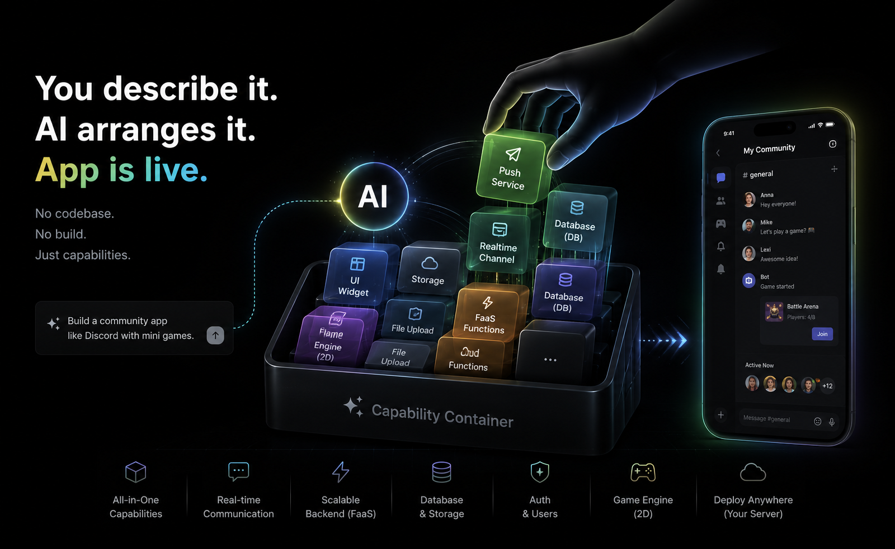
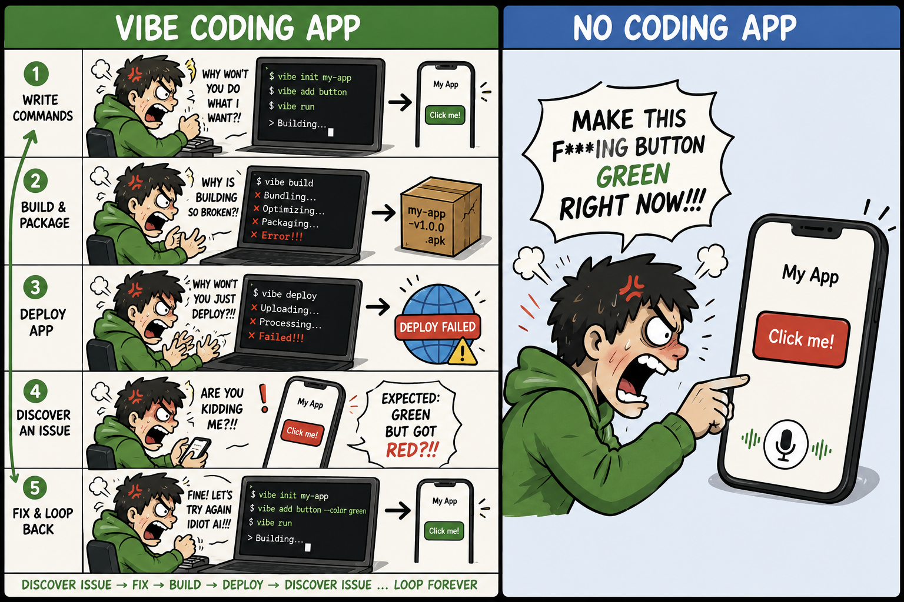
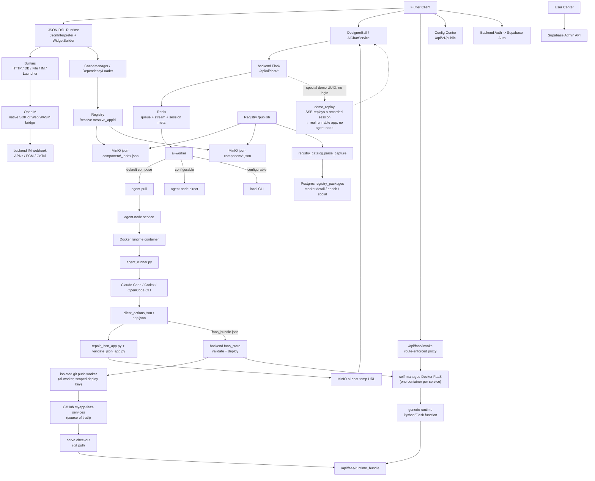

# MyApp

[中文](README.zh.md) · [English](README.md) · [Deutsch](README.de.md) · [Español](README.es.md) · [Français](README.fr.md) · [Português](README.pt.md) · [Català](README.ca.md) · **हिन्दी** · [한국어](README.ko.md) · [日本語](README.ja.md) · [Italiano](README.it.md)

<div align="center">

### vibe-*coding* बंद करें। vibe-*apps* शिप करें।

**बस बताइए → एक फुल-स्टैक ऐप (UI + असली बैकएंड + डेटाबेस) हर स्क्रीन पर लाइव।**

**न codebase। न build। न deploy। न ऐप स्टोर।**

</div>

> पूरी इंडस्ट्री अभी भी इसी बहस में उलझी है कि AI से *कोड कैसे लिखें*। हमने कोड को ही छोड़ दिया।
>
> Vibe coding — बेहतरीन AI ऐप बिल्डर (Lovable, Bolt, v0, Replit) तक — आपको फिर भी एक **codebase** थमाते हैं जिसे जोड़ना, होस्ट करना और शिप करना पड़ता है। MyApp आपको **चलता हुआ ऐप** थमाता है: आप बताते हैं कि आपको क्या चाहिए, AI एक JSON-DSL फ्रंट-एंड **और**, जब ऐप को ज़रूरत हो, अपने अलग-थलग Postgres डेटाबेस वाला एक असली Python/Flask बैकएंड उत्सर्जित करता है — फिर पूरी चीज़ को एक पूर्व-संकलित, क्रॉस-प्लेटफ़ॉर्म रनटाइम के भीतर तुरंत रेंडर और चलाता है। *वही* एक वाक्य एक **खेलने योग्य गेम** या **लॉगिन, पोस्ट और थ्रेडेड रिप्लाई वाले असली बैकएंड के साथ एक फ़ोरम** खड़ा कर सकता है — **एक ही विवरण से iOS, Android, Web, और डेस्कटॉप पर लाइव**। न कोई प्रोजेक्ट खोलना है, न कुछ कंपाइल करना है, न कुछ deploy करना है।


<div align="center">



</div>

### From vibe *coding* to *no* coding

Vibe coding — even the best AI app builders — still keeps you in the loop: write commands, build, package, deploy, spot the bug, argue with the AI, loop back. We deleted the loop. You talk straight to the app on your phone — *"make this button green"* — and it changes. Nothing to compile, nothing to publish, no project to open.

<div align="center">


</div>

You end up arguing with the AI either way — so drop the toolchain and argue straight at the app in your hand.

<div align="center">



</div>


[](LICENSE)
[](https://flutter.dev)
[]()
[](JSON-DSL.md)

> **प्लेटफ़ॉर्म स्थिति**: ✅ उत्पादन (iOS/Android/Web) • ⚠️ प्रायोगिक (macOS, केवल मुख्य फीचर) • 🚧 अपरीक्षित (Linux/Windows)

---

## Vibe *coding* बनाम vibe *app*

|  | Vibe coding / AI ऐप बिल्डर | **MyApp — एक vibe app** |
|---|---|---|
| आपको क्या मिलता है | एक **codebase** (React/Next + एक बैकएंड) | एक **चलता हुआ ऐप** |
| आर्टिफैक्ट | कोड जिसे आप होस्ट, मेंटेन और संभालते रहते हैं | एक JSON कॉन्फ़िग — **मेंटेन करने को कोई कोड नहीं** |
| शिप करने का चरण | Build → deploy → (ऐप-स्टोर समीक्षा) | **कोई नहीं।** यह पहले से ही लाइव है। |
| कहाँ चलता है | आमतौर पर एक वेब ऐप | **iOS · Android · Web · macOS · Linux · Windows** — एक ही विवरण |
| बैकएंड | "Supabase खुद जोड़ो" | **AI-जनित Python/Flask + अलग-थलग Postgres**, आपके लिए तैनात |
| दायरा | फ़ॉर्म, डैशबोर्ड, CRUD | …**और रियल-टाइम चैट, और खेलने योग्य गेम** (Tetris, 2048, एक प्लेटफ़ॉर्मर) — *वही* रनटाइम से |

यह कोई ऐसा खोखला नारा नहीं है जिसे हम साबित न कर सकें। पढ़ते रहिए — इंजन के आँकड़े नीचे हैं।

---

## यह क्या है?

एक ही रिपॉज़िटरी में तीन चीज़ें:

1. **एक Flutter सर्वर-संचालित UI इंजन** (`lib/`) — किसी JSON-DSL कॉन्फ़िग को रनटाइम पर एक असली, नेटिव, क्रॉस-प्लेटफ़ॉर्म ऐप में बदलता है। **91 विजेट प्रकार, 100+ अंतर्निहित फ़ंक्शन, एक 28-ऑपरेटर एक्सप्रेशन इंजन, और एक पूर्ण 2D गेम इंजन** — सब क्लाइंट में पूर्व-संकलित।
2. **एक फुल-स्टैक AI जनरेटर** (`backend/`, `user_center/`, `config_center/`) — AI JSON फ्रंट-एंड **और एक मेल खाता FaaS बैकएंड + अलग-थलग Postgres डेटाबेस** उत्पन्न करता है जब ऐप को इसकी ज़रूरत हो, ऑथ (Supabase), IM (OpenIM), पुश (APNs + FCM), AI चैट प्रॉक्सी, पैकेज रजिस्ट्री, और उपयोगकर्ता एडमिन के ऊपर।
3. **एक पैकेज इकोसिस्टम** (`templates/`) — 70+ उदाहरण JSON-App और पुन: प्रयोज्य लाइब्रेरी (IM, गेम, उपयोगकर्ता प्रोफ़ाइल, कैलकुलेटर, डैशबोर्ड…) जिन्हें आप रनटाइम के ऊपर इंस्टॉल कर सकते हैं।

नाम **MyApp** जानबूझकर रखा गया है: प्रत्येक उपयोगकर्ता साझा रनटाइम के ऊपर "मेरा ऐप" बना, इंस्टॉल और संचालित कर सकता है।

प्रमुख उपयोग का मामला: **एक उपयोगकर्ता ऐप खोलता है → AI से चैट करता है → AI एक JSON-DSL लौटाता है (और एक बैकएंड, अगर ज़रूरत हो) → ऐप इसे क्लाइंट में पहले से संकलित क्षमताओं के भीतर तुरंत लोड और चलाता है।** कोई बिल्ड नहीं, कोई समीक्षा नहीं, किसी ऐप स्टोर का इंतज़ार नहीं।

---

## प्लेटफ़ॉर्म समर्थन

MyApp को Flutter के साथ बनाया गया है और यह अलग-अलग फीचर पूर्णता के साथ कई प्लेटफ़ॉर्म का समर्थन करता है:

### ✅ उत्पादन के लिए तैयार (सभी फीचर)

- **iOS** — पूर्ण समर्थन, जिसमें IM, पुश सूचनाएँ, कैमरा, बायोमेट्रिक ऑथ, सभी मूल क्षमताएँ शामिल हैं
- **Android** — पूर्ण समर्थन, जिसमें IM, पुश सूचनाएँ, कैमरा, बायोमेट्रिक ऑथ, सभी मूल क्षमताएँ शामिल हैं
- **Web** — OpenIM WASM ब्रिज के माध्यम से IM के साथ पूर्ण समर्थन (पुश सूचनाएँ उपलब्ध नहीं हैं)

### ⚠️ प्रायोगिक (मुख्य फीचर)

- **macOS** — परीक्षित और अच्छी तरह काम करता है। मुख्य JSON रनटाइम, UI रेंडरिंग, ऑथ, AI चैट, फ़ाइल पिकर, और बायोमेट्रिक ऑथ सभी काम करते हैं। तृतीय-पक्ष SDK सीमाओं के कारण IM चैट और पुश सूचनाएँ समर्थित नहीं हैं।

### 🚧 अपरीक्षित (संभवतः काम करेगा)

- **Linux** — बिल्ड कॉन्फ़िगरेशन मौजूद है और मुख्य फीचर के लिए काम करना चाहिए। IM चैट और पुश सूचनाएँ समर्थित नहीं हैं।
- **Windows** — बिल्ड कॉन्फ़िगरेशन मौजूद है और मुख्य फीचर के लिए काम करना चाहिए। IM चैट और पुश सूचनाएँ समर्थित नहीं हैं।

### फीचर उपलब्धता

| फीचर | iOS | Android | Web | macOS | Linux | Windows |
|---------|-----|---------|-----|-------|-------|---------|
| JSON-DSL रनटाइम | ✅ | ✅ | ✅ | ✅ | ⚠️ | ⚠️ |
| UI रेंडरिंग | ✅ | ✅ | ✅ | ✅ | ⚠️ | ⚠️ |
| नेटवर्क और स्टोरेज | ✅ | ✅ | ✅ | ✅ | ⚠️ | ⚠️ |
| IM चैट | ✅ | ✅ | ✅ | ❌ | ❌ | ❌ |
| पुश सूचनाएँ | ✅ | ✅ | ❌ | ❌ | ❌ | ❌ |
| कैमरा | ✅ | ✅ | ✅ | ⚠️ | ❌ | ❌ |
| बायोमेट्रिक ऑथ | ✅ | ✅ | ❌ | ✅ | ❌ | ⚠️ |
| Flame गेम | ✅ | ✅ | ✅ | ✅ | ⚠️ | ⚠️ |

**संकेत-सूची**: ✅ परीक्षित और कार्यशील • ⚠️ अपरीक्षित लेकिन काम करना चाहिए • ❌ समर्थित नहीं

अधिकांश JSON-DSL ऐप सभी प्लेटफ़ॉर्म पर काम करते हैं। प्लेटफ़ॉर्म-विशिष्ट फीचर अनुपलब्ध होने पर स्पष्ट उपयोगकर्ता प्रतिक्रिया के साथ सुचारू रूप से घटित होते हैं।

---

## यह दिलचस्प क्यों है?

- **एक ही बार में फुल-स्टैक — यही अंतर है।** अधिकांश AI ऐप बिल्डर (v0, Lovable, Bolt, …) *फ्रंट-एंड* कोड उत्पन्न करते हैं जिसे आपको अब भी एक बैकएंड से जोड़ना और स्वयं तैनात करना पड़ता है। MyApp फ्रंट-एंड **और** एक असली Python/Flask FaaS बैकएंड उत्पन्न करता है — प्रत्येक अपने अलग-थलग Postgres डेटाबेस, प्रति-ऐप अनुमति मॉडल, और प्रति-कॉलर डेटा अलगाव के साथ — फिर पूरी चीज़ को तुरंत चलाता है। कोई अलग बैकएंड प्रोजेक्ट नहीं, कोई तैनाती चरण नहीं, कोई स्टोर सबमिशन नहीं।
- **कोई कोड आर्टिफैक्ट नहीं।** डिलिवरेबल एक पूर्व-संकलित क्लाइंट में चलने वाला JSON कॉन्फ़िग है, कोई codebase नहीं। न कुछ होस्ट करना, न कुछ मेंटेन करना, न अगली डिपेंडेंसी अपडेट पर कुछ टूटना। किसी ऐप को बस बदलाव बताकर अपडेट करें; अगली बार लोड होते ही यह हर जगह लाइव हो जाता है।
- **सच में क्रॉस-प्लेटफ़ॉर्म।** *वही* JSON-DSL iOS, Android, Web (उत्पादन-परीक्षित), macOS (प्रायोगिक), Linux, और Windows पर रेंडर होता है। अधिकांश "AI ऐप" टूल आपको एक वेब ऐप देते हैं; यह आपको एक ही विवरण से, हर जगह, नेटिव देता है।
- **सर्वर-संचालित** — UI और व्यवहार डेटा को एक निश्चित, पूर्व-संकलित रनटाइम सीमा के माध्यम से भेजें। [ऐप स्टोर अनुपालन नोट्स](docs/APP_STORE_COMPLIANCE.md) देखें।
- **AI-नेटिव** — DSL को LLM-अनुकूल बनाने के लिए डिज़ाइन किया गया है। शामिल AI चैट तीन प्लग करने योग्य एजेंट रनटाइम (Claude Code, Codex, OpenCode) के माध्यम से कई प्रदाताओं (DeepSeek, MiniMax, GLM / Kimi के साथ Volcengine एग्रीगेटर) को चलाता है, साथ ही जनरेशन प्लेबुक और आउटपुट को चलने योग्य बनाए रखने के लिए एक इन-रन विज़ुअल सेल्फ-रिव्यू पास के साथ।
- **बैटरीज़ शामिल** — पुश के साथ IM, AI प्रॉक्सी, पैकेज रजिस्ट्री, नेमस्पेस, मिररिंग, यूज़र सेंटर, एनवायरनमेंट स्विचिंग — सब एक साथ जुड़े हुए। "एक और लो-कोड फ्रेमवर्क जो ऑथ को टाल देता है" नहीं।
- **स्व-होस्ट करने योग्य** — `myapp-ctl deploy` एक ही होस्ट-स्तरीय CLI से बैकएंड स्टैक, एजेंट रनटाइम, रजिस्ट्री, कॉन्फ़िग सेंटर, और सर्विस सीक्रेट्स का प्रबंधन करता है।

---

## क्विकस्टार्ट

### होस्टेड क्लाइंट का उपयोग करें

यदि आप केवल MyApp आज़माना और AI-जनित JSON ऐप चलाना चाहते हैं:

1. होस्टेड Web क्लाइंट खोलें: <https://myapp-web.dapangyu.work/>
2. या iOS TestFlight Public Group 1 इंस्टॉल करें: <https://testflight.apple.com/join/3Fk5Exnn>
3. या Android APK डाउनलोड करें:
   <https://myapp-oss-endpoint.dapangyu.work/myapp-releases/android/apk/latest.apk>
4. सार्वजनिक ऐप ब्राउज़/चलाने के लिए अतिथि के रूप में जारी रखें, या ऐप उत्पन्न करने,
   IM/प्रोफ़ाइल फीचर का उपयोग करने, पैकेज प्रकाशित करने, और निजी Agent Node प्रबंधित करने के लिए साइन इन करें।
5. खाता नहीं है? फ्लोटिंग बॉल पर टैप करें → **Demo** देखें कि AI एक ऐप को
   एंड-टू-एंड कैसे बनाता है और असली परिणाम चलाएँ, बिना साइन इन किए।

पूर्ण उत्पाद उपयोग गाइड [docs/USER_GUIDE.md](docs/USER_GUIDE.md) है।

### स्रोत से क्लाइंट बनाएँ (5 मिनट)

```bash
git clone <this-repository-url> ai-app
cd ai-app
flutter pub get
flutter run -d <ios|android|chrome>
```

डिफ़ॉल्ट कॉन्फ़िग होस्टेड बैकएंड की ओर इशारा करता है। एक निजी बैकएंड से जुड़ने के लिए,
`myapp-ctl client-env` द्वारा प्रिंट किया गया एनवायरनमेंट JSON आयात करें।

Flutter Web IM समर्थन के लिए, चेक-इन किए गए `web/openIM.wasm`, `web/sql-wasm.wasm`,
वर्कर, और ब्रिज बंडल रनटाइम एसेट्स हैं जो `web_openim_bridge/package-lock.json` में पिन की गई
`@openim/wasm-client-sdk` निर्भरता से कॉपी किए गए हैं।
एक ताज़ी मशीन पर या CI में, यदि वे गायब हैं या SDK संस्करण बदलने के बाद हों तो
`flutter build web` से पहले उन्हें पुनर्जनित करें:

```bash
./scripts/build_web_openim.sh
flutter build web
```

Web बिल्ड/रन के लिए, आप रैपर स्क्रिप्ट का भी उपयोग कर सकते हैं ताकि OpenIM Web
एसेट्स पहले जाँचे जाएँ और ज़रूरत पड़ने पर पुनर्जनित हों:

```bash
./scripts/flutter_web.sh run -d chrome
./scripts/flutter_web.sh build web
```

### पूर्ण बैकएंड स्टैक को स्व-होस्ट करें (20 मिनट)

```bash
./deploy/production/install_ctl.sh
myapp-ctl setup --host <public-ip-or-domain> --data-root /mnt/myapp
myapp-ctl deploy --pull
myapp-ctl client-env --terminal-qr
```

इन कमांड को root के रूप में चलाएँ, या समकक्ष Docker और `/etc/myapp` लिखने की
अनुमतियों के साथ। पूर्ण तैनाती और `myapp-ctl` कमांड संदर्भ
[`deploy/production/README.md`](deploy/production/README.md) है।

पहला इंटरैक्टिव `myapp-ctl` रन एक बार CLI भाषा माँगता है (`zh`, `en`,
`de`, `es`, `fr`, `pt`, `ca`, `hi`, `ko`, `ja`, `it`); बाद के बदलाव
`myapp-ctl config lang <lang>` का उपयोग करते हैं। सेटअप विज़ार्ड
AI प्रदाता क्रेडेंशियल और वैकल्पिक ASR, SMTP ईमेल, APNs, FCM, और
GeTui कॉन्फ़िग माँगता है। एक पूर्ण तैनाती क्लाइंट एनवायरनमेंट JSON और QR प्रिंट करती है, और
एक इंटरैक्टिव `test@example.com` परीक्षण खाता बना/अपडेट कर सकती है; इसे फिर से दिखाने के लिए
`myapp-ctl client-env --terminal-qr` दोबारा चलाएँ।

Git चेकआउट से इंस्टॉल किए गए कंट्रोल CLI और उत्पादन तैनाती फ़ाइलों को
अपडेट करें:

```bash
myapp-ctl update
```

एक डेवलपमेंट/परीक्षण होस्ट के लिए जो इस चेकआउट से इमेज बनाता है:

```bash
myapp-ctl setup --host <public-ip-or-domain>
myapp-ctl deploy --build
```

यह MyApp बैकएंड स्टैक को स्थानीय रूप से / एक VPS पर बूट करता है:
- JSON ऐप Postgres + AI सेशन Redis + App MinIO
- Agent node + अलग-थलग Ubuntu एजेंट रनटाइम
- App बैकएंड + AI वर्कर + Registry + Config center + User center

तैनाती के बाद, क्लाइंट का अंतर्निहित **Environment Switcher** (लॉगिन पेज पर ब्रांड को 7 बार टैप करें) आपको अपने स्वयं के स्टैक की ओर इशारा करने देता है।

प्रामाणिक तैनाती गाइड के लिए [`deploy/production/README.md`](deploy/production/README.md) देखें।

### दस्तावेज़ीकरण मानचित्र

| ज़रूरत | दस्तावेज़ |
|---|---|
| MyApp का उपयोग करें, ऐप उत्पन्न करें, एक निजी बैकएंड से जुड़ें, Web appid/स्थानीय JSON डीबग करें | [docs/USER_GUIDE.md](docs/USER_GUIDE.md) |
| बैकएंड स्टैक को इंस्टॉल, अपडेट, संचालित, बैक अप, पुनर्स्थापित, या अनइंस्टॉल करें | [deploy/production/README.md](deploy/production/README.md) |
| वर्तमान बैकएंड/agent-node आर्किटेक्चर को समझें | [backend/ARCHITECTURE.md](backend/ARCHITECTURE.md) |
| ऐप स्टोर समीक्षा/रनटाइम सीमाओं को समझें | [docs/APP_STORE_COMPLIANCE.md](docs/APP_STORE_COMPLIANCE.md) |

---

## आर्किटेक्चर

यह प्रोजेक्ट अब एकल Flutter डेमो की तुलना में एक छोटे ऐप प्लेटफ़ॉर्म के करीब है।
Flutter क्लाइंट एक संकलित रनटाइम है; JSON-APP, कंपोनेंट, एसेट्स, IM,
AI जनरेशन, और **AI-जनित FaaS बैकएंड** सभी बैकएंड स्टैक द्वारा परोसे जाते हैं
— जो एक ही होस्ट पर ऑल-इन-वन चल सकता है (बैकएंड + Docker Compose स्टैक
+ स्व-प्रबंधित Docker FaaS रनटाइम, `docs/faas-docker-runtime.md` देखें)।



| कंपोनेंट | कहाँ | क्या |
|---|---|---|
| Flutter Runtime | `lib/` | क्रॉस-प्लेटफ़ॉर्म संकलित क्लाइंट: JSON-DSL इंटरप्रेटर, विजेट, Flame गेम एटम, एसेट कैश, एनवायरनमेंट स्विचिंग, AI प्रवेश, IM/मीडिया UI |
| Web Runtime Assets | `web/`, `web_openim_bridge/` | Flutter Web द्वारा उपयोग किया जाने वाला OpenIM Web WASM ब्रिज और बिल्ड एसेट्स |
| Backend API | `backend/app.py`, `backend/claude_chat.py` | ऑथ-गेटेड AI चैट, SSE स्ट्रीमिंग, मीडिया अपलोड, पुश, प्रदाता कॉन्फ़िग, और क्लाइंट-सामना करने वाले बैकएंड एंडपॉइंट के लिए Flask API |
| AI Queue / Sessions | `backend/ai_session.py` + Redis | टिकाऊ-ईश AI टास्क मेटाडेटा, सीमाबद्ध वर्कर कतार, फिर से शुरू करने योग्य SSE इवेंट स्ट्रीम, abort/retry स्थिति |
| AI Worker Pool | `backend/ai_worker_daemon.py`, `backend/ai_session.py`, `backend/agent_node_service.py`, `deploy/production/agent_runner.py` | स्वीकृत जॉब्स को Redis के माध्यम से ले जाता है, डिफ़ॉल्ट रूप से पुल-मोड agent-node निष्पादन का उपयोग करता है, और `AI_WORKER_EXECUTION_BACKEND` के आधार पर डायरेक्ट agent-node या स्थानीय CLI पथ भी चला सकता है |
| FaaS Backends | `backend/faas.py`, `backend/faas_store.py`, `backend/faas_push_worker.py`, `backend/faas_runtime_server.py` | AI-जनित Python/Flask बैकएंड: सख्त बंडल सत्यापन, अलग-थलग git push worker → `myapp-faas-services` (GitHub सत्य का स्रोत), स्व-प्रबंधित Docker रनटाइम (प्रति सर्विस एक कंटेनर, कंट्रोल-प्लेन-स्वामित्व वाला deploy/route/cold-wake/scale-to-zero — `docs/faas-docker-runtime.md` देखें), रूट-प्रवर्तित `/api/faas/invoke` प्रॉक्सी, प्रति-उपयोगकर्ता कोटा + create-vs-append |
| Registry | `backend/registry_server.py` | JSON-APP/कंपोनेंट के लिए पैकेज रजिस्ट्री: `_index.json` + MinIO पैकेज फ़ाइलें रनटाइम रिज़ॉल्व स्रोत हैं; Postgres `registry_packages` मार्केट/विवरण/संवर्धन/सोशल इंडेक्स है |
| Object Storage | MinIO / OSS | `json-component` के अंतर्गत सार्वजनिक JSON पैकेज, ऐप मीडिया, `json-app-assets` के अंतर्गत एसेट पैक, अस्थायी AI-जनित JSON URL, और निश्चित ज़ीरो-लॉगिन डेमो ऐप का एक सार्वजनिक `demo` बकेट |
| OpenIM | `backend/openim/` | IM बैकएंड ब्रिज। नेटिव क्लाइंट OpenIM Flutter/नेटिव SDK का उपयोग करते हैं; Web WASM SDK ब्रिज का उपयोग करता है |
| Supabase | `deploy/production/supabase/` | होस्ट-स्थानीय सीक्रेट्स के माध्यम से कॉन्फ़िगर की गई स्व-होस्टेड ऑथ, डेटाबेस, और स्टोरेज-संगत सेवाएँ |
| Config Center | `config_center/` | रिमोट कॉन्फ़िग फ़्लैग और एनवायरनमेंट-विशिष्ट क्लाइंट कॉन्फ़िगरेशन |
| User Center | `user_center/` | उपयोगकर्ता भूमिकाओं, बैन, रीसेट फ़्लो, और खाता संचालन के लिए एडमिन UI |
| Templates / Libraries | `templates/` | प्रकाशित उदाहरण ऐप और पुन: प्रयोज्य JSON लाइब्रेरी: IM, लॉन्चर, OpenAI चैट, गेम, कंट्रोल, प्रोफ़ाइल, यूटिलिटी |
| Website | `website/` | TS/Vite मार्केटिंग और डेमो साइट, जिसमें एम्बेडेड वेब क्लाइंट पूर्वावलोकन शामिल है |
| Control Plane | `deploy/production/`, `scripts/myapp_ctl/` | परीक्षण और उत्पादन होस्ट के लिए `myapp-ctl` status/log/secret/domain/image/deploy प्रबंधन |

मुख्य फ़्लो:

1. **AI ऐप जनरेशन**: क्लाइंट एक चैट टास्क भेजता है -> बैकएंड Redis में queue/meta लिखता है -> वर्तमान उत्पादन डिफ़ॉल्ट जॉब को agent-pull पथ पर रखता है -> एक agent-node एक अलग-थलग रनटाइम कंटेनर शुरू करता है -> `agent_runner.py` कॉन्फ़िगर किए गए एजेंट (Claude Code / Codex / OpenCode) को चलाता है -> agent-node इवेंट/आर्टिफैक्ट वापस स्ट्रीम करता है -> बैकएंड जनित JSON को सत्यापित/मरम्मत/अपलोड करता है -> क्लाइंट फिर से शुरू करने योग्य SSE के माध्यम से एक संरचित `json_app_ready` इवेंट प्राप्त करता है।
2. **पैकेज इंस्टॉल**: क्लाइंट पेजिनेशन/खोज या `/resolve(_appid)` के साथ Registry को क्वेरी करता है -> Registry `_index.json` और MinIO पैकेज फ़ाइलों के माध्यम से रिज़ॉल्व करता है -> क्लाइंट JSON डाउनलोड करता है -> डिपेंडेंसी लोडर लाइब्रेरी रिज़ॉल्व करता है और उन्हें स्थानीय रूप से कैश करता है। मार्केट विवरण, सारांश, लाइक, और इंस्टॉल Postgres `registry_packages` साइड इंडेक्स से आते हैं।
3. **IM**: मोबाइल नेटिव OpenIM SDK पथ का उपयोग करता है; Web `web_openim_bridge` के माध्यम से `openim/wasm-client-sdk` का उपयोग करता है, फ्रेमवर्क-स्तरीय संगतता के साथ ताकि JSON IM ऐप एक ही API आकार को कॉल करें।
4. **स्व-होस्ट बैकएंड**: `myapp-ctl secret` होस्ट-स्थानीय क्रेडेंशियल का प्रबंधन करता है; `myapp-ctl deploy --pull` या `myapp-ctl deploy --build` बैकएंड स्टैक और एजेंट रनटाइम शुरू करता है।

---

## JSON-DSL

एक 100-लाइन MyApp कॉन्फ़िग स्क्रीन, नेविगेशन, नेटवर्क कॉल, एनिमेशन, नेटिव विजेट वाला एक पूर्ण ऐप बन सकता है। DSL को [JSON-DSL.md](JSON-DSL.md) में प्रलेखित किया गया है।

न्यूनतम उदाहरण:

```json
{
  "dsl": "3.3",
  "meta": { "name": "hello", "version": "1.0.0", "type": "app" },
  "global": { "count": 0 },
  "ui": {
    "screens": [{
      "name": "home",
      "body": {
        "type": "container",
        "layout": "column",
        "children": [
          { "type": "text", "value": "Counter: {{ global.count }}" },
          { "type": "button", "label": "+1", "action": {
            "call": "@set",
            "args": { "var": "global.count", "value": { "+": [{ "var": "global.count" }, 1] } }
          }}
        ]
      }
    }]
  }
}
```

इसे AI जनरेशन फ़्लो के माध्यम से डालें, या `flutter run` करें और डिस्क से JSON फ़ाइल चुनें।

---

## फीचर

### इंजन
- **91 विजेट प्रकार** — text / button / input / list / container / image / video / chart / map / webview / camera / qr / tab_view / **एक पूर्ण Flame 2D गेम स्टैक** (गेम कैनवास, एनालॉग स्टिक, पार्टिकल/प्रोजेक्टेड-सीन कैनवास) / एनिमेशन (animated_*, Rive) / उन्नत जेस्चर (जेस्चर पासवर्ड, स्लाइड-टू-वेरिफ़ाई) / sliver-स्तरीय लेआउट
- **28 कस्टम ऑपरेटरों के साथ JsonLogic एक्सप्रेशन इंजन** (string / array / type / math)
- **100+ अंतर्निहित `@`-फ़ंक्शन** — HTTP (सभी verb + SSE), एक असली DB लेयर (query/insert/update/delete + key-value + create_table), IM (friends / conversations / history / inbox), फ़ाइल I/O, बायोमेट्रिक ऑथ, क्लिपबोर्ड, हैप्टिक्स, अनुमतियाँ, इमेज पिकिंग, थीमिंग, i18n, नेविगेशन, डायलॉग, गेम कंट्रोल
- समवर्ती चरणों के लिए `@parallel`
- टेम्पलेट `{{ path }}` मूल प्रकार में रिज़ॉल्व होते हैं (स्ट्रिंग में नहीं)
- नेटवर्क / डिस्क / रजिस्ट्री से हॉट-स्वैप कॉन्फ़िग
- संवेदनशील क्षमताओं के लिए प्रति-ऐप प्राधिकरण गेट (ऑथ टोकन, प्रोफ़ाइल)
- **क्लाइंट UI 11 भाषाओं में स्थानीयकृत** (zh / en / de / es / fr / pt / ca / hi / ko / ja / it)

### बैकएंड
- **AI-जनित FaaS फुल-स्टैक** — AI प्रति "सर्विस ग्रुप" (1 फ़ंक्शन सर्विस + वैकल्पिक Postgres DB) एक सत्यापित Python/Flask बैकएंड उत्सर्जित करता है, जिसे स्व-प्रबंधित Docker FaaS रनटाइम (प्रति सर्विस एक कंटेनर, scale-to-zero + cold-wake) पर तैनात किया जाता है। प्रति-ऐप स्कीमा अलगाव, अप्राप्य इन-ग्रुप छद्मनाम पहचान, बैकएंड-मध्यस्थता वाली प्रति-कॉलर डेटा पहुँच (फ़ंक्शन कोड कभी DB कनेक्शन नहीं रखता), कंटेनर हार्डनिंग, और एक निरस्त करने योग्य 3-स्तरीय एक्सेस नीति।
- Supabase ऑथ एकीकरण
- प्रदाता-स्कोप वाली कतारों और अलग-थलग एजेंट निष्पादन के साथ AI चैट — प्रदाता (DeepSeek, MiniMax, Volcengine एग्रीगेटर: GLM / Kimi) × तीन एजेंट रनटाइम (Claude Code, Codex, OpenCode), साथ ही जनरेशन प्लेबुक और एक इन-रन विज़ुअल सेल्फ-रिव्यू पास
- **ज़ीरो-लॉगिन डेमो मोड** — अप्रमाणित उपयोगकर्ता फ्लोटिंग बॉल पर टैप करते हैं → Demo, एक असली-दिखने वाली AI जनरेशन शुरू करते हैं जो एक रिकॉर्ड किए गए सेशन को SSE-रीप्ले करती है, और एक वास्तव में चलने योग्य ऐप पाते हैं (कोई agent-node नहीं, कोई FaaS निर्माण नहीं) — पूरे फ़्लो का तत्काल स्वाद — यह डेमो **वास्तविक, रिकॉर्ड किए गए जेनरेशन रन का त्वरित रीप्ले** है; इसके बहुभाषी टेक्स्ट **बाद में लोकलाइज़ेशन में जोड़े गए**
- चैनल-अज्ञेय पुश (APNs + FCM, और जोड़ना आसान)
- नेमस्पेस + semver + डिपेंडेंसी रिज़ॉल्यूशन के साथ पैकेज रजिस्ट्री
- **क्रॉस-इंस्टेंस मिरर** — स्व-होस्टेड इंस्टेंस अपस्ट्रीम से पैकेज मिरर कर सकता है (आलसी फ़ाइल प्रॉक्सी + 10-मिनट इंडेक्स सिंक)
- उपयोगकर्ता एडमिन UI (भूमिका / बैन / पासवर्ड रीसेट)
- ऑडिट लॉग

### तैनाती
- फुल-स्टैक या कंपोनेंट-स्तरीय बैकएंड तैनाती के लिए `myapp-ctl deploy`
- होस्ट-स्थानीय प्रदाता, पुश, OSS, और बैकएंड सीक्रेट्स के लिए `myapp-ctl secret`
- AI वर्कर के लिए अलग-थलग पुल-आधारित agent-node + Docker रनटाइम
- मीडिया अपलोड के लिए अंतर्निहित MinIO
- हेल्थचेक, लॉग, रीस्टार्ट, स्थिति, और एजेंट निरीक्षण कमांड

---

## स्थिति

| क्षेत्र | अवस्था |
|---|---|
| इंजन (Dart) | उत्पादन। 64k LOC, 91 विजेट, 100+ बिल्टिन। एक असली ऐप को संचालित करता है। क्लाइंट UI 11 भाषाओं में स्थानीयकृत। |
| बैकएंड (Python) | उत्पादन। 32k LOC। असली उपयोगकर्ताओं के साथ चल रहा है। |
| परीक्षण | विजेट स्मोक टेस्ट और JSON रिग्रेशन सूट (`templates/regression-test.json`)। कवरेज जोड़ने वाले PR का बहुत स्वागत है। |
| दस्तावेज़ | मध्यम (`JSON-DSL.md`, `deploy/production/README.md`, बैकएंड आर्किटेक्चर नोट्स)। सुधर रहे हैं। |
| API स्थिरता | DSL v3.4 — v4 तक छोटे ब्रेकिंग बदलाव संभव हैं। बैकएंड HTTP API स्थिर। |
| सार्वजनिक रूप से होस्टेड? | हाँ (उचित उपयोग के अधीन, Terms देखें) |

---

## योगदान

मुद्दे, PR, चर्चाएँ सभी का स्वागत है।

- [`CLAUDE.md`](CLAUDE.md) में दस्तावेज़ीकरण (यदि आप योगदान देने के लिए AI का उपयोग कर रहे हैं तो यह Claude Code निर्देशों के रूप में भी काम करता है)
- [`JSON-DSL.md`](JSON-DSL.md) में JSON-DSL विनिर्देश
- कोड परंपराएँ:
  - टिप्पणियाँ *क्यों* का उत्तर देती हैं, *क्या* का नहीं (कोड दिखाता है कि क्या)
  - काल्पनिक एब्स्ट्रैक्शन से बचें; तीन समान लाइनें एक समयपूर्व इंटरफ़ेस से बेहतर हैं
  - UI बदलावों के लिए, हो गया दावा करने से पहले एक ब्राउज़र/सिम्युलेटर में गोल्डन पथ *और* एज केस का परीक्षण करें

---

## लाइसेंस

Apache License 2.0 — [LICENSE](LICENSE) और [NOTICE](NOTICE) देखें।

आप कर सकते हैं:
- इसे वाणिज्यिक उत्पादों में उपयोग करना
- स्वतंत्र रूप से फ़ोर्क और संशोधित करना
- पूरे स्टैक को स्व-होस्ट करना

आप नहीं कर सकते:
- बिना अनुमति के **"MyApp" नाम या लोगो** का उपयोग करना (अनुमति का अनुरोध करने के लिए, [एक इश्यू खोलें](https://github.com/dapangyu-fish/ai-app/issues))
- कोड के मूल को गलत तरीके से प्रस्तुत करना

मार्केटप्लेस पैकेज, अपलोड किए गए एसेट्स, और उपयोगकर्ता-निर्मित JSON ऐप उनके लेखकों के स्वामित्व और
लाइसेंस के अधीन हैं जब तक वे स्पष्ट रूप से अन्यथा न कहें।

---

## आभार

- [Flutter](https://flutter.dev) — UI फ्रेमवर्क
- [Supabase](https://supabase.com) — ऑथ + DB + स्टोरेज बैकएंड
- [OpenIM](https://github.com/openimsdk) — IM SDK + सर्वर
- [Anthropic Claude Code CLI](https://docs.claude.com/en/docs/claude-code) — AI जनरेशन रनटाइम
- [JsonLogic](https://jsonlogic.com) — एक्सप्रेशन इंजन

---

## रोडमैप (प्राथमिकता क्रम में)

- [ ] एक 60-सेकंड वायरल डेमो वीडियो जारी करें (AI → JSON कॉन्फ़िग → ऐप तुरंत चलता है, कोई बिल्ड/तैनाती नहीं)
- [ ] सार्वजनिक होस्टेड मुफ़्त टियर
- [ ] QR के साथ ऐप शेयर-लिंक (डीप लिंक के माध्यम से AI-जनित ऐप खोलें)
- [ ] CI जोड़ें (GitHub Actions: pub get, analyze, build APK)
- [ ] अधिक उदाहरण JSON-APP (todo, notes, फिटनेस ट्रैकर)
- [x] प्रॉम्प्ट सिस्टम v2: लंबा जनरेशन प्रॉम्प्ट एक `index.md` राउटर + प्रति-टास्क कार्ड (`backend/prompts/generation/`) में स्तरित पाइपलाइन के साथ विभाजित है, साथ ही जनरेशन प्लेबुक (`docs/playbooks/`); JSON सत्यापन/मरम्मत `validate_json_app.py` / `repair_json_app.py` टूलिंग में रहती है
- [x] मल्टी-एजेंट + मल्टी-प्रदाता जनरेशन: Claude Code / Codex / OpenCode एजेंट रनटाइम × DeepSeek / MiniMax / Volcengine-एग्रीगेटर (GLM, Kimi) प्रदाता, प्रति सेशन चयन योग्य
- [x] ज़ीरो-लॉगिन डेमो मोड: रिकॉर्ड की गई जनरेशन का SSE-रीप्ले ताकि अप्रमाणित उपयोगकर्ता तुरंत एक असली चलने योग्य ऐप पाएँ (कोई agent-node / FaaS नहीं)
- [ ] वर्तमान तीन-एजेंट सेट से परे अधिक एजेंट रनटाइम / प्रदाता एग्रीगेटर जोड़ें
- [ ] JSON-APP के लिए ऑडियो समर्थन (रिकॉर्डिंग, प्लेबैक, अपलोड, और पुन: प्रयोज्य ऑडियो UI/एक्शन)
- [x] FaaS समर्थन: AI वार्तालाप Python/Flask बैकएंड फ़ंक्शन बनाते हैं, जिन्हें स्व-प्रबंधित Docker FaaS रनटाइम (प्रति सर्विस एक कंटेनर, कंट्रोल-प्लेन-स्वामित्व वाला deploy/route/cold-wake/scale-to-zero) द्वारा परोसा जाता है, सख्त बंडल सत्यापन, GitHub सत्य-का-स्रोत (`myapp-faas-services`), एक अलग-थलग git push worker, प्रति-उपयोगकर्ता कोटा + create-vs-append, और एक रूट-प्रवर्तित invoke प्रॉक्सी के साथ
- [ ] FaaS स्केल-आउट: मल्टी-नोड Docker FaaS + बैकएंड सेकेंडरी रूटिंग (क्षैतिज स्केल) और उपयोगकर्ता-निजी faas नोड (agent-node रजिस्ट्री पैटर्न का पुन: उपयोग)
- [ ] **प्रति-JSON-APP पुश अलगाव + डीप-लिंक + ऑप्ट-इन प्राधिकरण**: ऐप-स्कोप मैसेज एनवेलप (`app_id` + लक्ष्य `route` + `params`) ताकि एक सूचना किसी विशिष्ट JSON-APP स्क्रीन में रूट हो सके; प्राप्तकर्ताओं को प्रति ऐप/प्रेषक/सर्विस ऑप्ट इन करना होगा (डिफ़ॉल्ट बंद, दुरुपयोग-विरोधी); टैप-रूटिंग ऐप को लक्ष्य स्क्रीन पर खोलती है यदि इंस्टॉल हो, अन्यथा एक फ्रेमवर्क "install A" आमंत्रण फ़ॉलबैक। डिज़ाइन: [docs/planning/push-jsonapp-isolation.md](docs/planning/push-jsonapp-isolation.md)
- [ ] DSL v4 (ब्रेकिंग-चेंज विंडो को स्थिर करें)
- [ ] इंटरप्रेटर के आसपास अधिक परीक्षण
- [ ] प्रदर्शन: ऑफ-स्क्रीन सबट्री की व्याख्या को स्थगित करें

---

*ध्यान से बनाया गया। प्रतिक्रिया के लिए खुला।*
