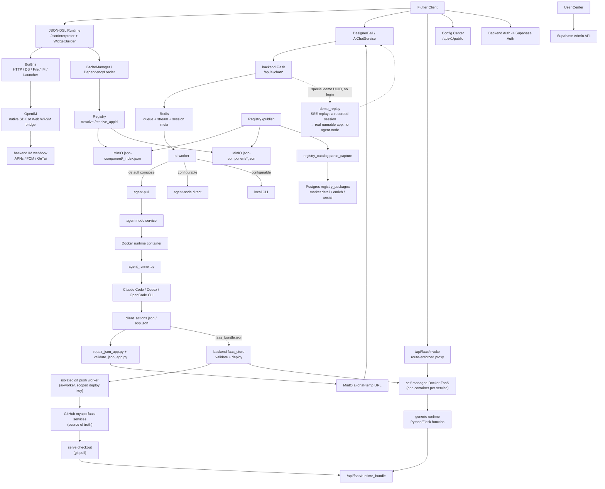

# MyApp

[中文](README.zh.md) · [English](README.md) · [Deutsch](README.de.md) · [Español](README.es.md) · [Français](README.fr.md) · [Português](README.pt.md) · [Català](README.ca.md) · [हिन्दी](README.hi.md) · [한국어](README.ko.md) · [日本語](README.ja.md) · **Italiano**

<div align="center">

### Basta vibe-*coding*. Lancia vibe-*app*.

**Descrivila → un'app full-stack (UI + backend reale + database) è live su ogni schermo.**

**Niente codebase. Niente build. Niente deploy. Niente app store.**

</div>

> Tutto il settore sta ancora discutendo su come *scrivere codice* con l'IA. Noi il codice l'abbiamo saltato.
>
> Il vibe coding — anche i migliori costruttori di app IA (Lovable, Bolt, v0, Replit) — ti consegna comunque un **codebase** da collegare, ospitare e pubblicare. MyApp ti consegna l'**app in esecuzione**: descrivi ciò che vuoi, l'IA emette un front-end JSON-DSL **e**, quando l'app ne ha bisogno, un vero backend Python/Flask con il proprio database Postgres isolato — poi renderizza ed esegue il tutto immediatamente all'interno di un runtime precompilato e multipiattaforma. La *stessa* frase può dar vita a un **gioco giocabile** o a un **forum con un vero backend con login, post e risposte in thread** — live su **iOS, Android, Web e desktop a partire da una sola descrizione**. Non c'è alcun progetto da aprire, niente da compilare, niente da distribuire.

[](LICENSE)
[](https://flutter.dev)
[]()
[](JSON-DSL.md)

> **Stato della piattaforma**: ✅ Produzione (iOS/Android/Web) • ⚠️ Sperimentale (macOS, solo funzionalità di base) • 🚧 Non testato (Linux/Windows)

---

## Vibe *coding* vs. vibe *app*

|  | Vibe coding / costruttori di app IA | **MyApp — una vibe app** |
|---|---|---|
| Cosa ottieni | Un **codebase** (React/Next + un backend) | Un'**app in esecuzione** |
| L'artefatto | Codice che ospiti, mantieni e accudisci | Una configurazione JSON — **nessun codice da mantenere** |
| Fase di rilascio | Build → deploy → (revisione dell'app store) | **Nessuna.** È già live. |
| Dove gira | Di solito una web app | **iOS · Android · Web · macOS · Linux · Windows** — una sola descrizione |
| Backend | "Collega Supabase da solo" | **Python/Flask generato dall'IA + Postgres isolato**, distribuito per te |
| Gamma | Form, dashboard, CRUD | …**e chat in tempo reale, e giochi giocabili** (Tetris, 2048, un platform) dallo *stesso* runtime |

Non è uno slogan campato in aria. Continua a leggere — i numeri del motore sono qui sotto.

---

## Cos'è questo?

Tre cose in un unico repository:

1. **Un motore Flutter di UI server-driven** (`lib/`) — interpreta una configurazione JSON-DSL in una vera app nativa e multipiattaforma in fase di esecuzione. **91 tipi di widget, oltre 100 funzioni integrate, un motore di espressioni con 28 operatori e un motore di gioco 2D completo** — tutto precompilato nel client.
2. **Un generatore full-stack basato su IA** (`backend/`, `user_center/`, `config_center/`) — l'IA genera il front-end JSON **e un backend FaaS corrispondente + database Postgres isolato** quando l'app ne ha bisogno, sopra autenticazione (Supabase), IM (OpenIM), push (APNs + FCM), proxy chat IA, registro dei pacchetti e amministrazione utenti.
3. **Un ecosistema di pacchetti** (`templates/`) — oltre 70 JSON-App di esempio e librerie riutilizzabili (IM, giochi, profilo utente, calcolatrice, dashboard…) che puoi installare sopra il runtime.

Il nome **MyApp** è intenzionale: ogni utente può creare, installare e gestire "la mia app" sopra il runtime condiviso.

Il caso d'uso di punta: **un utente apre l'app → chatta con l'IA → l'IA restituisce un JSON-DSL (e un backend, se necessario) → l'app lo carica ed esegue immediatamente** all'interno delle capacità già compilate nel client. Nessuna build, nessuna revisione, nessuna attesa di un app store.

---

## Supporto delle piattaforme

MyApp è costruito con Flutter e supporta più piattaforme con diversi livelli di completezza delle funzionalità:

### ✅ Pronto per la produzione (tutte le funzionalità)

- **iOS** — Supporto completo incluso IM, notifiche push, fotocamera, autenticazione biometrica, tutte le capacità native
- **Android** — Supporto completo incluso IM, notifiche push, fotocamera, autenticazione biometrica, tutte le capacità native
- **Web** — Supporto completo con IM tramite bridge WASM OpenIM (notifiche push non disponibili)

### ⚠️ Sperimentale (funzionalità di base)

- **macOS** — Testato e funzionante bene. Il runtime JSON di base, il rendering UI, l'autenticazione, la chat IA, il selettore di file e l'autenticazione biometrica funzionano tutti. La chat IM e le notifiche push non sono supportate a causa di limitazioni dell'SDK di terze parti.

### 🚧 Non testato (probabilmente funzionante)

- **Linux** — Ha la configurazione di build e dovrebbe funzionare per le funzionalità di base. La chat IM e le notifiche push non sono supportate.
- **Windows** — Ha la configurazione di build e dovrebbe funzionare per le funzionalità di base. La chat IM e le notifiche push non sono supportate.

### Disponibilità delle funzionalità

| Funzionalità | iOS | Android | Web | macOS | Linux | Windows |
|---------|-----|---------|-----|-------|-------|---------|
| Runtime JSON-DSL | ✅ | ✅ | ✅ | ✅ | ⚠️ | ⚠️ |
| Rendering UI | ✅ | ✅ | ✅ | ✅ | ⚠️ | ⚠️ |
| Rete e archiviazione | ✅ | ✅ | ✅ | ✅ | ⚠️ | ⚠️ |
| Chat IM | ✅ | ✅ | ✅ | ❌ | ❌ | ❌ |
| Notifiche push | ✅ | ✅ | ❌ | ❌ | ❌ | ❌ |
| Fotocamera | ✅ | ✅ | ✅ | ⚠️ | ❌ | ❌ |
| Autenticazione biometrica | ✅ | ✅ | ❌ | ✅ | ❌ | ⚠️ |
| Giochi Flame | ✅ | ✅ | ✅ | ✅ | ⚠️ | ⚠️ |

**Legenda**: ✅ Testato e funzionante • ⚠️ Non testato ma dovrebbe funzionare • ❌ Non supportato

La maggior parte delle app JSON-DSL funziona su tutte le piattaforme. Le funzionalità specifiche della piattaforma degradano in modo controllato con un chiaro feedback all'utente quando non sono disponibili.

---

## Perché è interessante?

- **Full-stack in un colpo solo — l'elemento differenziante.** La maggior parte dei costruttori di app IA (v0, Lovable, Bolt, …) genera codice *front-end* che devi comunque collegare a un backend e distribuire da solo. MyApp genera il front-end **e** un vero backend FaaS Python/Flask — ciascuno con il proprio database Postgres isolato, un modello di permessi per app e l'isolamento dei dati per chiamante — poi esegue il tutto immediatamente. Nessun progetto backend separato, nessun passaggio di distribuzione, nessuna sottomissione allo store.
- **Nessun artefatto di codice.** Ciò che ottieni è una configurazione JSON in esecuzione in un client precompilato, non un codebase. Niente da ospitare, niente da mantenere, niente che si rompa al prossimo aggiornamento di dipendenze. Aggiorni un'app descrivendone la modifica; è live ovunque al successivo caricamento.
- **Davvero multipiattaforma.** Lo *stesso* JSON-DSL viene renderizzato su iOS, Android, Web (testato in produzione), macOS (sperimentale), Linux e Windows. La maggior parte degli strumenti "app IA" ti dà una web app; questo ti dà app native, ovunque, a partire da una sola descrizione.
- **Server-driven** — distribuisci UI e comportamento come dati attraverso un confine di runtime fisso e precompilato. Vedi le [note sulla conformità all'App Store](docs/APP_STORE_COMPLIANCE.md).
- **Nativo per l'IA** — il DSL è progettato per essere LLM-friendly. La chat IA inclusa esegue più provider (DeepSeek, MiniMax, aggregatore Volcengine con GLM / Kimi) attraverso tre runtime di agente collegabili (Claude Code, Codex, OpenCode), con playbook di generazione e una passata di auto-revisione visiva in fase di esecuzione per mantenere l'output eseguibile.
- **Tutto incluso** — IM con push, proxy IA, registro dei pacchetti, namespace, mirroring, centro utenti, cambio di ambiente — tutto collegato insieme. Non "l'ennesimo framework low-code che rinuncia all'autenticazione".
- **Self-hostable** — `myapp-ctl deploy` gestisce lo stack backend, il runtime degli agenti, il registro, il config center e i segreti dei servizi da un'unica CLI a livello di host.

---

## Avvio rapido

### Usa i client ospitati

Se vuoi solo provare MyApp ed eseguire JSON App generate dall'IA:

1. Apri il client Web ospitato: <https://myapp-web.dapangyu.work/>
2. Oppure installa il gruppo pubblico 1 di iOS TestFlight: <https://testflight.apple.com/join/3Fk5Exnn>
3. Oppure scarica l'APK Android:
   <https://myapp-oss-endpoint.dapangyu.work/myapp-releases/android/apk/latest.apk>
4. Continua come ospite per sfogliare/eseguire app pubbliche, oppure accedi per generare app,
   usare le funzionalità IM/profilo, pubblicare pacchetti e gestire Agent Node privati.
5. Nessun account? Tocca la palla flottante → **Demo** per vedere l'IA costruire un'app
   end-to-end ed eseguire il risultato reale, senza effettuare l'accesso.

La guida completa all'uso del prodotto è [docs/USER_GUIDE.md](docs/USER_GUIDE.md).

### Costruisci il client dai sorgenti (5 minuti)

```bash
git clone <this-repository-url> ai-app
cd ai-app
flutter pub get
flutter run -d <ios|android|chrome>
```

La configurazione predefinita punta al backend ospitato. Per connetterti a un backend privato,
importa il JSON di ambiente stampato da `myapp-ctl client-env`.

Per il supporto IM su Flutter Web, i file `web/openIM.wasm`, `web/sql-wasm.wasm`,
i worker e il bundle del bridge inclusi nel repository sono asset di runtime copiati dalla
dipendenza `@openim/wasm-client-sdk` fissata in `web_openim_bridge/package-lock.json`.
Su una macchina nuova o in CI, rigenerali prima di `flutter build web` se
mancano o dopo aver cambiato la versione dell'SDK:

```bash
./scripts/build_web_openim.sh
flutter build web
```

Per le build/esecuzioni Web, puoi anche usare lo script wrapper in modo che gli asset Web
di OpenIM vengano controllati per primi e rigenerati quando necessario:

```bash
./scripts/flutter_web.sh run -d chrome
./scripts/flutter_web.sh build web
```

### Self-host dell'intero stack backend (20 minuti)

```bash
./deploy/production/install_ctl.sh
myapp-ctl setup --host <public-ip-or-domain> --data-root /mnt/myapp
myapp-ctl deploy --pull
myapp-ctl client-env --terminal-qr
```

Esegui questi comandi come root, o con permessi equivalenti di Docker e di scrittura su `/etc/myapp`.
Il riferimento completo del comando di distribuzione e di `myapp-ctl` è
[`deploy/production/README.md`](deploy/production/README.md).

La prima esecuzione interattiva di `myapp-ctl` chiede una volta la lingua della CLI (`zh`, `en`,
`de`, `es`, `fr`, `pt`, `ca`, `hi`, `ko`, `ja`, `it`); le modifiche successive usano
`myapp-ctl config lang <lang>`. La procedura guidata di configurazione
chiede le credenziali del provider IA e la configurazione opzionale di ASR, email SMTP, APNs, FCM e
GeTui. Una distribuzione completa stampa il JSON di ambiente del client e il QR, e può
creare/aggiornare un account di test interattivo `test@example.com`; riesegui
`myapp-ctl client-env --terminal-qr` per mostrarlo di nuovo.

Aggiorna la CLI di controllo installata e i file di distribuzione di produzione dal
checkout Git:

```bash
myapp-ctl update
```

Per un host di sviluppo/test che costruisce le immagini da questo checkout:

```bash
myapp-ctl setup --host <public-ip-or-domain>
myapp-ctl deploy --build
```

Questo avvia lo stack backend di MyApp localmente / su un VPS:
- Postgres per le JSON app + Redis per le sessioni IA + App MinIO
- Agent node + runtime agente Ubuntu isolato
- Backend dell'app + worker IA + Registry + Config center + User center

Dopo la distribuzione, il **Selettore di ambiente** integrato nel client (tocca il brand 7 volte nella pagina di login) ti permette di puntare al tuo stack.

Vedi [`deploy/production/README.md`](deploy/production/README.md) per la
guida di distribuzione autorevole.

### Mappa della documentazione

| Necessità | Documento |
|---|---|
| Usare MyApp, generare app, connettere un backend privato, fare debug di appid Web/JSON locale | [docs/USER_GUIDE.md](docs/USER_GUIDE.md) |
| Installare, aggiornare, gestire, fare backup, ripristinare o disinstallare lo stack backend | [deploy/production/README.md](deploy/production/README.md) |
| Comprendere l'attuale architettura backend/agent-node | [backend/ARCHITECTURE.md](backend/ARCHITECTURE.md) |
| Comprendere i confini di revisione/runtime dell'App Store | [docs/APP_STORE_COMPLIANCE.md](docs/APP_STORE_COMPLIANCE.md) |

---

## Architettura

Il progetto è ormai più vicino a una piccola piattaforma applicativa che a una singola demo Flutter.
Il client Flutter è un runtime compilato; le JSON-APP, i componenti, gli asset, l'IM,
la generazione IA e i **backend FaaS generati dall'IA** sono tutti serviti dallo stack
backend — che può funzionare tutto-in-uno su un singolo host (backend + stack Docker Compose
+ il runtime FaaS Docker autogestito, vedi `docs/faas-docker-runtime.md`).



| Componente | Dove | Cosa |
|---|---|---|
| Runtime Flutter | `lib/` | Client compilato multipiattaforma: interprete JSON-DSL, widget, atomi di gioco Flame, cache degli asset, cambio di ambiente, ingresso IA, UI IM/media |
| Asset di runtime Web | `web/`, `web_openim_bridge/` | Bridge WASM Web di OpenIM e asset di build usati da Flutter Web |
| API backend | `backend/app.py`, `backend/claude_chat.py` | API Flask per chat IA con accesso autenticato, streaming SSE, caricamento media, push, configurazione dei provider ed endpoint backend rivolti al client |
| Coda / Sessioni IA | `backend/ai_session.py` + Redis | Metadati delle attività IA quasi-durevoli, coda di worker limitata, stream di eventi SSE ripristinabile, stato di interruzione/ritentativo |
| Pool di worker IA | `backend/ai_worker_daemon.py`, `backend/ai_session.py`, `backend/agent_node_service.py`, `deploy/production/agent_runner.py` | Sposta i job accettati attraverso Redis, usa di default l'esecuzione agent-node in modalità pull, e può anche eseguire i percorsi agent-node diretto o CLI locale a seconda di `AI_WORKER_EXECUTION_BACKEND` |
| Backend FaaS | `backend/faas.py`, `backend/faas_store.py`, `backend/faas_push_worker.py`, `backend/faas_runtime_server.py` | Backend Python/Flask generati dall'IA: validazione rigorosa del bundle, push worker git isolato → `myapp-faas-services` (fonte di verità GitHub), runtime Docker autogestito (un container per servizio, distribuzione/routing/cold-wake/scale-to-zero di proprietà del control-plane — vedi `docs/faas-docker-runtime.md`), proxy `/api/faas/invoke` con routing imposto, quota per utente + create-vs-append |
| Registry | `backend/registry_server.py` | Registro dei pacchetti per JSON-APP/componenti: `_index.json` + i file dei pacchetti MinIO sono la fonte di risoluzione in runtime; `registry_packages` di Postgres è l'indice market/dettaglio/arricchimento/sociale |
| Object Storage | MinIO / OSS | Pacchetti JSON pubblici sotto `json-component`, media delle app, asset pack sotto `json-app-assets`, URL JSON temporanei generati dall'IA, e un bucket `demo` pubblico di app demo fisse senza login |
| OpenIM | `backend/openim/` | Bridge backend IM. I client nativi usano l'SDK Flutter/nativo di OpenIM; il Web usa il bridge dell'SDK WASM |
| Supabase | `deploy/production/supabase/` | Servizi self-hosted di autenticazione, database e compatibili con lo storage configurati tramite segreti a livello di host |
| Config Center | `config_center/` | Flag di configurazione remota e configurazione del client specifica per ambiente |
| User Center | `user_center/` | UI di amministrazione per ruoli utente, ban, flussi di reset e operazioni sugli account |
| Template / Librerie | `templates/` | App di esempio pubblicate e librerie JSON riutilizzabili: IM, launcher, chat OpenAI, giochi, controlli, profilo, utilità |
| Sito web | `website/` | Sito di marketing e demo TS/Vite, inclusa l'anteprima del client Web incorporata |
| Control Plane | `deploy/production/`, `scripts/myapp_ctl/` | Gestione di status/log/secret/domain/image/deploy di `myapp-ctl` per host di test e di produzione |

Flussi principali:

1. **Generazione di app IA**: il client invia un'attività di chat -> il backend scrive coda/metadati su Redis -> l'attuale impostazione predefinita di produzione mette il job sul percorso agent-pull -> un agent-node avvia un container di runtime isolato -> `agent_runner.py` esegue l'agente configurato (Claude Code / Codex / OpenCode) -> l'agent-node trasmette in streaming eventi/artefatti indietro -> il backend valida/ripara/carica il JSON generato -> il client riceve un evento strutturato `json_app_ready` attraverso un SSE ripristinabile.
2. **Installazione di pacchetti**: il client interroga il Registry con paginazione/ricerca o `/resolve(_appid)` -> il Registry risolve attraverso `_index.json` e i file dei pacchetti MinIO -> il client scarica il JSON -> il loader delle dipendenze risolve le librerie e le memorizza nella cache locale. I dettagli del market, i riepiloghi, i like e le installazioni provengono dall'indice laterale `registry_packages` di Postgres.
3. **IM**: il mobile usa il percorso dell'SDK nativo OpenIM; il Web usa `openim/wasm-client-sdk` attraverso `web_openim_bridge`, con compatibilità a livello di framework in modo che le app IM JSON chiamino una sola forma di API.
4. **Self-host del backend**: `myapp-ctl secret` gestisce le credenziali a livello di host; `myapp-ctl deploy --pull` o `myapp-ctl deploy --build` avvia lo stack backend e il runtime degli agenti.

---

## Il JSON-DSL

Una configurazione MyApp di 100 righe può diventare un'app completa con schermate, navigazione, chiamate di rete, animazioni, widget nativi. Il DSL è documentato in [JSON-DSL.md](JSON-DSL.md).

Esempio minimo:

```json
{
  "dsl": "3.3",
  "meta": { "name": "hello", "version": "1.0.0", "type": "app" },
  "global": { "count": 0 },
  "ui": {
    "screens": [{
      "name": "home",
      "body": {
        "type": "container",
        "layout": "column",
        "children": [
          { "type": "text", "value": "Counter: {{ global.count }}" },
          { "type": "button", "label": "+1", "action": {
            "call": "@set",
            "args": { "var": "global.count", "value": { "+": [{ "var": "global.count" }, 1] } }
          }}
        ]
      }
    }]
  }
}
```

Inseriscilo attraverso il flusso di generazione IA, oppure usa `flutter run` e scegli il file JSON dal disco.

---

## Funzionalità

### Motore
- **91 tipi di widget** — text / button / input / list / container / image / video / chart / map / webview / camera / qr / tab_view / **uno stack di gioco 2D Flame completo** (canvas di gioco, stick analogico, canvas di particelle/a scena proiettata) / animazioni (animated_*, Rive) / gesti avanzati (password gestuale, slide-to-verify) / layout di livello sliver
- **Motore di espressioni JsonLogic con 28 operatori personalizzati** (stringhe / array / tipi / matematica)
- **Oltre 100 funzioni integrate `@`** — HTTP (tutti i verbi + SSE), un vero livello DB (query/insert/update/delete + chiave-valore + create_table), IM (amici / conversazioni / cronologia / inbox), I/O su file, autenticazione biometrica, appunti, feedback aptico, permessi, selezione immagini, temi, i18n, navigazione, finestre di dialogo, controllo di gioco
- `@parallel` per passaggi concorrenti
- I template `{{ path }}` si risolvono nel tipo originale (non convertito in stringa)
- Scambio a caldo della configurazione da rete / disco / registro
- Gate di autorizzazione per app per le capacità sensibili (token di autenticazione, profilo)
- **UI del client localizzata in 11 lingue** (zh / en / de / es / fr / pt / ca / hi / ko / ja / it)

### Backend
- **Full-stack FaaS generato dall'IA** — l'IA emette un backend Python/Flask validato per ogni "service group" (1 servizio funzione + DB Postgres opzionale), distribuito su un runtime FaaS Docker autogestito (un container per servizio, scale-to-zero + cold-wake). Isolamento dello schema per app, identità pseudonima intra-gruppo non falsificabile, accesso ai dati per chiamante mediato dal backend (il codice della funzione non detiene mai una connessione DB), hardening del container e una politica di accesso revocabile a 3 livelli.
- Integrazione dell'autenticazione Supabase
- Chat IA con code con ambito per provider ed esecuzione di agenti isolata — provider (DeepSeek, MiniMax, aggregatore Volcengine: GLM / Kimi) × tre runtime di agente (Claude Code, Codex, OpenCode), più playbook di generazione e una passata di auto-revisione visiva in fase di esecuzione
- **Modalità demo senza login** — gli utenti non autenticati toccano la palla flottante → Demo, avviano una generazione IA dall'aspetto reale che riproduce in SSE una sessione registrata, e ottengono un'app effettivamente eseguibile (nessun agent-node, nessuna creazione FaaS) — un assaggio immediato dell'intero flusso
- Push agnostico rispetto al canale (APNs + FCM, facile aggiungerne altri)
- Registro dei pacchetti con namespace + semver + risoluzione delle dipendenze
- **Mirror cross-instance** — un'istanza self-hosted può mirrorare i pacchetti da upstream (proxy di file lazy + sincronizzazione dell'indice ogni 10 minuti)
- UI di amministrazione utenti (ruolo / ban / reset password)
- Log di audit

### Distribuzione
- `myapp-ctl deploy` per distribuzione backend full-stack o a livello di componente
- `myapp-ctl secret` per provider a livello di host, push, OSS e segreti del backend
- Agent-node basato su pull isolato + runtime Docker per i worker IA
- MinIO integrato per i caricamenti di media
- Comandi di healthcheck, log, riavvio, status e ispezione degli agenti

---

## Stato

| Area | Stato |
|---|---|
| Motore (Dart) | Produzione. 64k LOC, 91 widget, oltre 100 funzioni integrate. Alimenta un'app reale. UI del client localizzata in 11 lingue. |
| Backend (Python) | Produzione. 32k LOC. Serve utenti reali. |
| Test | Smoke test dei widget più suite di regressione JSON (`templates/regression-test.json`). PR che aggiungono copertura sono molto benvenute. |
| Documentazione | Media (`JSON-DSL.md`, `deploy/production/README.md`, note sull'architettura backend). In miglioramento. |
| Stabilità delle API | DSL v3.4 — possibili modifiche minori che rompono la compatibilità fino alla v4. API HTTP del backend stabile. |
| Ospitato pubblicamente? | Sì (soggetto a uso corretto, vedi i Termini) |

---

## Contribuire

Issue, PR e discussioni sono tutte benvenute.

- Documentazione in [`CLAUDE.md`](CLAUDE.md) (funge anche da istruzioni per Claude Code se stai usando l'IA per contribuire)
- Specifica JSON-DSL in [`JSON-DSL.md`](JSON-DSL.md)
- Convenzioni del codice:
  - I commenti rispondono al *perché*, non al *cosa* (il codice mostra il cosa)
  - Evita astrazioni speculative; tre righe simili sono meglio di un'interfaccia prematura
  - Per le modifiche UI, testa il percorso ideale *e* i casi limite in un browser/simulatore prima di dichiarare fatto

---

## Licenza

Apache License 2.0 — vedi [LICENSE](LICENSE) e [NOTICE](NOTICE).

Puoi:
- Usarlo in prodotti commerciali
- Fare fork e modificare liberamente
- Fare self-host dell'intero stack

Non puoi:
- Usare il **nome o il logo "MyApp"** senza permesso (per richiedere il permesso, [apri una issue](https://github.com/dapangyu-fish/ai-app/issues))
- Travisare l'origine del codice

I pacchetti del marketplace, gli asset caricati e le app JSON create dagli utenti sono di proprietà e
concessi in licenza dai loro autori a meno che non dichiarino esplicitamente diversamente.

---

## Ringraziamenti

- [Flutter](https://flutter.dev) — framework UI
- [Supabase](https://supabase.com) — backend di autenticazione + DB + storage
- [OpenIM](https://github.com/openimsdk) — SDK IM + server
- [Anthropic Claude Code CLI](https://docs.claude.com/en/docs/claude-code) — runtime di generazione IA
- [JsonLogic](https://jsonlogic.com) — motore di espressioni

---

## Roadmap (in ordine di priorità)

- [ ] Pubblicare un video demo virale di 60 secondi (IA → configurazione JSON → app in esecuzione immediata, senza build/deploy)
- [ ] Tier gratuito ospitato pubblicamente
- [ ] Link di condivisione dell'app con QR (apri l'app generata dall'IA tramite deep link)
- [ ] Aggiungere CI (GitHub Actions: pub get, analyze, build APK)
- [ ] Più JSON-APP di esempio (todo, note, fitness tracker)
- [x] Sistema di prompt v2: il lungo prompt di generazione è suddiviso in un router `index.md` + card per attività (`backend/prompts/generation/`) con pipeline a livelli, più playbook di generazione (`docs/playbooks/`); la validazione/riparazione JSON risiede negli strumenti `validate_json_app.py` / `repair_json_app.py`
- [x] Generazione multi-agente + multi-provider: runtime di agente Claude Code / Codex / OpenCode × provider DeepSeek / MiniMax / aggregatore Volcengine (GLM, Kimi), selezionabili per sessione
- [x] Modalità demo senza login: riproduzione SSE di generazioni registrate in modo che gli utenti non autenticati ottengano immediatamente un'app reale eseguibile (nessun agent-node / FaaS)
- [ ] Aggiungere altri runtime di agente / aggregatori di provider oltre all'attuale set di tre agenti
- [ ] Supporto audio per le JSON-APP (registrazione, riproduzione, caricamento e UI/azioni audio riutilizzabili)
- [x] Supporto FaaS: le conversazioni IA creano funzioni backend Python/Flask, servite dal runtime FaaS Docker autogestito (un container per servizio, distribuzione/routing/cold-wake/scale-to-zero di proprietà del control-plane) con validazione rigorosa del bundle, fonte di verità GitHub (`myapp-faas-services`), un push worker git isolato, quota per utente + create-vs-append, e un proxy di invoke con routing imposto
- [ ] Scale-out FaaS: FaaS Docker multi-nodo + routing secondario del backend (scala orizzontale) e nodi faas privati dell'utente (riutilizzando il pattern del registro agent-node)
- [ ] **Isolamento push per JSON-APP + deep-link + autorizzazione opt-in**: envelope di messaggi con ambito per app (`app_id` + `route` di destinazione + `params`) in modo che una notifica possa instradare verso una specifica schermata JSON-APP; i destinatari devono attivare l'opt-in per app/mittente/servizio (disattivato di default, anti-abuso); il tap-routing apre l'app alla schermata di destinazione se installata, altrimenti un fallback di invito framework "installa A". Design: [docs/planning/push-jsonapp-isolation.md](docs/planning/push-jsonapp-isolation.md)
- [ ] DSL v4 (stabilizzare la finestra di modifiche che rompono la compatibilità)
- [ ] Più test attorno all'interprete
- [ ] Prestazioni: rimandare l'interpretazione dei sottoalberi fuori schermo

---

*Costruito con cura. Aperto ai feedback.*
