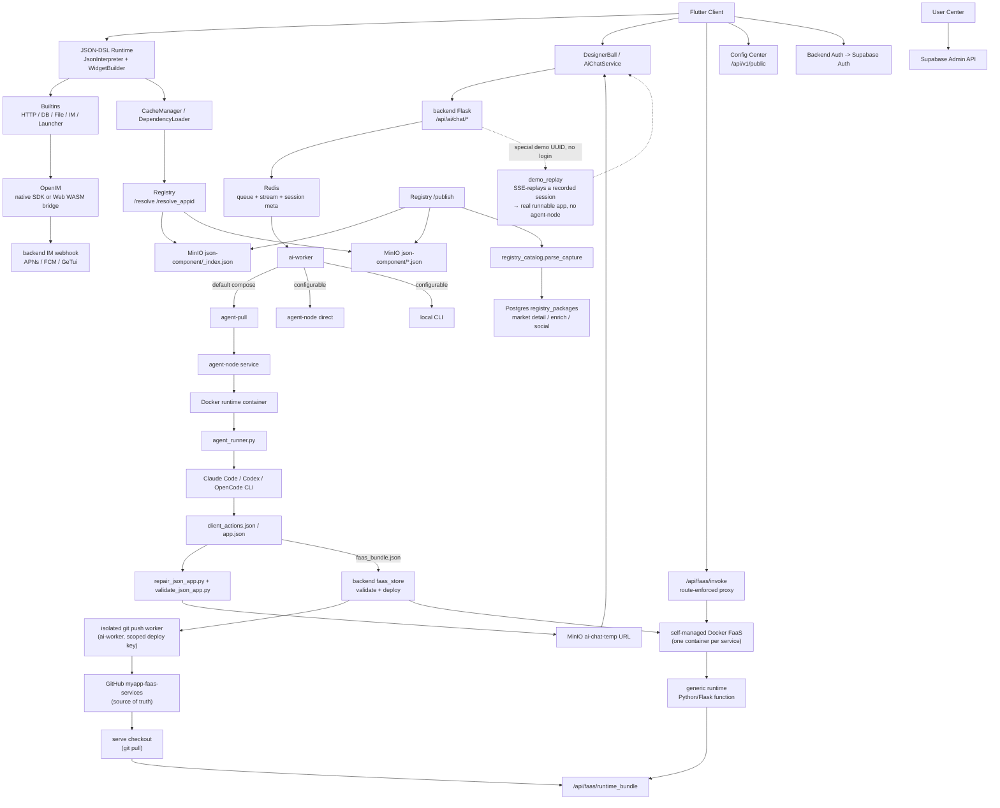

# MyApp

[中文](README.zh.md) · [English](README.md) · [Deutsch](README.de.md) · [Español](README.es.md) · [Français](README.fr.md) · [Português](README.pt.md) · [Català](README.ca.md) · [हिन्दी](README.hi.md) · [한국어](README.ko.md) · **日本語** · [Italiano](README.it.md)

<div align="center">

### vibe-*coding* はもう終わり。vibe-*app* を出荷しよう。

**言葉にするだけ → フルスタックアプリ（UI + 本物のバックエンド + データベース）が、あらゆる画面で動き出す。**

**コードベースなし。ビルドなし。デプロイなし。アプリストアなし。**

</div>

> 業界全体が、いまだに AI で*どうコードを書くか*を議論しています。私たちは、コードそのものを飛ばしました。
>
> vibe coding は——最高の AI アプリビルダー（Lovable、Bolt、v0、Replit）でさえ——配線し、ホスティングし、出荷するための**コードベース**を渡してくるだけです。MyApp が渡すのは**動作するアプリ**そのものです。望むものを伝えれば、AI は JSON-DSL のフロントエンドを生成し、**さらに**アプリが必要とする場合には、独自の独立した Postgres データベースを備えた本物の Python/Flask バックエンドも生成します——そして、事前にコンパイルされたクロスプラットフォームのランタイムの内部で、その全体を即座にレンダリングして実行します。*同じ*一文から、**プレイ可能なゲーム**も、**ログイン・投稿・スレッド形式の返信を備えた本物のバックエンド付きフォーラム**も立ち上がります——**たった 1 つの説明から、iOS、Android、Web、そしてデスクトップで動作します**。開くべきプロジェクトはなく、コンパイルするものも、デプロイするものもありません。

[](LICENSE)
[](https://flutter.dev)
[]()
[](JSON-DSL.md)

> **プラットフォームの状況**: ✅ 本番運用（iOS/Android/Web）• ⚠️ 実験的（macOS、コア機能のみ）• 🚧 未テスト（Linux/Windows）

---

## vibe *coding* 対 vibe *app*

|  | vibe coding / AI アプリビルダー | **MyApp — vibe app** |
|---|---|---|
| 手に入るもの | **コードベース**（React/Next + バックエンド） | **動作するアプリ** |
| 成果物 | 自分でホスティングし、保守し、面倒を見続けるコード | JSON 設定——**保守すべきコードなし** |
| 出荷の手順 | ビルド → デプロイ →（アプリストア審査） | **なし。** すでに動いています。 |
| 動作する場所 | たいていは Web アプリ | **iOS · Android · Web · macOS · Linux · Windows**——たった 1 つの説明から |
| バックエンド | 「Supabase は自分で配線してね」 | **AI 生成の Python/Flask + 独立した Postgres**、デプロイまで代行 |
| 対応範囲 | フォーム、ダッシュボード、CRUD | …**さらにリアルタイムチャットも、プレイ可能なゲームも**（テトリス、2048、横スクロールアクション）、*同じ*ランタイムから |

これは、裏付けのできないスローガンではありません。読み進めてください——エンジンの数字は以下にあります。

---

## これは何か？

1 つのリポジトリに 3 つのもの:

1. **Flutter サーバー駆動型 UI エンジン**（`lib/`）— JSON-DSL 設定を実行時に本物のネイティブなクロスプラットフォームアプリに解釈します。**91 種類のウィジェット、100 以上の組み込み関数、28 演算子の式エンジン、そして完全な 2D ゲームエンジン**——すべてがクライアントに事前コンパイルされています。
2. **フルスタック AI ジェネレーター**（`backend/`, `user_center/`, `config_center/`）— AI が JSON フロントエンドを生成し、**アプリが必要とする場合には、それに対応する FaaS バックエンド + 独立した Postgres データベースも**、認証（Supabase）、IM（OpenIM）、プッシュ（APNs + FCM）、AI チャットプロキシ、パッケージレジストリ、ユーザー管理の上に生成します。
3. **パッケージエコシステム**（`templates/`）— ランタイムの上にインストールできる、70 以上の JSON-App の例と再利用可能なライブラリ（IM、ゲーム、ユーザープロフィール、計算機、ダッシュボード…）。

**MyApp** という名前は意図的なものです。各ユーザーは、共有ランタイムの上に「自分のアプリ（my app）」を作成、インストール、運用できます。

主力ユースケース: **ユーザーがアプリを開く → AI とチャットする → AI が JSON-DSL（必要ならバックエンドも）を返す → アプリがそれを即座に読み込んで実行する**——クライアントにすでにコンパイルされている能力の内部で。ビルドも、審査も、アプリストアでの待ち時間もありません。

---

## プラットフォームサポート

MyApp は Flutter で構築されており、機能の完成度に差はあるものの、複数のプラットフォームをサポートしています:

### ✅ 本番運用可能（全機能）

- **iOS** — IM、プッシュ通知、カメラ、生体認証、すべてのネイティブ能力を含む完全サポート
- **Android** — IM、プッシュ通知、カメラ、生体認証、すべてのネイティブ能力を含む完全サポート
- **Web** — OpenIM WASM ブリッジ経由の IM を含む完全サポート（プッシュ通知は利用不可）

### ⚠️ 実験的（コア機能）

- **macOS** — テスト済みで良好に動作します。コア JSON ランタイム、UI レンダリング、認証、AI チャット、ファイルピッカー、生体認証はすべて動作します。IM チャットとプッシュ通知は、サードパーティ SDK の制限によりサポートされていません。

### 🚧 未テスト（おそらく動作）

- **Linux** — ビルド設定があり、コア機能は動作するはずです。IM チャットとプッシュ通知はサポートされていません。
- **Windows** — ビルド設定があり、コア機能は動作するはずです。IM チャットとプッシュ通知はサポートされていません。

### 機能の利用可否

| 機能 | iOS | Android | Web | macOS | Linux | Windows |
|---------|-----|---------|-----|-------|-------|---------|
| JSON-DSL ランタイム | ✅ | ✅ | ✅ | ✅ | ⚠️ | ⚠️ |
| UI レンダリング | ✅ | ✅ | ✅ | ✅ | ⚠️ | ⚠️ |
| ネットワーク & ストレージ | ✅ | ✅ | ✅ | ✅ | ⚠️ | ⚠️ |
| IM チャット | ✅ | ✅ | ✅ | ❌ | ❌ | ❌ |
| プッシュ通知 | ✅ | ✅ | ❌ | ❌ | ❌ | ❌ |
| カメラ | ✅ | ✅ | ✅ | ⚠️ | ❌ | ❌ |
| 生体認証 | ✅ | ✅ | ❌ | ✅ | ❌ | ⚠️ |
| Flame ゲーム | ✅ | ✅ | ✅ | ✅ | ⚠️ | ⚠️ |

**凡例**: ✅ テスト済み & 動作 • ⚠️ 未テストだが動作するはず • ❌ 非対応

ほとんどの JSON-DSL アプリはすべてのプラットフォームで動作します。プラットフォーム固有の機能は、利用できない場合には明確なユーザーフィードバックを伴って優雅に低下します。

---

## なぜこれが興味深いのか？

- **一発でフルスタック——これが差別化要因です。** ほとんどの AI アプリビルダー（v0、Lovable、Bolt など）は、あなたが自分でバックエンドに配線してデプロイしなければならない*フロントエンド*コードを生成します。MyApp はフロントエンド**と**本物の Python/Flask FaaS バックエンドを生成します——それぞれが独立した Postgres データベース、アプリごとの権限モデル、呼び出し元ごとのデータ分離を備え、その全体を即座に実行します。別個のバックエンドプロジェクトも、デプロイステップも、ストア申請も不要です。
- **コード成果物なし。** 成果物は、コードベースではなく、事前コンパイル済みクライアント上で動作する JSON 設定です。ホスティングするものも、保守するものも、次の依存関係の更新で壊れるものもありません。アプリの更新は、変更内容を伝えるだけ。次に読み込まれたときには、どこでも最新版が動いています。
- **正真正銘のクロスプラットフォーム。** *同じ* JSON-DSL が、iOS、Android、Web（本番テスト済み）、macOS（実験的）、Linux、Windows でレンダリングされます。ほとんどの「AI アプリ」ツールが渡すのは Web アプリですが、これはたった 1 つの説明から、あらゆる場所でネイティブに動くものを渡します。
- **サーバー駆動** — 固定された事前コンパイル済みのランタイム境界を通じて、UI と振る舞いのデータを配信します。[App Store コンプライアンスノート](docs/APP_STORE_COMPLIANCE.md)を参照してください。
- **AI ネイティブ** — DSL は LLM フレンドリーに設計されています。同梱の AI チャットは、3 つのプラガブルなエージェントランタイム（Claude Code、Codex、OpenCode）を通じて複数のプロバイダー（DeepSeek、MiniMax、GLM / Kimi を備えた Volcengine アグリゲーター）を実行し、出力を実行可能に保つための生成プレイブックと実行中のビジュアルセルフレビューパスを備えています。
- **バッテリー同梱** — プッシュ付き IM、AI プロキシ、パッケージレジストリ、名前空間、ミラーリング、ユーザーセンター、環境切り替え——すべてが配線済みです。「認証を先送りにするまた別のローコードフレームワーク」ではありません。
- **セルフホスト可能** — `myapp-ctl deploy` が、バックエンドスタック、エージェントランタイム、レジストリ、コンフィグセンター、サービスシークレットを 1 つのホストレベル CLI から管理します。

---

## クイックスタート

### ホスト型クライアントを使う

MyApp を試して AI 生成 JSON アプリを実行したいだけなら:

1. ホスト型 Web クライアントを開く: <https://myapp-web.dapangyu.work/>
2. または iOS TestFlight Public Group 1 をインストール: <https://testflight.apple.com/join/3Fk5Exnn>
3. または Android APK をダウンロード:
   <https://myapp-oss-endpoint.dapangyu.work/myapp-releases/android/apk/latest.apk>
4. ゲストとして続行して公開アプリを閲覧/実行するか、サインインしてアプリを生成したり、IM/プロフィール機能を使ったり、パッケージを公開したり、プライベートな Agent Node を管理したりできます。
5. アカウントがありませんか？フローティングボールをタップ → **Demo** で、AI がアプリをエンドツーエンドで構築し、サインインせずに本物の結果を実行する様子を見られます。

製品の完全な利用ガイドは [docs/USER_GUIDE.md](docs/USER_GUIDE.md) にあります。

### ソースからクライアントをビルドする（5 分）

```bash
git clone <this-repository-url> ai-app
cd ai-app
flutter pub get
flutter run -d <ios|android|chrome>
```

デフォルトの設定はホスト型バックエンドを指しています。プライベートバックエンドに接続するには、`myapp-ctl client-env` が出力する環境 JSON をインポートしてください。

Flutter Web の IM サポートについては、チェックインされている `web/openIM.wasm`、`web/sql-wasm.wasm`、ワーカー、ブリッジバンドルは、`web_openim_bridge/package-lock.json` でピン留めされた `@openim/wasm-client-sdk` 依存関係からコピーされたランタイムアセットです。新しいマシンや CI では、これらが欠けている場合や SDK バージョンを変更した後には、`flutter build web` の前に再生成してください:

```bash
./scripts/build_web_openim.sh
flutter build web
```

Web のビルド/実行では、OpenIM Web アセットがまず確認され、必要に応じて再生成されるよう、ラッパースクリプトを使うこともできます:

```bash
./scripts/flutter_web.sh run -d chrome
./scripts/flutter_web.sh build web
```

### バックエンドスタック全体をセルフホストする（20 分）

```bash
./deploy/production/install_ctl.sh
myapp-ctl setup --host <public-ip-or-domain> --data-root /mnt/myapp
myapp-ctl deploy --pull
myapp-ctl client-env --terminal-qr
```

これらのコマンドは root として、または同等の Docker と `/etc/myapp` への書き込み権限を持って実行してください。デプロイと `myapp-ctl` コマンドの完全なリファレンスは [`deploy/production/README.md`](deploy/production/README.md) にあります。

最初のインタラクティブな `myapp-ctl` 実行では、CLI 言語を一度尋ねられます（`zh`, `en`, `de`, `es`, `fr`, `pt`, `ca`, `hi`, `ko`, `ja`, `it`）。後で変更する場合は `myapp-ctl config lang <lang>` を使います。セットアップウィザードは、AI プロバイダーの認証情報と、オプションの ASR、SMTP メール、APNs、FCM、GeTui の設定を尋ねます。フルデプロイはクライアント環境 JSON と QR を出力し、インタラクティブな `test@example.com` テストアカウントを作成/更新できます。再度表示するには `myapp-ctl client-env --terminal-qr` を再実行してください。

インストール済みのコントロール CLI と本番デプロイファイルを Git チェックアウトから更新します:

```bash
myapp-ctl update
```

このチェックアウトからイメージをビルドする開発/テストホストの場合:

```bash
myapp-ctl setup --host <public-ip-or-domain>
myapp-ctl deploy --build
```

これにより、MyApp バックエンドスタックがローカル / VPS 上で起動します:
- JSON アプリ Postgres + AI セッション Redis + App MinIO
- Agent node + 独立した Ubuntu エージェントランタイム
- App バックエンド + AI ワーカー + Registry + コンフィグセンター + ユーザーセンター

デプロイ後、クライアント組み込みの **Environment Switcher**（ログインページでブランドを 7 回タップ）で、自分のスタックを指すように設定できます。

権威あるデプロイガイドについては [`deploy/production/README.md`](deploy/production/README.md) を参照してください。

### ドキュメントマップ

| 必要なこと | ドキュメント |
|---|---|
| MyApp を使う、アプリを生成する、プライベートバックエンドに接続する、Web の appid/ローカル JSON をデバッグする | [docs/USER_GUIDE.md](docs/USER_GUIDE.md) |
| バックエンドスタックをインストール、更新、運用、バックアップ、復元、またはアンインストールする | [deploy/production/README.md](deploy/production/README.md) |
| 現在のバックエンド/agent-node アーキテクチャを理解する | [backend/ARCHITECTURE.md](backend/ARCHITECTURE.md) |
| App Store 審査/ランタイム境界を理解する | [docs/APP_STORE_COMPLIANCE.md](docs/APP_STORE_COMPLIANCE.md) |

---

## アーキテクチャ

このプロジェクトは今や、単一の Flutter デモというよりも、小さなアプリプラットフォームに近いものになっています。Flutter クライアントはコンパイル済みのランタイムであり、JSON-APP、コンポーネント、アセット、IM、AI 生成、**AI 生成 FaaS バックエンド**はすべて、バックエンドスタックによって提供されます——これは単一ホスト上ですべて一体化して実行できます（バックエンド + Docker Compose スタック + 自己管理型 Docker FaaS ランタイム、`docs/faas-docker-runtime.md` を参照）。



| コンポーネント | 場所 | 内容 |
|---|---|---|
| Flutter Runtime | `lib/` | クロスプラットフォームのコンパイル済みクライアント: JSON-DSL インタープリタ、ウィジェット、Flame ゲームアトム、アセットキャッシュ、環境切り替え、AI エントリ、IM/メディア UI |
| Web Runtime Assets | `web/`, `web_openim_bridge/` | Flutter Web が使用する OpenIM Web WASM ブリッジとビルドアセット |
| Backend API | `backend/app.py`, `backend/claude_chat.py` | 認証ゲート付き AI チャット、SSE ストリーミング、メディアアップロード、プッシュ、プロバイダー設定、クライアント向けバックエンドエンドポイントのための Flask API |
| AI Queue / Sessions | `backend/ai_session.py` + Redis | ほぼ永続的な AI タスクメタデータ、境界付きワーカーキュー、再開可能な SSE イベントストリーム、中断/再試行ステータス |
| AI Worker Pool | `backend/ai_worker_daemon.py`, `backend/ai_session.py`, `backend/agent_node_service.py`, `deploy/production/agent_runner.py` | 受け入れられたジョブを Redis 経由で進め、デフォルトでプルモードの agent-node 実行を行い、`AI_WORKER_EXECUTION_BACKEND` に応じて直接 agent-node やローカル CLI パスも実行できます |
| FaaS Backends | `backend/faas.py`, `backend/faas_store.py`, `backend/faas_push_worker.py`, `backend/faas_runtime_server.py` | AI 生成の Python/Flask バックエンド: 厳格なバンドル検証、独立した git push ワーカー → `myapp-faas-services`（GitHub の信頼できる情報源）、自己管理型 Docker ランタイム（サービスごとに 1 コンテナ、コントロールプレーンが所有するデプロイ/ルート/コールドウェイク/スケールトゥーゼロ——`docs/faas-docker-runtime.md` を参照）、ルート強制の `/api/faas/invoke` プロキシ、ユーザーごとのクォータ + 新規作成 vs 追記 |
| Registry | `backend/registry_server.py` | JSON-APP/コンポーネントのためのパッケージレジストリ: `_index.json` + MinIO パッケージファイルがランタイムの解決ソース。Postgres `registry_packages` はマーケット/詳細/エンリッチメント/ソーシャルのインデックス |
| Object Storage | MinIO / OSS | `json-component` 下の公開 JSON パッケージ、アプリメディア、`json-app-assets` 下のアセットパック、一時的な AI 生成 JSON URL、および固定のゼロログインデモアプリの公開 `demo` バケット |
| OpenIM | `backend/openim/` | IM バックエンドブリッジ。ネイティブクライアントは OpenIM Flutter/ネイティブ SDK を使用し、Web は WASM SDK ブリッジを使用します |
| Supabase | `deploy/production/supabase/` | ホストローカルのシークレットを通じて設定される、セルフホスト型の認証、データベース、ストレージ互換サービス |
| Config Center | `config_center/` | リモート設定フラグと環境固有のクライアント設定 |
| User Center | `user_center/` | ユーザーロール、BAN、リセットフロー、アカウント操作のための管理 UI |
| Templates / Libraries | `templates/` | 公開されたサンプルアプリと再利用可能な JSON ライブラリ: IM、ランチャー、OpenAI チャット、ゲーム、コントロール、プロフィール、ユーティリティ |
| Website | `website/` | 埋め込み Web クライアントプレビューを含む、TS/Vite のマーケティング & デモサイト |
| Control Plane | `deploy/production/`, `scripts/myapp_ctl/` | テストおよび本番ホスト向けの `myapp-ctl` status/log/secret/domain/image/deploy 管理 |

コアフロー:

1. **AI アプリ生成**: クライアントがチャットタスクを送信 -> バックエンドがキュー/メタを Redis に書き込む -> 現在の本番デフォルトはジョブを agent-pull パスに載せる -> agent-node が独立したランタイムコンテナを起動する -> `agent_runner.py` が設定されたエージェント（Claude Code / Codex / OpenCode）を実行する -> agent-node がイベント/アーティファクトをストリームで返す -> バックエンドが生成された JSON を検証/修復/アップロードする -> クライアントが再開可能な SSE を通じて構造化された `json_app_ready` イベントを受信する。
2. **パッケージインストール**: クライアントがページネーション/検索付きで Registry に問い合わせる、または `/resolve(_appid)` -> Registry が `_index.json` と MinIO パッケージファイルを通じて解決する -> クライアントが JSON をダウンロードする -> 依存関係ローダーがライブラリを解決してローカルにキャッシュする。マーケットの詳細、サマリー、いいね、インストールは Postgres `registry_packages` のサイドインデックスから取得されます。
3. **IM**: モバイルはネイティブ OpenIM SDK パスを使用し、Web は `web_openim_bridge` を通じて `openim/wasm-client-sdk` を使用します。JSON IM アプリが 1 つの API 形状を呼び出すよう、フレームワークレベルの互換性を備えています。
4. **バックエンドのセルフホスト**: `myapp-ctl secret` がホストローカルの認証情報を管理し、`myapp-ctl deploy --pull` または `myapp-ctl deploy --build` がバックエンドスタックとエージェントランタイムを起動します。

---

## JSON-DSL

100 行の MyApp 設定が、画面、ナビゲーション、ネットワーク呼び出し、アニメーション、ネイティブウィジェットを備えた完全なアプリになります。DSL は [JSON-DSL.md](JSON-DSL.md) に文書化されています。

最小限の例:

```json
{
  "dsl": "3.3",
  "meta": { "name": "hello", "version": "1.0.0", "type": "app" },
  "global": { "count": 0 },
  "ui": {
    "screens": [{
      "name": "home",
      "body": {
        "type": "container",
        "layout": "column",
        "children": [
          { "type": "text", "value": "Counter: {{ global.count }}" },
          { "type": "button", "label": "+1", "action": {
            "call": "@set",
            "args": { "var": "global.count", "value": { "+": [{ "var": "global.count" }, 1] } }
          }}
        ]
      }
    }]
  }
}
```

これを AI 生成フローに通すか、`flutter run` してディスクから JSON ファイルを選択してください。

---

## 機能

### エンジン
- **91 種類のウィジェット** — text / button / input / list / container / image / video / chart / map / webview / camera / qr / tab_view / **完全な Flame 2D ゲームスタック**（ゲームキャンバス、アナログスティック、パーティクル/投影シーンキャンバス）/ アニメーション（animated_*、Rive）/ 高度なジェスチャー（ジェスチャーパスワード、スライド認証）/ sliver 級のレイアウト
- **28 個のカスタム演算子を備えた JsonLogic 式エンジン**（文字列 / 配列 / 型 / 数学）
- **100 以上の組み込み `@` 関数** — HTTP（全メソッド + SSE）、本物の DB レイヤー（query/insert/update/delete + キーバリュー + create_table）、IM（フレンド / 会話 / 履歴 / 受信箱）、ファイル I/O、生体認証、クリップボード、触覚フィードバック、権限、画像選択、テーマ設定、i18n、ナビゲーション、ダイアログ、ゲーム制御
- 並行ステップのための `@parallel`
- テンプレート `{{ path }}` は元の型に解決されます（文字列化されません）
- ネットワーク / ディスク / レジストリから設定をホットスワップ
- 機微な能力（認証トークン、プロフィール）のためのアプリごとの認可ゲート
- **クライアント UI は 11 言語にローカライズ済み**（zh / en / de / es / fr / pt / ca / hi / ko / ja / it）

### バックエンド
- **AI 生成 FaaS フルスタック** — AI は「サービスグループ」（1 つの関数サービス + オプションの Postgres DB）ごとに検証済みの Python/Flask バックエンドを生成し、自己管理型 Docker FaaS ランタイム（サービスごとに 1 コンテナ、スケールトゥーゼロ + コールドウェイク）にデプロイします。アプリごとのスキーマ分離、偽造不可能なグループ内仮名アイデンティティ、バックエンド仲介の呼び出し元ごとのデータアクセス（関数コードは DB 接続を保持しません）、コンテナ堅牢化、取り消し可能な 3 段階アクセスポリシーを備えています。
- Supabase 認証統合
- プロバイダースコープのキューと独立したエージェント実行を備えた AI チャット — プロバイダー（DeepSeek、MiniMax、Volcengine アグリゲーター: GLM / Kimi）× 3 つのエージェントランタイム（Claude Code、Codex、OpenCode）、加えて生成プレイブックと実行中のビジュアルセルフレビューパス
- **ゼロログインデモモード** — 未認証ユーザーがフローティングボールをタップ → Demo すると、本物そっくりの AI 生成が発火し、記録されたセッションを SSE 再生して、実際に実行可能なアプリ（agent-node なし、FaaS 作成なし）を得られます——フルフローを即座に味見できます — このデモは**実際に記録した生成フローの加速再生**で、多言語テキストは**後日のローカライズで追加**されました
- チャネル非依存のプッシュ（APNs + FCM、追加が容易）
- 名前空間 + semver + 依存関係解決を備えたパッケージレジストリ
- **インスタンス間ミラー** — セルフホスト型インスタンスは上流からパッケージをミラーできます（遅延ファイルプロキシ + 10 分間隔のインデックス同期）
- ユーザー管理 UI（ロール / BAN / パスワードリセット）
- 監査ログ

### デプロイ
- フルスタックまたはコンポーネントレベルのバックエンドデプロイのための `myapp-ctl deploy`
- ホストローカルのプロバイダー、プッシュ、OSS、バックエンドシークレットのための `myapp-ctl secret`
- AI ワーカーのための独立したプルベース agent-node + Docker ランタイム
- メディアアップロードのための組み込み MinIO
- ヘルスチェック、ログ、再起動、ステータス、エージェント検査コマンド

---

## 状況

| 領域 | 状態 |
|---|---|
| エンジン（Dart） | 本番運用。64k LOC、91 種類のウィジェット、100 以上の組み込み関数。実アプリを稼働中。クライアント UI は 11 言語にローカライズ済み。 |
| バックエンド（Python） | 本番運用。32k LOC。実ユーザーが稼働中。 |
| テスト | ウィジェットスモークテストと JSON 回帰スイート（`templates/regression-test.json`）。カバレッジを追加する PR を大歓迎します。 |
| ドキュメント | 中程度（`JSON-DSL.md`、`deploy/production/README.md`、バックエンドアーキテクチャノート）。改善中。 |
| API の安定性 | DSL v3.4 — v4 までは小さな破壊的変更があり得ます。バックエンド HTTP API は安定しています。 |
| 公開ホスト型？ | はい（公正利用に従う、利用規約を参照） |

---

## コントリビューション

Issue、PR、ディスカッション、すべて歓迎します。

- ドキュメントは [`CLAUDE.md`](CLAUDE.md) にあります（AI を使ってコントリビュートする場合は Claude Code の指示も兼ねます）
- JSON-DSL 仕様は [`JSON-DSL.md`](JSON-DSL.md) にあります
- コード規約:
  - コメントは*なぜ*に答える、*何を*ではない（何をするかはコードが示す）
  - 投機的な抽象化を避ける。3 行の似たコードは早すぎるインターフェースに勝る
  - UI の変更については、完了を主張する前にブラウザ/シミュレーターでゴールデンパス*と*エッジケースをテストする

---

## ライセンス

Apache License 2.0 — [LICENSE](LICENSE) と [NOTICE](NOTICE) を参照してください。

許可されること:
- 商用製品での使用
- 自由なフォークと改変
- スタック全体のセルフホスト

許可されないこと:
- 許可なく **「MyApp」の名称またはロゴ**を使用すること（許可を求めるには、[issue を開く](https://github.com/dapangyu-fish/ai-app/issues)）
- コードの出所を偽ること

マーケットプレイスのパッケージ、アップロードされたアセット、ユーザー作成の JSON アプリは、明示的に別段の定めがない限り、その作者が所有しライセンスを付与します。

---

## 謝辞

- [Flutter](https://flutter.dev) — UI フレームワーク
- [Supabase](https://supabase.com) — 認証 + DB + ストレージのバックエンド
- [OpenIM](https://github.com/openimsdk) — IM SDK + サーバー
- [Anthropic Claude Code CLI](https://docs.claude.com/en/docs/claude-code) — AI 生成ランタイム
- [JsonLogic](https://jsonlogic.com) — 式エンジン

---

## ロードマップ（優先度順）

- [ ] 60 秒のバイラルデモ動画を投下する（AI → JSON 設定 → アプリが即座に実行、ビルド/デプロイなし）
- [ ] 公開ホスト型の無料ティア
- [ ] QR 付きアプリ共有リンク（ディープリンク経由で AI 生成アプリを開く）
- [ ] CI を追加する（GitHub Actions: pub get、analyze、build APK）
- [ ] より多くのサンプル JSON-APP（todo、メモ、フィットネストラッカー）
- [x] プロンプトシステム v2: 長い生成プロンプトを `index.md` ルーター + タスクごとのカード（`backend/prompts/generation/`）に分割し、階層化されたパイプラインと生成プレイブック（`docs/playbooks/`）を加えました。JSON の検証/修復は `validate_json_app.py` / `repair_json_app.py` のツールにあります
- [x] マルチエージェント + マルチプロバイダー生成: Claude Code / Codex / OpenCode のエージェントランタイム × DeepSeek / MiniMax / Volcengine アグリゲーター（GLM、Kimi）のプロバイダー、セッションごとに選択可能
- [x] ゼロログインデモモード: 記録された生成の SSE 再生により、未認証ユーザーが本物の実行可能アプリを即座に得られます（agent-node / FaaS なし）
- [ ] 現在の 3 エージェントセットを超えるエージェントランタイム / プロバイダーアグリゲーターを追加する
- [ ] JSON-APP の音声サポート（録音、再生、アップロード、再利用可能な音声 UI/アクション）
- [x] FaaS サポート: AI 会話が Python/Flask バックエンド関数を作成し、自己管理型 Docker FaaS ランタイム（サービスごとに 1 コンテナ、コントロールプレーンが所有するデプロイ/ルート/コールドウェイク/スケールトゥーゼロ）が、厳格なバンドル検証、GitHub の信頼できる情報源（`myapp-faas-services`）、独立した git push ワーカー、ユーザーごとのクォータ + 新規作成 vs 追記、ルート強制の invoke プロキシとともに提供します
- [ ] FaaS スケールアウト: マルチノード Docker FaaS + バックエンドのセカンダリルーティング（水平スケール）とユーザー専用 faas ノード（agent-node レジストリパターンを再利用）
- [ ] **JSON-APP ごとのプッシュ分離 + ディープリンク + オプトイン認可**: アプリスコープのメッセージエンベロープ（`app_id` + ターゲット `route` + `params`）により、通知を特定の JSON-APP 画面にルーティングできます。受信者はアプリ/送信者/サービスごとにオプトインしなければなりません（デフォルトはオフ、不正利用対策）。タップルーティングは、インストール済みならアプリをターゲット画面で開き、そうでなければフレームワークの「A をインストール」招待フォールバックを開きます。設計: [docs/planning/push-jsonapp-isolation.md](docs/planning/push-jsonapp-isolation.md)
- [ ] DSL v4（破壊的変更ウィンドウを安定化する）
- [ ] インタープリタ周りのより多くのテスト
- [ ] パフォーマンス: 画面外のサブツリーの解釈を遅延する

---

*丁寧に作られています。フィードバックを歓迎します。*
