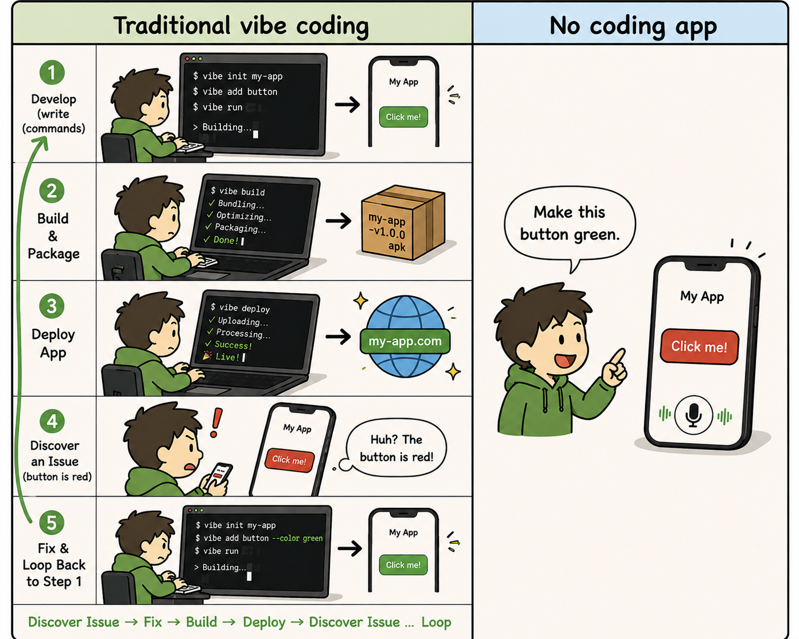
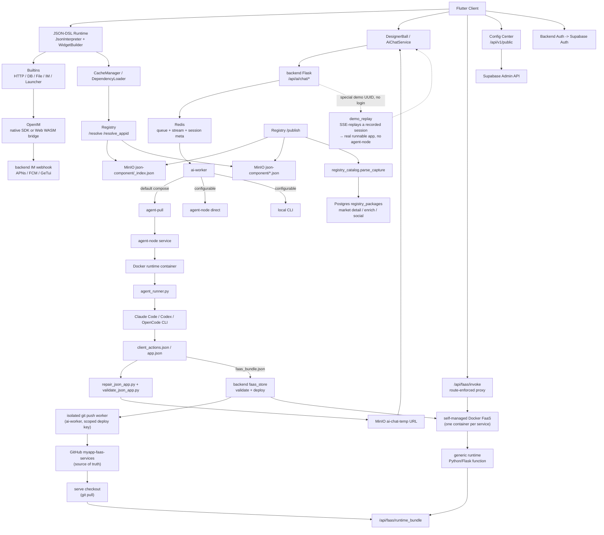

# MyApp

[中文](README.zh.md) · [English](README.md) · [Deutsch](README.de.md) · [Español](README.es.md) · [Français](README.fr.md) · [Português](README.pt.md) · [Català](README.ca.md) · [हिन्दी](README.hi.md) · **한국어** · [日本語](README.ja.md) · [Italiano](README.it.md)

<div align="center">

### Vibe *coding*은 그만. Vibe *app*을 출시하세요.

**설명만 하세요 → 풀스택 앱(UI + 실제 백엔드 + 데이터베이스)이 모든 화면에서 바로 실행됩니다.**

**코드베이스 없음. 빌드 없음. 배포 없음. 앱스토어 없음.**

</div>

> 업계 전체가 아직도 AI로 *코드를 작성하는* 방법을 두고 논쟁하고 있습니다. 우리는 코드를 건너뛰었습니다.
>
> Vibe coding은 — 최고의 AI 앱 빌더(Lovable, Bolt, v0, Replit)조차도 — 여전히 호스팅하고 유지보수해야 하는 **웹 코드베이스**를 건네줍니다. MyApp은 **실행 중인 앱 그 자체, 몇 초 만에 폰에서 네이티브로 동작하는 앱**을 건네줍니다: 원하는 것을 설명하면, AI가 JSON-DSL 프런트엔드를, **그리고** 앱에 필요할 경우 자체 격리된 Postgres 데이터베이스를 갖춘 실제 Python/Flask 백엔드를 만들어낸 뒤, 사전 컴파일된 크로스플랫폼 런타임 안에서 전체를 즉시 렌더링하고 실행합니다. *똑같은* 한 문장이 **플레이 가능한 게임**을, 또는 **로그인·게시글·스레드형 답글을 갖춘 실제 백엔드 기반 포럼**을 띄울 수 있습니다 — **하나의 설명만으로 iOS, Android, Web, 데스크톱에서** 바로 실행됩니다. 열어야 할 프로젝트도, 컴파일할 것도, 배포할 것도 없습니다.


<div align="center">


</div>

### From vibe *coding* to *no* coding

Vibe coding — even the best AI app builders — still keeps you in the loop: write commands, build, package, deploy, spot the bug, argue with the AI, loop back. We deleted the loop. You talk straight to the app on your phone — *"make this button green"* — and it changes. Nothing to compile, nothing to publish, no project to open.

<div align="center">



</div>

You end up arguing with the AI either way — so drop the toolchain and argue straight at the app in your hand.

<div align="center">


</div>


[](LICENSE)
[](https://flutter.dev)
[]()
[](JSON-DSL.md)

> **플랫폼 상태**: ✅ 프로덕션 (iOS/Android/Web) • ⚠️ 실험적 (macOS, 핵심 기능만) • 🚧 미검증 (Linux/Windows)

---

## Vibe *coding* vs. vibe *app*

|  | Vibe coding / AI 앱 빌더 | **MyApp — vibe app** |
|---|---|---|
| 무엇을 얻는가 | **코드베이스** (React/Next + 백엔드) | **실행 중인 앱** |
| 결과물 | 직접 호스팅하고, 유지보수하고, 돌봐야 하는 코드 | JSON 설정 — **유지보수할 코드 없음** |
| 출시 단계 | 빌드 → 배포 → (앱스토어 심사) | **없음.** 이미 실행 중입니다. |
| 어디서 실행되는가 | 보통 웹 앱 | **iOS · Android · Web · macOS · Linux · Windows** — 하나의 설명으로 |
| 백엔드 | "Supabase는 직접 연결하세요" | **AI 생성 Python/Flask + 격리된 Postgres**, 대신 배포해 드립니다 |
| 범위 | 폼, 대시보드, CRUD | …**그리고 실시간 채팅, 플레이 가능한 게임**(Tetris, 2048, 플랫포머)까지 *동일한* 런타임에서 |

이것은 뒷받침할 수 없는 구호가 아닙니다. 계속 읽어보세요 — 엔진 수치가 아래에 있습니다.

---

## 이것은 무엇인가?

하나의 저장소에 담긴 세 가지:

1. **Flutter Server-Driven UI 엔진** (`lib/`) — JSON-DSL 설정을 런타임에 실제 네이티브 크로스플랫폼 앱으로 해석합니다. **91종의 위젯 타입, 100개 이상의 내장 함수, 28개 연산자 표현식 엔진, 그리고 완전한 2D 게임 엔진** — 모두 클라이언트에 사전 컴파일되어 있습니다.
2. **풀스택 AI 생성기** (`backend/`, `config_center/`) — 인증(Supabase), IM(OpenIM), 푸시(APNs + FCM), AI 채팅 프록시, 패키지 레지스트리, 사용자 관리 위에서, AI가 JSON 프런트엔드를, **그리고 앱에 필요할 경우 그에 맞는 FaaS 백엔드 + 격리된 Postgres 데이터베이스까지** 생성합니다.
3. **패키지 생태계** (`templates/`) — 런타임 위에 설치할 수 있는 70개 이상의 예제 JSON-App과 재사용 가능한 라이브러리(IM, 게임, 사용자 프로필, 계산기, 대시보드 등).

**MyApp**이라는 이름은 의도적입니다: 각 사용자는 공유 런타임 위에서 "나의 앱(my app)"을 만들고, 설치하고, 운영할 수 있습니다.

대표적인 사용 사례: **사용자가 앱을 연다 → AI와 대화한다 → AI가 JSON-DSL을(필요하면 백엔드까지) 반환한다 → 클라이언트에 이미 컴파일된 기능 안에서 앱이 그것을 즉시 로드하고 실행한다.** 빌드도, 심사도, 앱스토어 대기도 없습니다.

---

## 플랫폼 지원

MyApp은 Flutter로 빌드되었으며, 기능 완성도는 다양하지만 여러 플랫폼을 지원합니다:

### ✅ 프로덕션 준비 완료 (모든 기능)

- **iOS** — IM, 푸시 알림, 카메라, 생체 인증을 포함한 모든 네이티브 기능 완전 지원
- **Android** — IM, 푸시 알림, 카메라, 생체 인증을 포함한 모든 네이티브 기능 완전 지원
- **Web** — OpenIM WASM 브리지를 통한 IM 포함 완전 지원 (푸시 알림은 불가)

### ⚠️ 실험적 (핵심 기능)

- **macOS** — 테스트 완료, 정상 동작. 핵심 JSON 런타임, UI 렌더링, 인증, AI 채팅, 파일 선택기, 생체 인증이 모두 동작합니다. IM 채팅과 푸시 알림은 서드파티 SDK 제약으로 지원되지 않습니다.

### 🚧 미검증 (동작 가능성 높음)

- **Linux** — 빌드 설정이 있으며 핵심 기능은 동작할 것으로 예상됩니다. IM 채팅과 푸시 알림은 지원되지 않습니다.
- **Windows** — 빌드 설정이 있으며 핵심 기능은 동작할 것으로 예상됩니다. IM 채팅과 푸시 알림은 지원되지 않습니다.

### 기능 가용성

| 기능 | iOS | Android | Web | macOS | Linux | Windows |
|---------|-----|---------|-----|-------|-------|---------|
| JSON-DSL 런타임 | ✅ | ✅ | ✅ | ✅ | ⚠️ | ⚠️ |
| UI 렌더링 | ✅ | ✅ | ✅ | ✅ | ⚠️ | ⚠️ |
| 네트워크 & 저장소 | ✅ | ✅ | ✅ | ✅ | ⚠️ | ⚠️ |
| IM 채팅 | ✅ | ✅ | ✅ | ❌ | ❌ | ❌ |
| 푸시 알림 | ✅ | ✅ | ❌ | ❌ | ❌ | ❌ |
| 카메라 | ✅ | ✅ | ✅ | ⚠️ | ❌ | ❌ |
| 생체 인증 | ✅ | ✅ | ❌ | ✅ | ❌ | ⚠️ |
| Flame 게임 | ✅ | ✅ | ✅ | ✅ | ⚠️ | ⚠️ |

**범례**: ✅ 테스트 완료 & 동작 • ⚠️ 미검증이나 동작 예상 • ❌ 미지원

대부분의 JSON-DSL 앱은 모든 플랫폼에서 동작합니다. 플랫폼별 기능은 사용할 수 없을 때 명확한 사용자 피드백과 함께 우아하게 비활성화됩니다.

---

## 왜 흥미로운가?

- **단번에 풀스택 — 차별화 요소.** 대부분의 AI 앱 빌더(v0, Lovable, Bolt 등)는 여전히 직접 호스팅하고 유지 관리해야 하는 *웹 코드베이스*를 제공합니다. MyApp은 프런트엔드 **그리고** 실제 Python/Flask FaaS 백엔드를 생성합니다 — 각각 자체 격리된 Postgres 데이터베이스, 앱별 권한 모델, 호출자별 데이터 격리를 갖추고 있으며, 전체를 즉시 실행합니다. 별도의 백엔드 프로젝트, 배포 단계, 스토어 제출이 필요 없습니다.
- **코드 산출물 없음.** 결과물은 코드베이스가 아니라 사전 컴파일된 클라이언트에서 실행되는 JSON 설정입니다. 호스팅할 것도, 유지보수할 것도, 다음 의존성 업데이트에서 깨질 것도 없습니다. 변경 사항을 설명하기만 하면 앱이 업데이트되고, 다음에 로드될 때 모든 곳에서 즉시 반영됩니다.
- **진정한 크로스플랫폼.** *동일한* JSON-DSL이 iOS, Android, Web(프로덕션 검증됨), macOS(실험적), Linux, Windows에서 렌더링됩니다. 대부분의 "AI 앱" 도구는 웹 앱을 제공하지만, 이것은 하나의 설명만으로 어디서나 네이티브로 제공합니다.
- **서버 주도** — 고정된 사전 컴파일 런타임 경계를 통해 UI와 동작을 데이터로 전달합니다. [App Store 준수 참고 사항](docs/APP_STORE_COMPLIANCE.md)을 참조하세요. <sub>(이 문서는 오래전에 작성되어 지금 100% 최신이 아닐 수 있습니다; 스토어 등록을 위해 최선을 다하겠습니다)</sub>
- **AI 네이티브** — DSL은 LLM 친화적으로 설계되었습니다. 포함된 AI 채팅은 세 가지 플러그형 에이전트 런타임(Claude Code, Codex, OpenCode)을 통해 여러 제공자(DeepSeek, MiniMax, GLM / Kimi를 갖춘 Volcengine 애그리게이터)를 실행하며, 출력물이 실행 가능하도록 유지하기 위한 생성 플레이북과 실행 중 시각적 자체 검토 단계를 갖추고 있습니다.
- **배터리 포함** — 푸시 기능이 있는 IM, AI 프록시, 패키지 레지스트리, 네임스페이스, 미러링, 환경 전환 — 모두 함께 연결되어 있습니다. "인증을 외면하는 또 하나의 로우코드 프레임워크"가 아닙니다.
- **셀프 호스팅 가능** — `myapp-ctl deploy`가 단일 호스트 레벨 CLI에서 백엔드 스택, 에이전트 런타임, 레지스트리, 설정 센터, 서비스 시크릿을 관리합니다.

---

## 이 프로젝트가 존재하는 이유 — 만든이의 말

솔직히 말하면, 저는 요즘의 AI 광풍이 싫습니다 — 끝없는 논의, 끝없는 마케팅. 하지만 제가 좋아하든 아니든, 이 물결은 물러가지 않을 겁니다.

그러니 어차피 AI coding을 받아들일 거라면, 어중간하게 하느니 아예 끝까지 가 보는 편이 낫습니다. 아이러니하게도, 바로 그것이 이 프로젝트가 존재하는 이유입니다. 목표는 결코 유행을 좇는 것이 아니었습니다 — 이 생각을 논리적인 끝까지 밀어붙이고 이렇게 묻는 것이었습니다: **AI가 정말 개발의 미래라면, 진정한 AI-first 워크플로우는 어떤 모습이어야 할까?**

이 프로젝트가 지금까지의 제 답입니다.

---

## 빠른 시작

### 호스팅된 클라이언트 사용하기

MyApp을 체험하고 AI 생성 JSON 앱을 실행해 보고 싶을 뿐이라면:

1. 호스팅된 Web 클라이언트를 엽니다: <https://myapp-web.dapangyu.work/>
2. 또는 iOS TestFlight Public Group 1을 설치합니다: <https://testflight.apple.com/join/3Fk5Exnn>
3. 또는 Android APK를 다운로드합니다:
   <https://myapp-oss-endpoint.dapangyu.work/myapp-releases/android/apk/latest.apk>
4. 게스트로 계속하여 공개 앱을 탐색/실행하거나, 로그인하여 앱을 생성하고,
   IM/프로필 기능을 사용하고, 패키지를 게시하고, 비공개 Agent Node를 관리하세요.
5. 계정이 없나요? 플로팅 볼을 탭하세요 → **Demo**를 누르면 로그인 없이도
   AI가 앱을 처음부터 끝까지 만드는 과정을 보고 실제 결과물을 실행할 수 있습니다.

전체 제품 사용 가이드는 [docs/USER_GUIDE.md](docs/USER_GUIDE.md)입니다.

### 소스에서 클라이언트 빌드하기 (5분)

```bash
git clone <this-repository-url> ai-app
cd ai-app
flutter pub get
flutter run -d <ios|android|chrome>
```

기본 설정은 호스팅된 백엔드를 가리킵니다. 비공개 백엔드에 연결하려면
`myapp-ctl client-env`가 출력하는 환경 JSON을 가져오세요.

Flutter Web IM 지원의 경우, 체크인된 `web/openIM.wasm`, `web/sql-wasm.wasm`,
워커, 브리지 번들은 `web_openim_bridge/package-lock.json`에 고정된
`@openim/wasm-client-sdk` 의존성에서 복사된 런타임 자산입니다.
새 머신이나 CI에서는, 이들이 누락되었거나 SDK 버전을 변경한 후라면
`flutter build web` 전에 재생성하세요:

```bash
./scripts/build_web_openim.sh
flutter build web
```

Web 빌드/실행의 경우, OpenIM Web 자산이 먼저 확인되고 필요 시 재생성되도록
래퍼 스크립트를 사용할 수도 있습니다:

```bash
./scripts/flutter_web.sh run -d chrome
./scripts/flutter_web.sh build web
```

### 전체 백엔드 스택 셀프 호스팅하기 (20분)

```bash
./deploy/production/install_ctl.sh
myapp-ctl setup --host <public-ip-or-domain> --data-root /mnt/myapp
myapp-ctl deploy --pull
myapp-ctl client-env --terminal-qr
```

이 명령들은 root로 실행하거나, 그에 상응하는 Docker 및 `/etc/myapp` 쓰기
권한을 갖고 실행하세요. 전체 배포 및 `myapp-ctl` 명령 레퍼런스는
[`deploy/production/README.md`](deploy/production/README.md)입니다.

처음 대화형 `myapp-ctl`을 실행하면 CLI 언어를 한 번 묻습니다(`zh`, `en`,
`de`, `es`, `fr`, `pt`, `ca`, `hi`, `ko`, `ja`, `it`); 이후 변경은
`myapp-ctl config lang <lang>`을 사용합니다. 설정 마법사는
AI 제공자 자격 증명과 선택적 ASR, SMTP 이메일, APNs, FCM, GeTui 설정을
묻습니다. 전체 배포는 클라이언트 환경 JSON과 QR을 출력하며,
대화형 `test@example.com` 테스트 계정을 생성/업데이트할 수 있습니다; 다시 보려면
`myapp-ctl client-env --terminal-qr`을 재실행하세요.

Git 체크아웃에서 설치된 컨트롤 CLI와 프로덕션 배포 파일을 업데이트합니다:

```bash
myapp-ctl update
```

이 체크아웃에서 이미지를 빌드하는 개발/테스트 호스트의 경우:

```bash
myapp-ctl setup --host <public-ip-or-domain>
myapp-ctl deploy --build
```

이는 MyApp 백엔드 스택을 로컬 / VPS에서 부팅합니다:
- JSON 앱 Postgres + AI 세션 Redis + App MinIO
- Agent node + 격리된 Ubuntu 에이전트 런타임
- App backend + AI worker + Registry + Config center

배포 후, 클라이언트의 내장 **환경 전환기**(로그인 페이지에서 브랜드를 7번 탭)를 사용하면 자신만의 스택을 가리킬 수 있습니다.

권위 있는 배포 가이드는 [`deploy/production/README.md`](deploy/production/README.md)를
참조하세요.

### 문서 맵

| 필요한 것 | 문서 |
|---|---|
| MyApp 사용, 앱 생성, 비공개 백엔드 연결, Web appid/로컬 JSON 디버깅 | [docs/USER_GUIDE.md](docs/USER_GUIDE.md) |
| 백엔드 스택 설치, 업데이트, 운영, 백업, 복원, 제거 | [deploy/production/README.md](deploy/production/README.md) |
| 현재 백엔드/agent-node 아키텍처 이해 | [backend/ARCHITECTURE.md](backend/ARCHITECTURE.md) |
| App Store 심사/런타임 경계 이해 | [docs/APP_STORE_COMPLIANCE.md](docs/APP_STORE_COMPLIANCE.md) |

---

## 아키텍처

이 프로젝트는 이제 단일 Flutter 데모라기보다는 작은 앱 플랫폼에 더 가깝습니다.
Flutter 클라이언트는 컴파일된 런타임이며; JSON-APP, 컴포넌트, 자산, IM,
AI 생성, 그리고 **AI 생성 FaaS 백엔드**는 모두 백엔드 스택에서 제공됩니다 —
이 스택은 단일 호스트에서 올인원으로 실행할 수 있습니다(backend + Docker Compose 스택
+ 자체 관리 Docker FaaS 런타임, `docs/faas-docker-runtime.md` 참조).



| 구성 요소 | 위치 | 무엇 |
|---|---|---|
| Flutter Runtime | `lib/` | 크로스플랫폼 컴파일된 클라이언트: JSON-DSL 인터프리터, 위젯, Flame 게임 아톰, 자산 캐시, 환경 전환, AI 진입점, IM/미디어 UI |
| Web Runtime Assets | `web/`, `web_openim_bridge/` | Flutter Web에서 사용하는 OpenIM Web WASM 브리지 및 빌드 자산 |
| Backend API | `backend/app.py`, `backend/claude_chat.py` | 인증 게이트가 적용된 AI 채팅, SSE 스트리밍, 미디어 업로드, 푸시, 제공자 설정, 클라이언트 대상 백엔드 엔드포인트를 위한 Flask API |
| AI Queue / Sessions | `backend/ai_session.py` + Redis | 어느 정도 지속성 있는 AI 작업 메타데이터, 제한된 워커 큐, 재개 가능한 SSE 이벤트 스트림, 중단/재시도 상태 |
| AI Worker Pool | `backend/ai_worker_daemon.py`, `backend/ai_session.py`, `backend/agent_node_service.py`, `deploy/production/agent_runner.py` | 수락된 작업을 Redis를 통해 이동시키며, 기본적으로 pull 모드 agent-node 실행으로 동작하고, `AI_WORKER_EXECUTION_BACKEND`에 따라 직접 agent-node 또는 로컬 CLI 경로로도 실행할 수 있습니다 |
| FaaS Backends | `backend/faas.py`, `backend/faas_store.py`, `backend/faas_push_worker.py`, `backend/faas_runtime_server.py` | AI 생성 Python/Flask 백엔드: 엄격한 번들 검증, 격리된 git push 워커 → `myapp-faas-services`(GitHub 단일 진실 공급원), 자체 관리 Docker 런타임(서비스당 컨테이너 하나, 컨트롤 플레인 소유 배포/라우팅/콜드 웨이크/scale-to-zero — `docs/faas-docker-runtime.md` 참조), 라우트가 강제되는 `/api/faas/invoke` 프록시, 사용자별 쿼터 + 생성-대-추가 |
| Registry | `backend/registry_server.py` | JSON-APP/컴포넌트용 패키지 레지스트리: `_index.json` + MinIO 패키지 파일이 런타임 resolve 소스; Postgres `registry_packages`는 마켓/상세/보강/소셜 인덱스 |
| Object Storage | MinIO / OSS | `json-component` 아래의 공개 JSON 패키지, 앱 미디어, `json-app-assets` 아래의 자산 팩, 임시 AI 생성 JSON URL, 그리고 고정된 무로그인 데모 앱들의 공개 `demo` 버킷 |
| OpenIM | `backend/openim/` | IM 백엔드 브리지. 네이티브 클라이언트는 OpenIM Flutter/네이티브 SDK 사용; Web은 WASM SDK 브리지 사용 |
| Supabase | `deploy/production/supabase/` | 호스트 로컬 시크릿으로 설정되는 셀프 호스팅 인증, 데이터베이스, 스토리지 호환 서비스 |
| Config Center | `config_center/` | 원격 설정 플래그 및 환경별 클라이언트 설정 |
| Templates / Libraries | `templates/` | 게시된 예제 앱 및 재사용 가능한 JSON 라이브러리: IM, 런처, OpenAI 채팅, 게임, 컨트롤, 프로필, 유틸리티 |
| Website | `website/` | 임베디드 웹 클라이언트 미리보기를 포함한 TS/Vite 마케팅 및 데모 사이트 |
| Control Plane | `deploy/production/`, `scripts/myapp_ctl/` | 테스트 및 프로덕션 호스트를 위한 `myapp-ctl` status/log/secret/domain/image/deploy 관리 |

핵심 흐름:

1. **AI 앱 생성**: 클라이언트가 채팅 작업을 전송 -> 백엔드가 큐/메타를 Redis에 기록 -> 현재 프로덕션 기본값은 작업을 agent-pull 경로에 둠 -> agent-node가 격리된 런타임 컨테이너를 시작 -> `agent_runner.py`가 설정된 에이전트(Claude Code / Codex / OpenCode)를 실행 -> agent-node가 이벤트/아티팩트를 스트리밍하여 반환 -> 백엔드가 생성된 JSON을 검증/복구/업로드 -> 클라이언트가 재개 가능한 SSE를 통해 구조화된 `json_app_ready` 이벤트를 수신.
2. **패키지 설치**: 클라이언트가 페이지네이션/검색 또는 `/resolve(_appid)`로 Registry에 질의 -> Registry가 `_index.json` 및 MinIO 패키지 파일을 통해 resolve -> 클라이언트가 JSON 다운로드 -> 의존성 로더가 라이브러리를 resolve하고 로컬에 캐시. 마켓 상세, 요약, 좋아요, 설치는 Postgres `registry_packages` 사이드 인덱스에서 옵니다.
3. **IM**: 모바일은 네이티브 OpenIM SDK 경로 사용; Web은 `web_openim_bridge`를 통해 `openim/wasm-client-sdk` 사용, 프레임워크 레벨 호환성으로 JSON IM 앱이 하나의 API 형태로 호출합니다.
4. **백엔드 셀프 호스팅**: `myapp-ctl secret`이 호스트 로컬 자격 증명을 관리; `myapp-ctl deploy --pull` 또는 `myapp-ctl deploy --build`가 백엔드 스택과 에이전트 런타임을 시작합니다.

---

## JSON-DSL

100줄짜리 MyApp 설정이 화면, 내비게이션, 네트워크 호출, 애니메이션, 네이티브 위젯을 갖춘 완전한 앱이 될 수 있습니다. DSL은 [JSON-DSL.md](JSON-DSL.md)에 문서화되어 있습니다.

최소 예시:

```json
{
  "dsl": "3.3",
  "meta": { "name": "hello", "version": "1.0.0", "type": "app" },
  "global": { "count": 0 },
  "ui": {
    "screens": [{
      "name": "home",
      "body": {
        "type": "container",
        "layout": "column",
        "children": [
          { "type": "text", "value": "Counter: {{ global.count }}" },
          { "type": "button", "label": "+1", "action": {
            "call": "@set",
            "args": { "var": "global.count", "value": { "+": [{ "var": "global.count" }, 1] } }
          }}
        ]
      }
    }]
  }
}
```

이것을 AI 생성 흐름을 통해 넣거나, `flutter run` 후 디스크에서 JSON 파일을 선택하세요.

---

## 기능

### 엔진
- **91종의 위젯 타입** — text / button / input / list / container / image / video / chart / map / webview / camera / qr / tab_view / **완전한 Flame 2D 게임 스택**(게임 캔버스, 아날로그 스틱, 파티클/투영 장면 캔버스) / 애니메이션(animated_*, Rive) / 고급 제스처(제스처 비밀번호, 슬라이드 검증) / sliver급 레이아웃
- **28개의 커스텀 연산자를 갖춘 JsonLogic 표현식 엔진**(문자열 / 배열 / 타입 / 수학)
- **100개 이상의 내장 `@`-함수** — HTTP(모든 메서드 + SSE), 실제 DB 레이어(query/insert/update/delete + 키-값 + create_table), IM(친구 / 대화 / 기록 / 받은 편지함), 파일 I/O, 생체 인증, 클립보드, 햅틱, 권한, 이미지 선택, 테마, i18n, 내비게이션, 다이얼로그, 게임 제어
- 동시 단계를 위한 `@parallel`
- 템플릿 `{{ path }}`는 (문자열화하지 않고) 원래 타입으로 resolve됨
- 네트워크 / 디스크 / 레지스트리에서 설정 핫스왑
- 민감한 기능(인증 토큰, 프로필)에 대한 앱별 권한 게이트
- **클라이언트 UI가 11개 언어로 현지화됨**(zh / en / de / es / fr / pt / ca / hi / ko / ja / it)

### 백엔드
- **AI 생성 FaaS 풀스택** — AI가 "서비스 그룹"마다 검증된 Python/Flask 백엔드(함수 서비스 1개 + 선택적 Postgres DB)를 생성하여, 자체 관리 Docker FaaS 런타임(서비스당 컨테이너 하나, scale-to-zero + 콜드 웨이크)에 배포합니다. 앱별 스키마 격리, 위조 불가능한 그룹 내 가명 신원, 백엔드 중개 호출자별 데이터 접근(함수 코드는 DB 연결을 절대 보유하지 않음), 컨테이너 하드닝, 그리고 철회 가능한 3단계 접근 정책.
- Supabase 인증 통합
- 제공자별 큐와 격리된 에이전트 실행을 갖춘 AI 채팅 — 제공자(DeepSeek, MiniMax, Volcengine 애그리게이터: GLM / Kimi) × 세 가지 에이전트 런타임(Claude Code, Codex, OpenCode), 더불어 생성 플레이북과 실행 중 시각적 자체 검토 단계
- **무로그인 데모 모드** — 미인증 사용자가 플로팅 볼을 탭하고 → Demo를 눌러, 녹화된 세션을 SSE로 재생하는 진짜 같은 AI 생성을 시작하고, 실제로 실행 가능한 앱을 얻습니다(agent-node 없음, FaaS 생성 없음) — 전체 흐름을 즉시 맛볼 수 있음 — 이 데모는 **실제로 기록된 생성 실행의 가속 재생**이며, 다국어 문구는 **이후 현지화 단계에서 추가**되었습니다
- 채널 불가지론적 푸시 (APNs + FCM, 추가하기 쉬움)
- 네임스페이스 + semver + 의존성 resolution을 갖춘 패키지 레지스트리
- **인스턴스 간 미러** — 셀프 호스팅 인스턴스가 업스트림에서 패키지를 미러링할 수 있음 (지연 파일 프록시 + 10분 인덱스 동기화)
- 사용자 관리 UI (역할 / 차단 / 비밀번호 재설정)
- 감사 로그

### 배포
- 풀스택 또는 컴포넌트 레벨 백엔드 배포를 위한 `myapp-ctl deploy`
- 호스트 로컬 제공자, 푸시, OSS, 백엔드 시크릿을 위한 `myapp-ctl secret`
- AI 워커를 위한 격리된 pull 기반 agent-node + Docker 런타임
- 미디어 업로드를 위한 내장 MinIO
- 헬스체크, 로그, 재시작, 상태, 에이전트 검사 명령

---

## 상태

| 영역 | 상태 |
|---|---|
| 엔진 (Dart) | 프로덕션. 64k LOC, 위젯 91종, 내장 함수 100개 이상. 실제 앱을 구동 중. 클라이언트 UI는 11개 언어로 현지화됨. |
| 백엔드 (Python) | 프로덕션. 32k LOC. 실제 사용자 운영 중. |
| 테스트 | 위젯 스모크 테스트 및 JSON 회귀 스위트(`templates/regression-test.json`). 커버리지를 추가하는 PR을 매우 환영합니다. |
| 문서 | 중간 수준 (`JSON-DSL.md`, `deploy/production/README.md`, 백엔드 아키텍처 노트). 개선 중. |
| API 안정성 | DSL v3.4 — v4까지는 사소한 호환성 깨짐 가능. 백엔드 HTTP API는 안정적. |
| 공개 호스팅? | 예 (공정 사용 대상, 이용약관 참조) |

---

## 기여하기

이슈, PR, 토론 모두 환영합니다.

- 문서는 [`CLAUDE.md`](CLAUDE.md)에 있습니다 (AI를 사용해 기여하는 경우 Claude Code 지침 역할도 겸합니다)
- JSON-DSL 사양은 [`JSON-DSL.md`](JSON-DSL.md)에 있습니다
- 코드 컨벤션:
  - 주석은 *무엇*이 아니라 *왜*에 답합니다 (무엇은 코드가 보여줍니다)
  - 추측성 추상화를 피하세요; 비슷한 세 줄이 성급한 인터페이스보다 낫습니다
  - UI 변경의 경우, 완료를 주장하기 전에 브라우저/시뮬레이터에서 골든 패스 *와* 엣지 케이스를 테스트하세요

---

## 라이선스

Apache License 2.0 — [LICENSE](LICENSE) 및 [NOTICE](NOTICE)를 참조하세요.

다음을 할 수 있습니다:
- 상업용 제품에 사용
- 자유롭게 포크 및 수정
- 전체 스택 셀프 호스팅

다음은 할 수 없습니다:
- 허가 없이 **"MyApp" 이름 또는 로고** 사용 (허가를 요청하려면 [이슈를 열어주세요](https://github.com/dapangyu-fish/ai-app/issues))
- 코드의 출처를 허위로 표현

마켓플레이스 패키지, 업로드된 자산, 사용자가 만든 JSON 앱은 명시적으로 달리 밝히지 않는 한
해당 작성자가 소유하고 라이선스를 부여합니다.

---

## 감사의 말

- [Flutter](https://flutter.dev) — UI 프레임워크
- [Supabase](https://supabase.com) — 인증 + DB + 스토리지 백엔드
- [OpenIM](https://github.com/openimsdk) — IM SDK + 서버
- [Anthropic Claude Code CLI](https://docs.claude.com/en/docs/claude-code) — AI 생성 런타임
- [JsonLogic](https://jsonlogic.com) — 표현식 엔진
- [mx0c/super-mario-python](https://github.com/mx0c/super-mario-python) — Super Mario level data (Mario demo apps); Nintendo SMB IP is used for demo/educational purposes only

---

## 로드맵 (우선순위 순)

- [ ] 60초짜리 바이럴 데모 영상 공개 (AI → JSON 설정 → 앱 즉시 실행, 빌드/배포 없음)
- [ ] 공개 호스팅 무료 티어
- [ ] QR이 포함된 앱 공유 링크 (딥 링크로 AI 생성 앱 열기)
- [ ] CI 추가 (GitHub Actions: pub get, analyze, build APK)
- [ ] 더 많은 예제 JSON-APP (할 일, 메모, 피트니스 트래커)
- [x] 프롬프트 시스템 v2: 긴 생성 프롬프트가 `index.md` 라우터 + 작업별 카드(`backend/prompts/generation/`)로 계층형 파이프라인과 함께 분리되었고, 생성 플레이북(`docs/playbooks/`)이 추가됨; JSON 검증/복구는 `validate_json_app.py` / `repair_json_app.py` 도구에 위치
- [x] 멀티 에이전트 + 멀티 제공자 생성: Claude Code / Codex / OpenCode 에이전트 런타임 × DeepSeek / MiniMax / Volcengine 애그리게이터(GLM, Kimi) 제공자, 세션별로 선택 가능
- [x] 무로그인 데모 모드: 녹화된 생성의 SSE 재생으로 미인증 사용자가 실제 실행 가능한 앱을 즉시 얻음 (agent-node / FaaS 없음)
- [ ] 현재의 세 에이전트 세트를 넘어 더 많은 에이전트 런타임 / 제공자 애그리게이터 추가
- [ ] JSON-APP을 위한 오디오 지원 (녹음, 재생, 업로드, 재사용 가능한 오디오 UI/액션)
- [x] FaaS 지원: AI 대화가 Python/Flask 백엔드 함수를 생성하여, 자체 관리 Docker FaaS 런타임(서비스당 컨테이너 하나, 컨트롤 플레인 소유 배포/라우팅/콜드 웨이크/scale-to-zero)에서 제공하며, 엄격한 번들 검증, GitHub 단일 진실 공급원(`myapp-faas-services`), 격리된 git push 워커, 사용자별 쿼터 + 생성-대-추가, 라우트가 강제되는 invoke 프록시를 갖춤
- [ ] FaaS 스케일아웃: 멀티 노드 Docker FaaS + 백엔드 보조 라우팅(수평 확장) 및 사용자 전용 faas 노드(agent-node 레지스트리 패턴 재사용)
- [ ] **JSON-APP별 푸시 격리 + 딥 링크 + 옵트인 권한**: 앱 범위 메시지 봉투(`app_id` + 대상 `route` + `params`)로 알림이 특정 JSON-APP 화면으로 라우팅될 수 있음; 수신자는 앱/발신자/서비스별로 옵트인해야 함(기본 꺼짐, 남용 방지); 탭 라우팅은 설치되어 있으면 대상 화면으로 앱을 열고, 그렇지 않으면 프레임워크 "A 설치" 초대 폴백. 설계: [docs/planning/push-jsonapp-isolation.md](docs/planning/push-jsonapp-isolation.md)
- [ ] DSL v4 (호환성 깨짐 윈도우 안정화)
- [ ] 인터프리터 주변 테스트 추가
- [ ] 성능: 화면 밖 서브트리의 해석 지연

---

*정성껏 만들었습니다. 피드백 환영합니다.*
