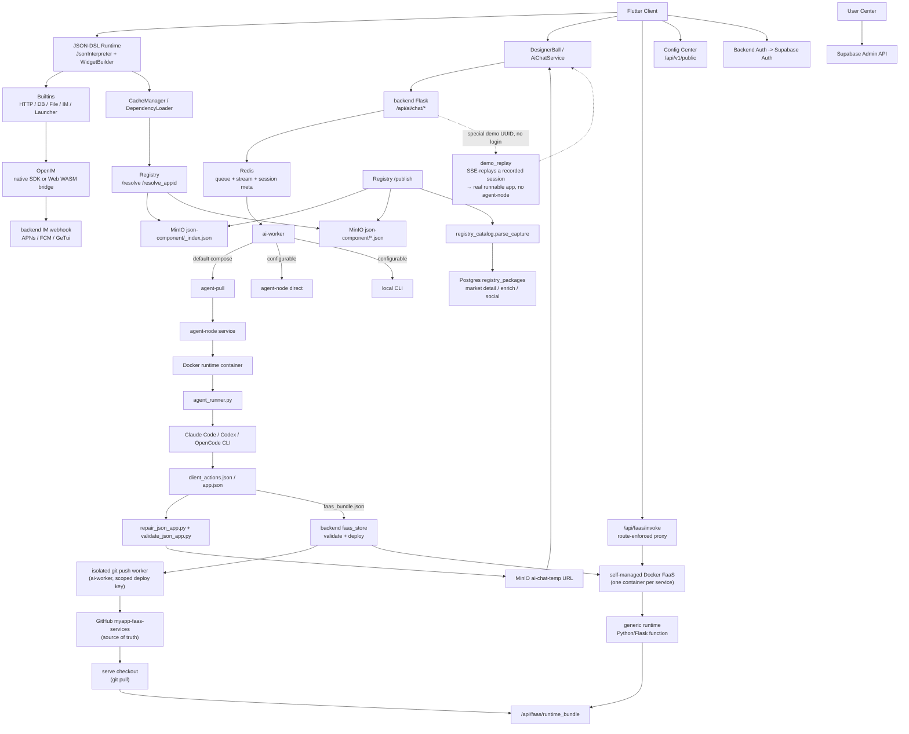

# MyApp

[中文](README.zh.md) · **English** · [Deutsch](README.de.md) · [Español](README.es.md) · [Français](README.fr.md) · [Português](README.pt.md) · [Català](README.ca.md) · [हिन्दी](README.hi.md) · [한국어](README.ko.md) · [日本語](README.ja.md) · [Italiano](README.it.md)

<div align="center">

### Stop vibe-*coding*. Ship vibe-*apps*.

**Describe it → a full-stack app (UI + real backend + database) is live on every screen.**

**No codebase. No build. No deploy. No app store.**

</div>

> The whole industry is still arguing about how to *write code* with AI. We skipped the code.
>
> Vibe coding — even the best AI app builders (Lovable, Bolt, v0, Replit) — still hands you a **codebase** to wire up, host, and ship. MyApp hands you the **running app**: you describe what you want, AI emits a JSON-DSL front-end **and**, when the app needs one, a real Python/Flask backend with its own isolated Postgres database — then renders and runs the whole thing instantly inside a precompiled, cross-platform runtime. The *same* sentence can spin up a **playable game** or a **forum with a real backend with login, posts and threaded replies** — live on **iOS, Android, Web, and desktop from one description**. There is no project to open, nothing to compile, nothing to deploy.

[](LICENSE)
[](https://flutter.dev)
[]()
[](JSON-DSL.md)

> **Platform Status**: ✅ Production (iOS/Android/Web) • ⚠️ Experimental (macOS, core features only) • 🚧 Untested (Linux/Windows)

---

## Vibe *coding* vs. vibe *app*

|  | Vibe coding / AI app builders | **MyApp — a vibe app** |
|---|---|---|
| What you get | A **codebase** (React/Next + a backend) | A **running app** |
| The artifact | Code you host, maintain, and babysit | A JSON config — **no code to maintain** |
| Ship step | Build → deploy → (app-store review) | **None.** It's already live. |
| Where it runs | Usually a web app | **iOS · Android · Web · macOS · Linux · Windows** — one description |
| Backend | "Wire up Supabase yourself" | **AI-generated Python/Flask + isolated Postgres**, deployed for you |
| Range | Forms, dashboards, CRUD | …**and real-time chat, and playable games** (Tetris, 2048, a platformer) from the *same* runtime |

This is not a slogan we can't back up. Keep reading — the engine numbers are below.

---

## What is this?

Three things in one repo:

1. **A Flutter Server-Driven UI engine** (`lib/`) — interprets a JSON-DSL config into a real, native, cross-platform app at runtime. **91 widget types, 100+ built-in functions, a 28-operator expression engine, and a full 2D game engine** — all precompiled into the client.
2. **A full-stack AI generator** (`backend/`, `user_center/`, `config_center/`) — AI generates the JSON front-end **and a matching FaaS backend + isolated Postgres database** when the app needs one, on top of auth (Supabase), IM (OpenIM), push (APNs + FCM), AI chat proxy, package registry, and user admin.
3. **A package ecosystem** (`templates/`) — 70+ example JSON-Apps and reusable libraries (IM, games, user profile, calculator, dashboards…) you can install on top of the runtime.

The name **MyApp** is intentional: each user can create, install, and operate "my app" on top of the shared runtime.

The flagship use case: **a user opens the app → chats with AI → AI returns a JSON-DSL (and a backend, if needed) → the app loads and runs it instantly** inside the capabilities already compiled into the client. No build, no review, no waiting on an app store.

---

## Platform Support

MyApp is built with Flutter and supports multiple platforms with varying feature completeness:

### ✅ Production Ready (All Features)

- **iOS** — Full support including IM, push notifications, camera, biometric auth, all native capabilities
- **Android** — Full support including IM, push notifications, camera, biometric auth, all native capabilities
- **Web** — Full support with IM via OpenIM WASM bridge (push notifications not available)

### ⚠️ Experimental (Core Features)

- **macOS** — Tested and working well. Core JSON runtime, UI rendering, auth, AI chat, file picker, and biometric auth all work. IM chat and push notifications are not supported due to third-party SDK limitations.

### 🚧 Untested (Likely to Work)

- **Linux** — Has build configuration and should work for core features. IM chat and push notifications are not supported.
- **Windows** — Has build configuration and should work for core features. IM chat and push notifications are not supported.

### Feature Availability

| Feature | iOS | Android | Web | macOS | Linux | Windows |
|---------|-----|---------|-----|-------|-------|---------|
| JSON-DSL Runtime | ✅ | ✅ | ✅ | ✅ | ⚠️ | ⚠️ |
| UI Rendering | ✅ | ✅ | ✅ | ✅ | ⚠️ | ⚠️ |
| Network & Storage | ✅ | ✅ | ✅ | ✅ | ⚠️ | ⚠️ |
| IM Chat | ✅ | ✅ | ✅ | ❌ | ❌ | ❌ |
| Push Notifications | ✅ | ✅ | ❌ | ❌ | ❌ | ❌ |
| Camera | ✅ | ✅ | ✅ | ⚠️ | ❌ | ❌ |
| Biometric Auth | ✅ | ✅ | ❌ | ✅ | ❌ | ⚠️ |
| Flame Games | ✅ | ✅ | ✅ | ✅ | ⚠️ | ⚠️ |

**Legend**: ✅ Tested & Working • ⚠️ Untested but Should Work • ❌ Not Supported

Most JSON-DSL apps work across all platforms. Platform-specific features gracefully degrade with clear user feedback when unavailable.

---

## Why is this interesting?

- **Full-stack in one shot — the differentiator.** Most AI app builders (v0, Lovable, Bolt, …) generate *front-end* code that you still have to wire to a backend and deploy yourself. MyApp generates the front-end **and** a real Python/Flask FaaS backend — each with its own isolated Postgres database, per-app permission model, and per-caller data isolation — then runs the whole thing instantly. No separate backend project, no deploy step, no store submission.
- **No code artifact.** The deliverable is a JSON config running in a precompiled client, not a codebase. Nothing to host, nothing to maintain, nothing to break on the next dependency bump. Update an app by describing the change; it's live everywhere the next time it loads.
- **Genuinely cross-platform.** The *same* JSON-DSL renders on iOS, Android, Web (production-tested), macOS (experimental), Linux, and Windows. Most "AI app" tools give you a web app; this gives you native, everywhere, from one description.
- **Server-driven** — ship UI and behavior data through a fixed, precompiled runtime boundary. See [App Store compliance notes](docs/APP_STORE_COMPLIANCE.md).
- **AI-native** — the DSL is designed to be LLM-friendly. The included AI chat runs multiple providers (DeepSeek, MiniMax, Volcengine aggregator with GLM / Kimi) through three pluggable agent runtimes (Claude Code, Codex, OpenCode), with generation playbooks and an in-run visual self-review pass to keep output runnable.
- **Batteries included** — IM with push, AI proxy, package registry, namespaces, mirroring, user center, environment switching — all wired together. Not "yet another low-code framework that punts on auth".
- **Self-hostable** — `myapp-ctl deploy` manages the backend stack, agent runtime, registry, config center, and service secrets from one host-level CLI.

---

## Quickstart

### Use the hosted clients

If you only want to try MyApp and run AI-generated JSON Apps:

1. Open the hosted Web client: <https://myapp-web.dapangyu.work/>
2. Or install iOS TestFlight Public Group 1: <https://testflight.apple.com/join/3Fk5Exnn>
3. Or download the Android APK:
   <https://myapp-oss-endpoint.dapangyu.work/myapp-releases/android/apk/latest.apk>
4. Continue as guest to browse/run public apps, or sign in to generate apps,
   use IM/profile features, publish packages, and manage private Agent Nodes.
5. No account? Tap the floating ball → **Demo** to watch AI build an app
   end-to-end and run the real result, without signing in.

The full product usage guide is [docs/USER_GUIDE.md](docs/USER_GUIDE.md).

### Build the client from source (5 minutes)

```bash
git clone <this-repository-url> ai-app
cd ai-app
flutter pub get
flutter run -d <ios|android|chrome>
```

The default config points at the hosted backend. To connect a private backend,
import the environment JSON printed by `myapp-ctl client-env`.

For Flutter Web IM support, the checked-in `web/openIM.wasm`, `web/sql-wasm.wasm`,
workers, and bridge bundle are runtime assets copied from the pinned
`@openim/wasm-client-sdk` dependency in `web_openim_bridge/package-lock.json`.
On a fresh machine or in CI, regenerate them before `flutter build web` if they
are missing or after changing the SDK version:

```bash
./scripts/build_web_openim.sh
flutter build web
```

For Web builds/runs, you can also use the wrapper script so the OpenIM Web
assets are checked first and regenerated when needed:

```bash
./scripts/flutter_web.sh run -d chrome
./scripts/flutter_web.sh build web
```

### Self-host the full backend stack (20 minutes)

```bash
./deploy/production/install_ctl.sh
myapp-ctl setup --host <public-ip-or-domain> --data-root /mnt/myapp
myapp-ctl deploy --pull
myapp-ctl client-env --terminal-qr
```

Run these commands as root, or with equivalent Docker and `/etc/myapp` write
permissions. The full deployment and `myapp-ctl` command reference is
[`deploy/production/README.md`](deploy/production/README.md).

The first interactive `myapp-ctl` run asks for a CLI language once (`zh`, `en`,
`de`, `es`, `fr`, `pt`, `ca`, `hi`, `ko`, `ja`, `it`); later changes use
`myapp-ctl config lang <lang>`. The setup wizard
asks for AI provider credentials and optional ASR, SMTP email, APNs, FCM, and
GeTui config. A full deploy prints the client environment JSON and QR, and can
create/update an interactive `test@example.com` test account; rerun
`myapp-ctl client-env --terminal-qr` to show it again.

Update the installed control CLI and production deploy files from the Git
checkout:

```bash
myapp-ctl update
```

For a development/test host that builds images from this checkout:

```bash
myapp-ctl setup --host <public-ip-or-domain>
myapp-ctl deploy --build
```

This boots the MyApp backend stack locally / on a VPS:
- JSON app Postgres + AI session Redis + App MinIO
- Agent node + isolated Ubuntu agent runtime
- App backend + AI worker + Registry + Config center + User center

After deploy, the client's built-in **Environment Switcher** (tap brand 7 times on login page) lets you point to your own stack.

See [`deploy/production/README.md`](deploy/production/README.md) for the
authoritative deployment guide.

### Documentation map

| Need | Document |
|---|---|
| Use MyApp, generate apps, connect a private backend, debug Web appid/local JSON | [docs/USER_GUIDE.md](docs/USER_GUIDE.md) |
| Install, update, operate, back up, restore, or uninstall the backend stack | [deploy/production/README.md](deploy/production/README.md) |
| Understand the current backend/agent-node architecture | [backend/ARCHITECTURE.md](backend/ARCHITECTURE.md) |
| Understand App Store review/runtime boundaries | [docs/APP_STORE_COMPLIANCE.md](docs/APP_STORE_COMPLIANCE.md) |

---

## Architecture

The project is now closer to a small app platform than a single Flutter demo.
The Flutter client is a compiled runtime; JSON-APPs, components, assets, IM,
AI generation, and **AI-generated FaaS backends** are all served by the backend
stack — which can run all-in-one on a single host (backend + Docker Compose stack
+ the self-managed Docker FaaS runtime, see `docs/faas-docker-runtime.md`).



| Component | Where | What |
|---|---|---|
| Flutter Runtime | `lib/` | Cross-platform compiled client: JSON-DSL interpreter, widgets, Flame game atoms, asset cache, environment switching, AI entry, IM/media UI |
| Web Runtime Assets | `web/`, `web_openim_bridge/` | OpenIM Web WASM bridge and build assets used by Flutter Web |
| Backend API | `backend/app.py`, `backend/claude_chat.py` | Flask API for auth-gated AI chat, SSE streaming, media upload, push, provider config, and client-facing backend endpoints |
| AI Queue / Sessions | `backend/ai_session.py` + Redis | Durable-ish AI task metadata, bounded worker queue, resumable SSE event stream, abort/retry status |
| AI Worker Pool | `backend/ai_worker_daemon.py`, `backend/ai_session.py`, `backend/agent_node_service.py`, `deploy/production/agent_runner.py` | Moves accepted jobs through Redis, defaults to pull-mode agent-node execution, and can also run direct agent-node or local CLI paths depending on `AI_WORKER_EXECUTION_BACKEND` |
| FaaS Backends | `backend/faas.py`, `backend/faas_store.py`, `backend/faas_push_worker.py`, `backend/faas_runtime_server.py` | AI-generated Python/Flask backends: strict bundle validation, isolated git push worker → `myapp-faas-services` (GitHub source of truth), self-managed Docker runtime (one container per service, control-plane-owned deploy/route/cold-wake/scale-to-zero — see `docs/faas-docker-runtime.md`), route-enforced `/api/faas/invoke` proxy, per-user quota + create-vs-append |
| Registry | `backend/registry_server.py` | Package registry for JSON-APPs/components: `_index.json` + MinIO package files are the runtime resolve source; Postgres `registry_packages` is the market/detail/enrichment/social index |
| Object Storage | MinIO / OSS | Public JSON packages under `json-component`, app media, asset packs under `json-app-assets`, temporary AI-generated JSON URLs, and a public `demo` bucket of fixed zero-login demo apps |
| OpenIM | `backend/openim/` | IM backend bridge. Native clients use OpenIM Flutter/native SDK; Web uses the WASM SDK bridge |
| Supabase | `deploy/production/supabase/` | Self-hosted auth, database, and storage-compatible services configured through host-local secrets |
| Config Center | `config_center/` | Remote config flags and environment-specific client configuration |
| User Center | `user_center/` | Admin UI for user roles, bans, reset flows, and account operations |
| Templates / Libraries | `templates/` | Published example apps and reusable JSON libraries: IM, launcher, OpenAI chat, games, controls, profile, utilities |
| Website | `website/` | TS/Vite marketing and demo site, including the embedded web client preview |
| Control Plane | `deploy/production/`, `scripts/myapp_ctl/` | `myapp-ctl` status/log/secret/domain/image/deploy management for test and production hosts |

Core flows:

1. **AI app generation**: client sends a chat task -> Backend writes queue/meta to Redis -> the current production default puts the job on the agent-pull path -> an agent-node starts an isolated runtime container -> `agent_runner.py` runs the configured agent (Claude Code / Codex / OpenCode) -> agent-node streams events/artifacts back -> backend validates/repairs/uploads generated JSON -> client receives a structured `json_app_ready` event through resumable SSE.
2. **Package install**: client queries Registry with pagination/search or `/resolve(_appid)` -> Registry resolves through `_index.json` and MinIO package files -> client downloads JSON -> dependency loader resolves libraries and caches them locally. Market details, summaries, likes, and installs come from the Postgres `registry_packages` side index.
3. **IM**: mobile uses the native OpenIM SDK path; Web uses `openim/wasm-client-sdk` through `web_openim_bridge`, with framework-level compatibility so JSON IM apps call one API shape.
4. **Self-host backend**: `myapp-ctl secret` manages host-local credentials; `myapp-ctl deploy --pull` or `myapp-ctl deploy --build` starts the backend stack and agent runtime.

---

## The JSON-DSL

A 100-line MyApp config can become a full app with screens, navigation, network calls, animations, native widgets. The DSL is documented in [JSON-DSL.md](JSON-DSL.md).

Minimal example:

```json
{
  "dsl": "3.3",
  "meta": { "name": "hello", "version": "1.0.0", "type": "app" },
  "global": { "count": 0 },
  "ui": {
    "screens": [{
      "name": "home",
      "body": {
        "type": "container",
        "layout": "column",
        "children": [
          { "type": "text", "value": "Counter: {{ global.count }}" },
          { "type": "button", "label": "+1", "action": {
            "call": "@set",
            "args": { "var": "global.count", "value": { "+": [{ "var": "global.count" }, 1] } }
          }}
        ]
      }
    }]
  }
}
```

Drop this through the AI generation flow, or `flutter run` and pick the JSON file from disk.

---

## Features

### Engine
- **91 widget types** — text / button / input / list / container / image / video / chart / map / webview / camera / qr / tab_view / **a full Flame 2D game stack** (game canvas, analog stick, particle/projected-scene canvases) / animations (animated_*, Rive) / advanced gestures (gesture password, slide-to-verify) / sliver-grade layout
- **JsonLogic expression engine with 28 custom operators** (string / array / type / math)
- **100+ built-in `@`-functions** — HTTP (all verbs + SSE), a real DB layer (query/insert/update/delete + key-value + create_table), IM (friends / conversations / history / inbox), file I/O, biometric auth, clipboard, haptics, permissions, image picking, theming, i18n, navigation, dialogs, game control
- `@parallel` for concurrent steps
- Templates `{{ path }}` resolve to original type (not stringified)
- Hot-swap config from network / disk / registry
- Per-app authorization gate for sensitive capabilities (auth token, profile)
- **Client UI localized to 11 languages** (zh / en / de / es / fr / pt / ca / hi / ko / ja / it)

### Backend
- **AI-generated FaaS full-stack** — AI emits a validated Python/Flask backend per "service group" (1 function service + optional Postgres DB), deployed to a self-managed Docker FaaS runtime (one container per service, scale-to-zero + cold-wake). Per-app schema isolation, unforgeable in-group pseudonymous identity, backend-mediated per-caller data access (function code never holds a DB connection), container hardening, and a revocable 3-tier access policy.
- Supabase auth integration
- AI chat with provider-scoped queues and isolated agent execution — providers (DeepSeek, MiniMax, Volcengine aggregator: GLM / Kimi) × three agent runtimes (Claude Code, Codex, OpenCode), plus generation playbooks and an in-run visual self-review pass
- **Zero-login demo mode** — unauthenticated users tap the floating ball → Demo, fire a real-looking AI generation that SSE-replays a recorded session, and get an actually-runnable app (no agent-node, no FaaS creation) — instant taste of the full flow
- Channel-agnostic push (APNs + FCM, easy to add more)
- Package registry with namespaces + semver + dependency resolution
- **Cross-instance mirror** — self-hosted instance can mirror packages from upstream (lazy file proxy + 10-minute index sync)
- User admin UI (role / ban / reset password)
- Audit log

### Deploy
- `myapp-ctl deploy` for full-stack or component-level backend deployment
- `myapp-ctl secret` for host-local provider, push, OSS, and backend secrets
- Isolated pull-based agent-node + Docker runtime for AI workers
- Built-in MinIO for media uploads
- Healthchecks, logs, restart, status, and agent inspection commands

---

## Status

| Area | State |
|---|---|
| Engine (Dart) | Production. 64k LOC, 91 widgets, 100+ builtins. Powering a real app. Client UI localized to 11 languages. |
| Backend (Python) | Production. 32k LOC. Running real users. |
| Tests | Widget smoke test plus JSON regression suite (`templates/regression-test.json`). PRs adding coverage very welcome. |
| Docs | Mid (`JSON-DSL.md`, `deploy/production/README.md`, backend architecture notes). Improving. |
| API stability | DSL v3.4 — minor breaking changes possible until v4. Backend HTTP API stable. |
| Public hosted? | Yes (subject to fair use, see Terms) |

---

## Contributing

Issues, PRs, discussions all welcome.

- Documentation in [`CLAUDE.md`](CLAUDE.md) (also doubles as Claude Code instructions if you're using AI to contribute)
- JSON-DSL specification in [`JSON-DSL.md`](JSON-DSL.md)
- Code conventions:
  - Comments answer *why*, not *what* (the code shows what)
  - Avoid speculative abstractions; three similar lines beat a premature interface
  - For UI changes, test the golden path *and* edge cases in a browser/simulator before claiming done

---

## License

Apache License 2.0 — see [LICENSE](LICENSE) and [NOTICE](NOTICE).

You may:
- Use this in commercial products
- Fork and modify freely
- Self-host the whole stack

You may not:
- Use the **"MyApp" name or logo** without permission (to request permission, [open an issue](https://github.com/dapangyu-fish/ai-app/issues))
- Misrepresent the origin of the code

Marketplace packages, uploaded assets, and user-created JSON apps are owned and
licensed by their authors unless they explicitly say otherwise.

---

## Acknowledgements

- [Flutter](https://flutter.dev) — UI framework
- [Supabase](https://supabase.com) — auth + DB + storage backend
- [OpenIM](https://github.com/openimsdk) — IM SDK + server
- [Anthropic Claude Code CLI](https://docs.claude.com/en/docs/claude-code) — AI generation runtime
- [JsonLogic](https://jsonlogic.com) — expression engine

---

## Roadmap (in priority order)

- [ ] Drop a 60-second viral demo video (AI → JSON config → app runs instantly, no build/deploy)
- [ ] Public hosted free tier
- [ ] App share-link with QR (open AI-generated app via deep link)
- [ ] Add CI (GitHub Actions: pub get, analyze, build APK)
- [ ] More example JSON-APPs (todo, notes, fitness tracker)
- [x] Prompt system v2: the long generation prompt is split into an `index.md` router + per-task cards (`backend/prompts/generation/`) with layered pipelines, plus generation playbooks (`docs/playbooks/`); JSON validation/repair lives in `validate_json_app.py` / `repair_json_app.py` tooling
- [x] Multi-agent + multi-provider generation: Claude Code / Codex / OpenCode agent runtimes × DeepSeek / MiniMax / Volcengine-aggregator (GLM, Kimi) providers, selectable per session
- [x] Zero-login demo mode: SSE-replay of recorded generations so unauthenticated users get a real runnable app instantly (no agent-node / FaaS)
- [ ] Add more agent runtimes / provider aggregators beyond the current three-agent set
- [ ] Audio support for JSON-APPs (recording, playback, upload, and reusable audio UI/actions)
- [x] FaaS support: AI conversations create Python/Flask backend functions, served by the self-managed Docker FaaS runtime (one container per service, control-plane-owned deploy/route/cold-wake/scale-to-zero) with strict bundle validation, GitHub source-of-truth (`myapp-faas-services`), an isolated git push worker, per-user quota + create-vs-append, and a route-enforced invoke proxy
- [ ] FaaS scale-out: multi-node Docker FaaS + backend secondary routing (horizontal scale) and user-private faas nodes (reusing the agent-node registry pattern)
- [ ] **Per-JSON-APP push isolation + deep-link + opt-in authorization**: app-scoped message envelope (`app_id` + target `route` + `params`) so a notification can route into a specific JSON-APP screen; recipients must opt in per app/sender/service (default off, anti-abuse); tap-routing opens the app to the target screen if installed, else a framework "install A" invite fallback. Design: [docs/planning/push-jsonapp-isolation.md](docs/planning/push-jsonapp-isolation.md)
- [ ] DSL v4 (stabilize breaking-change window)
- [ ] More tests around the interpreter
- [ ] Performance: defer interpret of off-screen subtrees

---

*Built with care. Open to feedback.*
