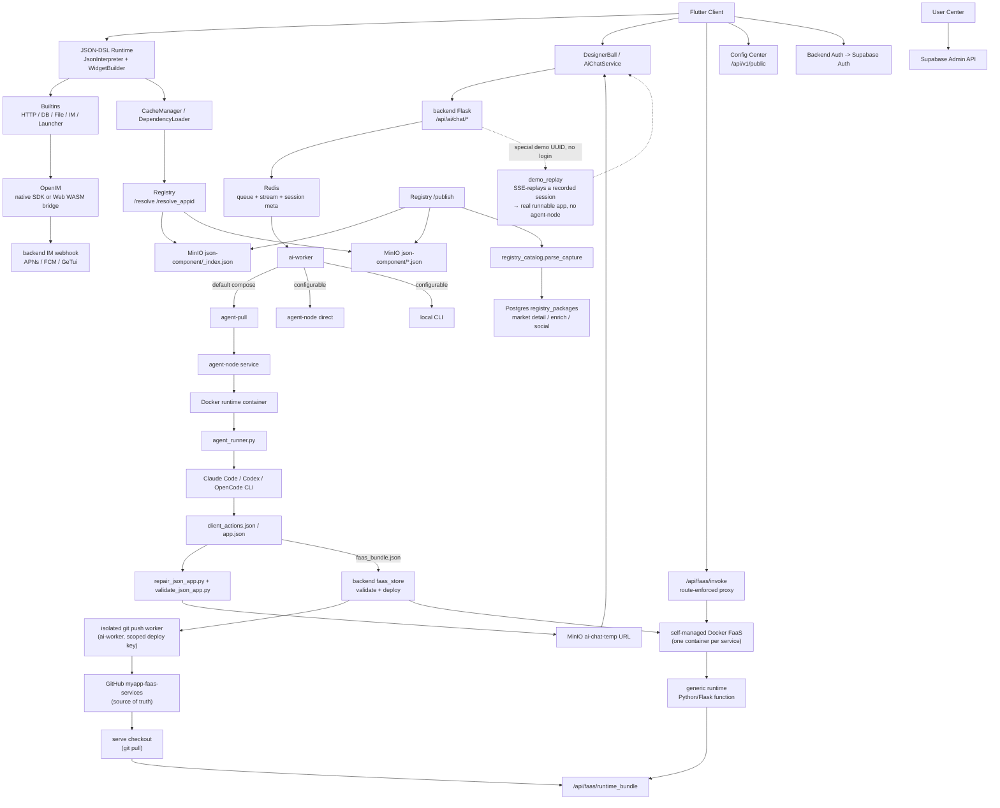

# MyApp

[中文](README.zh.md) · [English](README.md) · [Deutsch](README.de.md) · [Español](README.es.md) · [Français](README.fr.md) · **Português** · [Català](README.ca.md) · [हिन्दी](README.hi.md) · [한국어](README.ko.md) · [日本語](README.ja.md) · [Italiano](README.it.md)

> **A IA descreve → app full-stack (UI + backend + base de dados) → a correr instantaneamente no telemóvel do utilizador. Sem etapa de build, sem revisão na app store.**
>
> Um runtime Flutter que interpreta JSON-DSL em UI nativa + lógica de negócio. Os utilizadores dizem à IA o que querem; a IA emite o front-end em JSON **e, quando a app precisa de um, um backend Python/Flask real com a sua própria base de dados Postgres isolada** — depois renderiza-o e executa-o instantaneamente dentro de um conjunto de capacidades pré-compilado. Outros construtores de apps de IA entregam-lhe código front-end para você próprio ligar e implementar; o MyApp entrega a stack completa, já a correr.

[](LICENSE)
[](https://flutter.dev)
[]()

> **Estado da Plataforma**: ✅ Produção (iOS/Android/Web) • ⚠️ Experimental (macOS, apenas funcionalidades essenciais) • 🚧 Não testado (Linux/Windows)

---

## O que é isto?

Três coisas num só repositório:

1. **Um motor Flutter de UI orientada por servidor (Server-Driven UI)** (`lib/`) — renderiza qualquer configuração JSON-DSL numa app multiplataforma real em tempo de execução
2. **Um gerador full-stack com IA** (`backend/`, `user_center/`, `config_center/`) — a IA gera o front-end em JSON **e um backend FaaS correspondente + uma base de dados Postgres isolada** quando a app precisa de uma, em cima de autenticação (Supabase), IM (OpenIM), notificações push (APNs + FCM), proxy de chat de IA, registo de pacotes e administração de utilizadores
3. **Um ecossistema de pacotes** (`templates/`) — exemplos de JSON-APPs (IM, jogos, perfil de utilizador, calculadora…) que pode instalar em cima do runtime

O nome **MyApp** é intencional: cada utilizador pode criar, instalar e operar a "minha app" em cima do runtime partilhado.

O caso de uso emblemático: **um utilizador abre a app → conversa com a IA (a geração demora tipicamente 10-20 minutos) → a IA devolve um JSON-DSL → a app carrega-o e executa-o instantaneamente** dentro das capacidades já compiladas no cliente.

---

## Suporte de Plataformas

O MyApp é construído com Flutter e suporta várias plataformas com diferentes níveis de completude de funcionalidades:

### ✅ Pronto para Produção (Todas as Funcionalidades)

- **iOS** — Suporte total, incluindo IM, notificações push, câmara, autenticação biométrica, todas as capacidades nativas
- **Android** — Suporte total, incluindo IM, notificações push, câmara, autenticação biométrica, todas as capacidades nativas
- **Web** — Suporte total com IM via ponte OpenIM WASM (notificações push não disponíveis)

### ⚠️ Experimental (Funcionalidades Essenciais)

- **macOS** — Testado e a funcionar bem. O runtime JSON essencial, a renderização de UI, a autenticação, o chat de IA, o seletor de ficheiros e a autenticação biométrica funcionam todos. O chat de IM e as notificações push não são suportados devido a limitações de SDK de terceiros.

### 🚧 Não testado (Provavelmente Funciona)

- **Linux** — Tem configuração de build e deverá funcionar para as funcionalidades essenciais. O chat de IM e as notificações push não são suportados.
- **Windows** — Tem configuração de build e deverá funcionar para as funcionalidades essenciais. O chat de IM e as notificações push não são suportados.

### Disponibilidade de Funcionalidades

| Funcionalidade | iOS | Android | Web | macOS | Linux | Windows |
|---------|-----|---------|-----|-------|-------|---------|
| Runtime JSON-DSL | ✅ | ✅ | ✅ | ✅ | ⚠️ | ⚠️ |
| Renderização de UI | ✅ | ✅ | ✅ | ✅ | ⚠️ | ⚠️ |
| Rede e Armazenamento | ✅ | ✅ | ✅ | ✅ | ⚠️ | ⚠️ |
| Chat de IM | ✅ | ✅ | ✅ | ❌ | ❌ | ❌ |
| Notificações Push | ✅ | ✅ | ❌ | ❌ | ❌ | ❌ |
| Câmara | ✅ | ✅ | ✅ | ⚠️ | ❌ | ❌ |
| Autenticação Biométrica | ✅ | ✅ | ❌ | ✅ | ❌ | ⚠️ |
| Jogos Flame | ✅ | ✅ | ✅ | ✅ | ⚠️ | ⚠️ |

**Legenda**: ✅ Testado e a Funcionar • ⚠️ Não testado mas Deverá Funcionar • ❌ Não Suportado

A maioria das apps JSON-DSL funciona em todas as plataformas. As funcionalidades específicas de cada plataforma degradam-se graciosamente, com feedback claro ao utilizador quando indisponíveis.

---

## Porque é que isto é interessante?

- **Full-stack de uma só vez — o diferenciador.** A maioria dos construtores de apps de IA (v0, Lovable, Bolt, …) gera código *front-end* que ainda tem de ligar a um backend e implementar você próprio. O MyApp gera o front-end **e** um backend FaaS Python/Flask real — cada um com a sua própria base de dados Postgres isolada, modelo de permissões por app e isolamento de dados por chamador — e depois executa tudo instantaneamente. Sem projeto de backend separado, sem etapa de implementação, sem submissão à store.
- **Orientado por servidor** — entregue UI e comportamento como dados através de uma fronteira de runtime fixa e pré-compilada. Veja as [notas de conformidade com a App Store](docs/APP_STORE_COMPLIANCE.md).
- **Nativo de IA** — o DSL foi concebido para ser amigável a LLMs. O chat de IA incluído executa vários fornecedores (DeepSeek, MiniMax, agregador Volcengine com GLM / Kimi) através de três runtimes de agente plugáveis (Claude Code, Codex, OpenCode) e gera apps que realmente renderizam — com playbooks de geração e uma passagem de auto-revisão visual em execução para manter o output executável.
- **Tudo incluído** — IM com push, proxy de IA, registo de pacotes, namespaces, espelhamento, centro de utilizadores, troca de ambientes — tudo interligado. Não é "mais uma framework low-code que despacha a autenticação".
- **Auto-hospedável** — `myapp-ctl deploy` gere a stack de backend, o runtime de agente, o registo, o centro de configuração e os segredos de serviço a partir de uma CLI de nível de host.
- **Multiplataforma** — o mesmo JSON-DSL renderiza em iOS, Android, Web (testado em produção), macOS (testado experimentalmente), Linux, Windows. As funcionalidades essenciais funcionam em todas as plataformas; as funcionalidades específicas de cada plataforma (IM, push) degradam-se graciosamente em plataformas não suportadas.

---

## Início Rápido

### Usar os clientes hospedados

Se quiser apenas experimentar o MyApp e executar JSON Apps geradas por IA:

1. Abra o cliente Web hospedado: <https://myapp-web.dapangyu.work/>
2. Ou instale o iOS TestFlight Public Group 1: <https://testflight.apple.com/join/3Fk5Exnn>
3. Ou descarregue o APK Android:
   <https://myapp-oss-endpoint.dapangyu.work/myapp-releases/android/apk/latest.apk>
4. Continue como convidado para navegar/executar apps públicas, ou inicie sessão para gerar apps,
   usar funcionalidades de IM/perfil, publicar pacotes e gerir Agent Nodes privados.
5. Sem conta? Toque na bola flutuante → **Demo** para ver a IA construir uma app
   de ponta a ponta e executar o resultado real, sem iniciar sessão.

O guia de utilização completo do produto está em [docs/USER_GUIDE.md](docs/USER_GUIDE.md).

### Construir o cliente a partir do código-fonte (5 minutos)

```bash
git clone <this-repository-url> ai-app
cd ai-app
flutter pub get
flutter run -d <ios|android|chrome>
```

A configuração predefinida aponta para o backend hospedado. Para ligar a um backend privado,
importe o JSON de ambiente impresso por `myapp-ctl client-env`.

Para suporte de IM no Flutter Web, os ficheiros `web/openIM.wasm`, `web/sql-wasm.wasm`,
workers e o bundle de ponte já incluídos no repositório são ativos de runtime copiados da
dependência fixada `@openim/wasm-client-sdk` em `web_openim_bridge/package-lock.json`.
Numa máquina nova ou em CI, regenere-os antes de `flutter build web` se estiverem
em falta ou após alterar a versão do SDK:

```bash
./scripts/build_web_openim.sh
flutter build web
```

Para builds/execuções Web, também pode usar o script wrapper para que os ativos Web do OpenIM
sejam verificados primeiro e regenerados quando necessário:

```bash
./scripts/flutter_web.sh run -d chrome
./scripts/flutter_web.sh build web
```

### Auto-hospedar a stack de backend completa (20 minutos)

```bash
./deploy/production/install_ctl.sh
myapp-ctl setup --host <public-ip-or-domain> --data-root /mnt/myapp
myapp-ctl deploy --pull
myapp-ctl client-env --terminal-qr
```

Execute estes comandos como root, ou com permissões de Docker e de escrita em `/etc/myapp`
equivalentes. A referência completa de implementação e dos comandos `myapp-ctl` está em
[`deploy/production/README.md`](deploy/production/README.md).

A primeira execução interativa do `myapp-ctl` pede uma vez o idioma da CLI (`zh`, `en`,
`de`, `es`, `fr`, `pt`, `ca`, `hi`, `ko`, `ja`, `it`); alterações posteriores usam
`myapp-ctl config lang <lang>`. O assistente de configuração
pede credenciais do fornecedor de IA e configuração opcional de ASR, e-mail SMTP, APNs, FCM e
GeTui. Uma implementação completa imprime o JSON de ambiente do cliente e o QR, e pode
criar/atualizar uma conta de teste interativa `test@example.com`; reexecute
`myapp-ctl client-env --terminal-qr` para a mostrar novamente.

Atualize a CLI de controlo instalada e os ficheiros de implementação de produção a partir do
checkout do Git:

```bash
myapp-ctl update
```

Para um host de desenvolvimento/teste que constrói imagens a partir deste checkout:

```bash
myapp-ctl setup --host <public-ip-or-domain>
myapp-ctl deploy --build
```

Isto arranca a stack de backend do MyApp localmente / num VPS:
- Postgres da JSON app + Redis de sessões de IA + App MinIO
- Agent node + runtime de agente Ubuntu isolado
- Backend da app + worker de IA + Registry + centro de configuração + centro de utilizadores

Após a implementação, o **Trocador de Ambientes** integrado no cliente (toque na marca 7 vezes na página de login) permite-lhe apontar para a sua própria stack.

Consulte [`deploy/production/README.md`](deploy/production/README.md) para o
guia de implementação autoritativo.

### Mapa de documentação

| Necessidade | Documento |
|---|---|
| Usar o MyApp, gerar apps, ligar um backend privado, depurar appid Web/JSON local | [docs/USER_GUIDE.md](docs/USER_GUIDE.md) |
| Instalar, atualizar, operar, fazer backup, restaurar ou desinstalar a stack de backend | [deploy/production/README.md](deploy/production/README.md) |
| Compreender a arquitetura atual de backend/agent-node | [backend/ARCHITECTURE.md](backend/ARCHITECTURE.md) |
| Compreender os limites de revisão/runtime da App Store | [docs/APP_STORE_COMPLIANCE.md](docs/APP_STORE_COMPLIANCE.md) |

---

## Arquitetura

O projeto está agora mais próximo de uma pequena plataforma de apps do que de uma única demo Flutter.
O cliente Flutter é um runtime compilado; os JSON-APPs, componentes, ativos, IM,
geração de IA e os **backends FaaS gerados por IA** são todos servidos pela stack de backend
— que pode correr tudo-em-um num único host (backend + stack Docker Compose
+ o runtime FaaS Docker autogerido, veja `docs/faas-docker-runtime.md`).



| Componente | Onde | O quê |
|---|---|---|
| Flutter Runtime | `lib/` | Cliente compilado multiplataforma: interpretador JSON-DSL, widgets, átomos de jogo Flame, cache de ativos, troca de ambientes, ponto de entrada de IA, UI de IM/media |
| Ativos de Runtime Web | `web/`, `web_openim_bridge/` | Ponte OpenIM Web WASM e ativos de build usados pelo Flutter Web |
| API de Backend | `backend/app.py`, `backend/claude_chat.py` | API Flask para chat de IA com gate de autenticação, streaming SSE, upload de media, push, configuração de fornecedores e endpoints de backend voltados para o cliente |
| Fila / Sessões de IA | `backend/ai_session.py` + Redis | Metadados de tarefas de IA quase-duráveis, fila de workers limitada, fluxo de eventos SSE retomável, estado de aborto/repetição |
| Pool de Workers de IA | `backend/ai_worker_daemon.py`, `backend/ai_session.py`, `backend/agent_node_service.py`, `deploy/production/agent_runner.py` | Move os trabalhos aceites através do Redis, usa por defeito a execução agent-node em modo pull, e pode também correr caminhos diretos de agent-node ou CLI local consoante `AI_WORKER_EXECUTION_BACKEND` |
| Backends FaaS | `backend/faas.py`, `backend/faas_store.py`, `backend/faas_push_worker.py`, `backend/faas_runtime_server.py` | Backends Python/Flask gerados por IA: validação estrita de bundle, worker de git push isolado → `myapp-faas-services` (fonte de verdade no GitHub), runtime Docker autogerido (um contentor por serviço, deploy/route/cold-wake/scale-to-zero geridos pelo control-plane — veja `docs/faas-docker-runtime.md`), proxy `/api/faas/invoke` com rota imposta, quota por utilizador + criar-vs-acrescentar |
| Registry | `backend/registry_server.py` | Registo de pacotes para JSON-APPs/componentes: `_index.json` + os ficheiros de pacote MinIO são a fonte de resolução em runtime; o `registry_packages` do Postgres é o índice de mercado/detalhe/enriquecimento/social |
| Armazenamento de Objetos | MinIO / OSS | Pacotes JSON públicos em `json-component`, media de apps, packs de ativos em `json-app-assets`, URLs temporários de JSON gerado por IA, e um bucket público `demo` de apps de demonstração fixas com login zero |
| OpenIM | `backend/openim/` | Ponte de backend de IM. Os clientes nativos usam o SDK OpenIM Flutter/nativo; a Web usa a ponte do SDK WASM |
| Supabase | `deploy/production/supabase/` | Serviços auto-hospedados de autenticação, base de dados e compatíveis com armazenamento, configurados através de segredos locais ao host |
| Centro de Configuração | `config_center/` | Flags de configuração remota e configuração do cliente específica de cada ambiente |
| Centro de Utilizadores | `user_center/` | UI de administração para papéis de utilizador, banimentos, fluxos de reset e operações de conta |
| Templates / Bibliotecas | `templates/` | Apps de exemplo publicadas e bibliotecas JSON reutilizáveis: IM, launcher, chat OpenAI, jogos, controlos, perfil, utilitários |
| Website | `website/` | Site de marketing e demo em TS/Vite, incluindo a pré-visualização do cliente web embebida |
| Control Plane | `deploy/production/`, `scripts/myapp_ctl/` | Gestão `myapp-ctl` de status/log/secret/domain/image/deploy para hosts de teste e produção |

Fluxos principais:

1. **Geração de app por IA**: o cliente envia uma tarefa de chat -> o Backend escreve a fila/metadados no Redis -> o atual default de produção coloca o trabalho no caminho agent-pull -> um agent-node arranca um contentor de runtime isolado -> o `agent_runner.py` executa o agente configurado (Claude Code / Codex / OpenCode) -> o agent-node transmite eventos/artefactos de volta -> o backend valida/repara/carrega o JSON gerado -> o cliente recebe um evento estruturado `json_app_ready` através de SSE retomável.
2. **Instalação de pacote**: o cliente consulta o Registry com paginação/pesquisa ou `/resolve(_appid)` -> o Registry resolve através de `_index.json` e dos ficheiros de pacote MinIO -> o cliente descarrega o JSON -> o carregador de dependências resolve as bibliotecas e armazena-as localmente em cache. Os detalhes de mercado, resumos, likes e instalações vêm do índice lateral `registry_packages` do Postgres.
3. **IM**: o mobile usa o caminho do SDK nativo OpenIM; a Web usa `openim/wasm-client-sdk` através do `web_openim_bridge`, com compatibilidade ao nível da framework para que as apps de IM em JSON chamem um único formato de API.
4. **Auto-hospedar o backend**: o `myapp-ctl secret` gere as credenciais locais ao host; o `myapp-ctl deploy --pull` ou o `myapp-ctl deploy --build` arranca a stack de backend e o runtime de agente.

---

## O JSON-DSL

Uma configuração MyApp de 100 linhas pode tornar-se uma app completa com ecrãs, navegação, chamadas de rede, animações e widgets nativos. O DSL está documentado em [JSON-DSL.md](JSON-DSL.md).

Exemplo mínimo:

```json
{
  "dsl": "3.3",
  "meta": { "name": "hello", "version": "1.0.0", "type": "app" },
  "global": { "count": 0 },
  "ui": {
    "screens": [{
      "name": "home",
      "body": {
        "type": "container",
        "layout": "column",
        "children": [
          { "type": "text", "value": "Counter: {{ global.count }}" },
          { "type": "button", "label": "+1", "action": {
            "call": "@set",
            "args": { "var": "global.count", "value": { "+": [{ "var": "global.count" }, 1] } }
          }}
        ]
      }
    }]
  }
}
```

Passe isto pelo fluxo de geração de IA, ou faça `flutter run` e escolha o ficheiro JSON a partir do disco.

---

## Funcionalidades

### Motor
- 30+ widgets (text / button / input / list / image / video / chart / map / webview / camera / qr / chat bubble / …)
- Motor de expressões JsonLogic com 15 operadores personalizados
- 30+ funções incorporadas (HTTP, JSON, string, array, controlo de fluxo, feedback de UI)
- `@parallel` para passos concorrentes
- Os templates `{{ path }}` resolvem para o tipo original (não convertido em string)
- Troca a quente de configuração via rede / disco / registo
- Motor de jogos 2D Flame (sprites, física, mapas Tiled)
- Gate de autorização por app para capacidades sensíveis (token de autenticação, perfil)

### Backend
- **Full-stack FaaS gerado por IA** — a IA emite um backend Python/Flask validado por "grupo de serviço" (1 serviço de função + base de dados Postgres opcional), implementado num runtime FaaS Docker autogerido (um contentor por serviço, scale-to-zero + cold-wake). Isolamento de schema por app, identidade pseudónima dentro do grupo não falsificável, acesso a dados por chamador mediado pelo backend (o código da função nunca detém uma ligação à base de dados), reforço de contentor e uma política de acesso de 3 níveis revogável.
- Integração de autenticação Supabase
- Chat de IA com filas com escopo por fornecedor e execução de agente isolada — fornecedores (DeepSeek, MiniMax, agregador Volcengine: GLM / Kimi) × três runtimes de agente (Claude Code, Codex, OpenCode), além de playbooks de geração e uma passagem de auto-revisão visual em execução
- **Modo demo com login zero** — os utilizadores não autenticados tocam na bola flutuante → Demo, disparam uma geração de IA de aparência real que reproduz uma sessão gravada via SSE, e obtêm uma app efetivamente executável (sem agent-node, sem criação de FaaS) — um vislumbre instantâneo do fluxo completo
- Push agnóstico ao canal (APNs + FCM, fácil de adicionar mais)
- Registo de pacotes com namespaces + semver + resolução de dependências
- **Espelho entre instâncias** — uma instância auto-hospedada pode espelhar pacotes a partir de um upstream (proxy de ficheiros lazy + sincronização de índice a cada 10 minutos)
- UI de administração de utilizadores (papel / banimento / reset de palavra-passe)
- Registo de auditoria

### Deploy
- `myapp-ctl deploy` para implementação de backend full-stack ou ao nível de componente
- `myapp-ctl secret` para segredos de fornecedor, push, OSS e backend locais ao host
- Agent-node baseado em pull isolado + runtime Docker para workers de IA
- MinIO incorporado para uploads de media
- Comandos de healthcheck, logs, restart, status e inspeção de agente

---

## Estado

| Área | Estado |
|---|---|
| Motor (Dart) | Produção. 65k LOC. A alimentar uma app real. UI do cliente localizada em 11 idiomas. |
| Backend (Python) | Produção. 32k LOC. A correr com utilizadores reais. |
| Testes | Teste de fumo de widgets mais conjunto de regressão JSON (`templates/regression-test.json`). PRs que adicionem cobertura são muito bem-vindos. |
| Documentação | Média (`JSON-DSL.md`, `deploy/production/README.md`, notas de arquitetura de backend). A melhorar. |
| Estabilidade da API | DSL v3.3 — pequenas alterações incompatíveis possíveis até à v4. API HTTP de backend estável. |
| Hospedagem pública? | Sim (sujeito a uso justo, ver Termos) |

---

## Contribuir

Issues, PRs e discussões são todos bem-vindos.

- Documentação em [`CLAUDE.md`](CLAUDE.md) (que também serve de instruções para o Claude Code se estiver a usar IA para contribuir)
- Especificação do JSON-DSL em [`JSON-DSL.md`](JSON-DSL.md)
- Convenções de código:
  - Os comentários respondem ao *porquê*, não ao *quê* (o código mostra o quê)
  - Evite abstrações especulativas; três linhas semelhantes são melhores do que uma interface prematura
  - Para alterações de UI, teste o caminho dourado *e* os casos extremos num browser/simulador antes de declarar concluído

---

## Licença

Apache License 2.0 — veja [LICENSE](LICENSE) e [NOTICE](NOTICE).

Pode:
- Usar isto em produtos comerciais
- Fazer fork e modificar livremente
- Auto-hospedar toda a stack

Não pode:
- Usar o **nome ou logótipo "MyApp"** sem permissão (para pedir permissão, [abra uma issue](https://github.com/dapangyu-fish/ai-app/issues))
- Deturpar a origem do código

Os pacotes do marketplace, os ativos carregados e as apps JSON criadas por utilizadores são propriedade dos respetivos autores e licenciados por eles, salvo indicação explícita em contrário.

---

## Agradecimentos

- [Flutter](https://flutter.dev) — framework de UI
- [Supabase](https://supabase.com) — backend de autenticação + BD + armazenamento
- [OpenIM](https://github.com/openimsdk) — SDK + servidor de IM
- [Anthropic Claude Code CLI](https://docs.claude.com/en/docs/claude-code) — runtime de geração de IA
- [JsonLogic](https://jsonlogic.com) — motor de expressões

---

## Roteiro (por ordem de prioridade)

- [ ] Lançar um vídeo de demonstração viral de 60 segundos (IA → configuração JSON em ~10-20 min → app corre instantaneamente)
- [ ] Camada gratuita pública hospedada
- [ ] Link de partilha de app com QR (abrir app gerada por IA via deep link)
- [ ] Adicionar CI (GitHub Actions: pub get, analyze, build APK)
- [ ] Mais exemplos de JSON-APPs (todo, notas, rastreador de fitness)
- [x] Sistema de prompts v2: o longo prompt de geração é dividido num router `index.md` + cartões por tarefa (`backend/prompts/generation/`) com pipelines em camadas, mais playbooks de geração (`docs/playbooks/`); a validação/reparação de JSON vive nas ferramentas `validate_json_app.py` / `repair_json_app.py`
- [x] Geração multi-agente + multi-fornecedor: runtimes de agente Claude Code / Codex / OpenCode × fornecedores DeepSeek / MiniMax / agregador Volcengine (GLM, Kimi), selecionáveis por sessão
- [x] Modo demo com login zero: reprodução SSE de gerações gravadas para que os utilizadores não autenticados obtenham uma app real executável instantaneamente (sem agent-node / FaaS)
- [ ] Adicionar mais runtimes de agente / agregadores de fornecedores além do conjunto atual de três agentes
- [ ] Suporte de áudio para JSON-APPs (gravação, reprodução, upload e UI/ações de áudio reutilizáveis)
- [x] Suporte FaaS: as conversas de IA criam funções de backend Python/Flask, servidas pelo runtime FaaS Docker autogerido (um contentor por serviço, deploy/route/cold-wake/scale-to-zero geridos pelo control-plane) com validação estrita de bundle, fonte de verdade no GitHub (`myapp-faas-services`), um worker de git push isolado, quota por utilizador + criar-vs-acrescentar, e um proxy de invocação com rota imposta
- [ ] Scale-out de FaaS: FaaS Docker multi-nó + roteamento secundário de backend (escala horizontal) e nós faas privados de utilizador (reutilizando o padrão do registo de agent-node)
- [ ] **Isolamento de push por JSON-APP + deep-link + autorização opt-in**: envelope de mensagem com escopo de app (`app_id` + `route` alvo + `params`) para que uma notificação possa encaminhar para um ecrã específico de um JSON-APP; os destinatários têm de optar por participar por app/remetente/serviço (desligado por defeito, anti-abuso); o tap-routing abre a app no ecrã alvo se instalada, senão um fallback de convite "instalar A" da framework. Design: [docs/planning/push-jsonapp-isolation.md](docs/planning/push-jsonapp-isolation.md)
- [ ] DSL v4 (estabilizar a janela de alterações incompatíveis)
- [ ] Mais testes em torno do interpretador
- [ ] Desempenho: adiar a interpretação de subárvores fora do ecrã

---

*Construído com cuidado. Aberto a feedback.*
