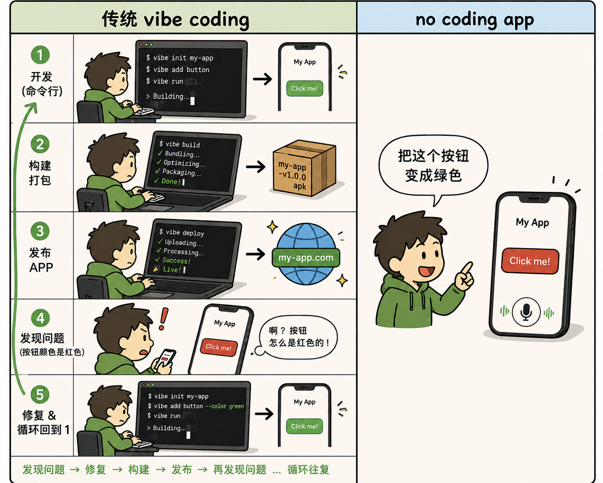
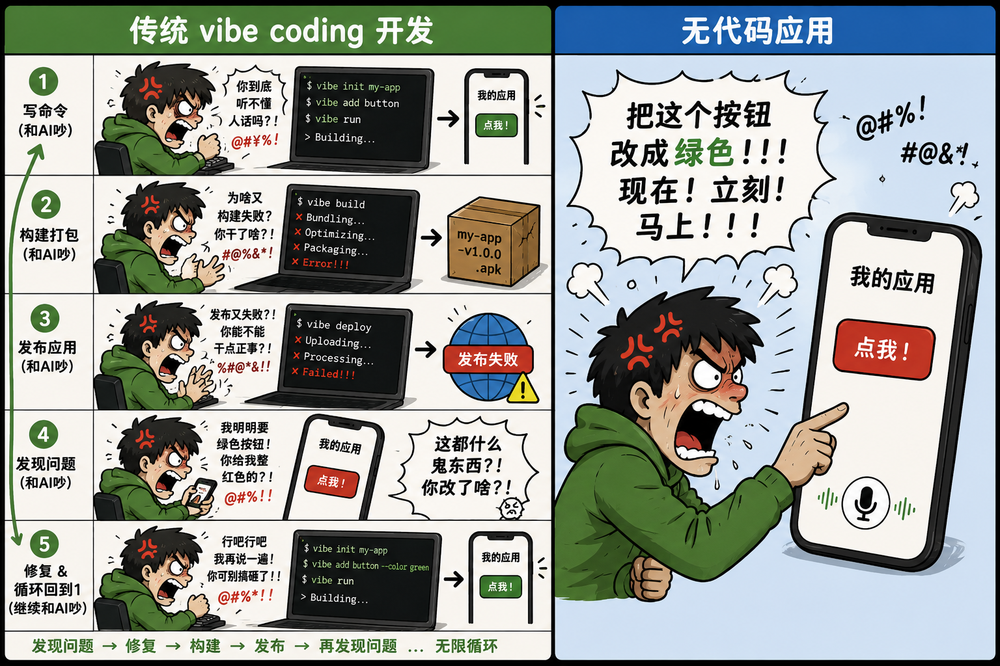
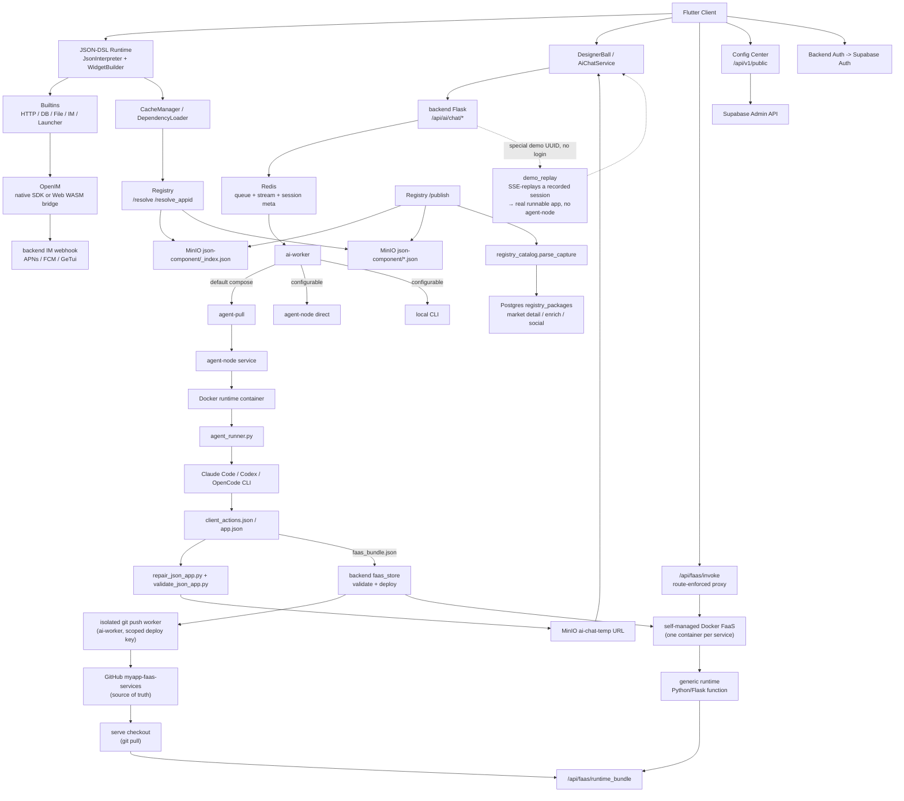

# MyApp

**中文** · [English](README.md) · [Deutsch](README.de.md) · [Español](README.es.md) · [Français](README.fr.md) · [Português](README.pt.md) · [Català](README.ca.md) · [हिन्दी](README.hi.md) · [한국어](README.ko.md) · [日本語](README.ja.md) · [Italiano](README.it.md)

<div align="center">

### 别再 vibe-*coding*。直接交付 vibe-*app*。

**一句话描述 → 一个全栈应用（UI + 真实后端 + 数据库）即刻运行在每一块屏幕上。**

**无代码库。无构建。无部署。无应用商店。**

</div>

> 整个行业还在争论怎么用 AI *写代码*。我们直接跳过了代码。
>
> Vibe coding——哪怕是最好的 AI 应用构建工具（Lovable、Bolt、v0、Replit）——交给你的仍然是一个需要自己托管、维护的 **web 代码库**。MyApp 交给你的是**在手机上原生、几秒即刻运行的应用本身**：你描述想要什么，AI 产出一份 JSON-DSL 前端，**并在应用需要时**，产出一个带有独立 Postgres 数据库的真实 Python/Flask 后端——然后在预编译的跨平台运行时里即刻渲染并运行整套系统。*同一句话*既能生成一个**可玩的游戏**，也能生成一个**带有真实后端、支持登录、发帖和楼层回复的论坛**——*一句描述*就在 **iOS、Android、Web 和桌面**上运行起来。没有项目要打开，没有东西要编译，没有东西要部署。


<div align="center">


</div>

### 从 vibe *编程* 到*不写代码*

Vibe 编程——哪怕最好的 AI 应用生成器——仍然把你困在循环里：写命令、构建、打包、发布、发现 bug、和 AI 吵、再绕回来。我们把这个循环删掉了。你直接对手机里的应用说话——*“把这个按钮改成绿色”*——它就变了。没有东西要编译、没有东西要发布、没有工程要打开。

<div align="center">



</div>

反正你横竖都要和 AI 吵——那就扔掉工具链，直接冲着手里的应用吵。

<div align="center">



</div>


[](LICENSE)
[](https://flutter.dev)
[]()
[](JSON-DSL.md)

> **平台状态**：✅ 生产可用（iOS/Android/Web） • ⚠️ 实验性（macOS，仅核心功能） • 🚧 未测试（Linux/Windows）

---

## Vibe *coding* vs. vibe *app*

|  | Vibe coding / AI 应用构建工具 | **MyApp —— 一个 vibe app** |
|---|---|---|
| 你得到什么 | 一个**代码库**（React/Next + 一个后端） | 一个**正在运行的应用** |
| 交付物 | 需要你托管、维护、照看的代码 | 一份 JSON 配置——**没有代码要维护** |
| 发布步骤 | 构建 → 部署 →（应用商店审核） | **无。** 它已经在运行了。 |
| 在哪运行 | 通常是一个 Web 应用 | **iOS · Android · Web · macOS · Linux · Windows**——一句描述 |
| 后端 | "自己去接 Supabase" | **AI 生成的 Python/Flask + 独立 Postgres**，已为你部署 |
| 覆盖范围 | 表单、仪表盘、CRUD | ……**还有实时聊天，还有可玩的游戏**（俄罗斯方块、2048、一个平台跳跃游戏），全部来自*同一个*运行时 |

这不是一句我们兑现不了的口号。继续往下读——引擎的数字就在下面。

---

## 这是什么？

一个仓库里包含三样东西：

1. **一个 Flutter 服务端驱动 UI 引擎**（`lib/`）——在运行时将 JSON-DSL 配置解释为真实的、原生的、跨平台的应用。**91 种控件类型、100+ 内置函数、一个 28 运算符的表达式引擎，以及一整套 2D 游戏引擎**——全部预编译进客户端。
2. **一个全栈 AI 生成器**（`backend/`、`config_center/`）——AI 生成 JSON 前端，**并在应用需要时生成匹配的 FaaS 后端 + 独立 Postgres 数据库**，构建于认证（Supabase）、IM（OpenIM）、推送（APNs + FCM）、AI 聊天代理、包注册表和用户管理之上。
3. **一个包生态系统**（`templates/`）——70+ 个示例 JSON-App 和可复用库（IM、游戏、用户资料、计算器、仪表盘……），你可以安装在运行时之上。

**MyApp** 这个名字是有意为之的：每个用户都可以在共享运行时之上创建、安装和运营"我的应用"。

旗舰用例：**用户打开应用 → 与 AI 对话 → AI 返回一份 JSON-DSL（如有需要，还有一个后端）→ 应用即刻加载并运行它**，运行在客户端已经编译好的能力范围内。无需构建，无需审核，无需等待应用商店。

---

## 平台支持

MyApp 使用 Flutter 构建，支持多个平台，功能完整度各有不同：

### ✅ 生产可用（全部功能）

- **iOS** —— 完整支持，包括 IM、推送通知、相机、生物识别认证及所有原生能力
- **Android** —— 完整支持，包括 IM、推送通知、相机、生物识别认证及所有原生能力
- **Web** —— 完整支持，通过 OpenIM WASM 桥接支持 IM（不支持推送通知）

### ⚠️ 实验性（核心功能）

- **macOS** —— 已测试且运行良好。核心 JSON 运行时、UI 渲染、认证、AI 聊天、文件选择器和生物识别认证均可用。由于第三方 SDK 限制，不支持 IM 聊天和推送通知。

### 🚧 未测试（很可能可用）

- **Linux** —— 已有构建配置，核心功能应可用。不支持 IM 聊天和推送通知。
- **Windows** —— 已有构建配置，核心功能应可用。不支持 IM 聊天和推送通知。

### 功能可用性

| 功能 | iOS | Android | Web | macOS | Linux | Windows |
|---------|-----|---------|-----|-------|-------|---------|
| JSON-DSL 运行时 | ✅ | ✅ | ✅ | ✅ | ⚠️ | ⚠️ |
| UI 渲染 | ✅ | ✅ | ✅ | ✅ | ⚠️ | ⚠️ |
| 网络与存储 | ✅ | ✅ | ✅ | ✅ | ⚠️ | ⚠️ |
| IM 聊天 | ✅ | ✅ | ✅ | ❌ | ❌ | ❌ |
| 推送通知 | ✅ | ✅ | ❌ | ❌ | ❌ | ❌ |
| 相机 | ✅ | ✅ | ✅ | ⚠️ | ❌ | ❌ |
| 生物识别认证 | ✅ | ✅ | ❌ | ✅ | ❌ | ⚠️ |
| Flame 游戏 | ✅ | ✅ | ✅ | ✅ | ⚠️ | ⚠️ |

**图例**：✅ 已测试且可用 • ⚠️ 未测试但应可用 • ❌ 不支持

大多数 JSON-DSL 应用可跨所有平台运行。当平台特定功能不可用时，会优雅降级并向用户给出清晰的反馈。

---

## 为什么有意思？

- **一步到位的全栈——这正是差异化所在。** 大多数 AI 应用构建工具（v0、Lovable、Bolt 等）给你的是一个仍需自己托管、维护的 *web 代码库*。MyApp 生成前端**以及**一个真实的 Python/Flask FaaS 后端——每个都拥有独立的 Postgres 数据库、按应用划分的权限模型和按调用方划分的数据隔离——然后即刻运行整套系统。没有独立的后端项目，没有部署步骤，没有商店提交。
- **没有代码产物。** 交付物是一份运行在预编译客户端里的 JSON 配置，而不是一个代码库。没有东西要托管，没有东西要维护，也不会在下一次依赖升级时崩掉。描述一下改动就能更新应用；它下次加载时就已经在所有地方生效了。
- **真正的跨平台。** *同一份* JSON-DSL 可在 iOS、Android、Web（已生产验证）、macOS（实验性）、Linux 和 Windows 上渲染。大多数"AI 应用"工具给你的是一个 Web 应用；这个给你的是原生的、无处不在的应用，只需一句描述。
- **服务端驱动** —— 通过固定的、预编译的运行时边界下发 UI 和行为数据。参见 [App Store 合规说明](docs/APP_STORE_COMPLIANCE.md)。 <sub>(这份说明是很久以前写的，不确定现在是否 100% 合规；我会尽力尝试上架应用市场)</sub>
- **AI 原生** —— DSL 设计得对 LLM 友好。内置的 AI 聊天通过三种可插拔的 agent 运行时（Claude Code、Codex、OpenCode）运行多个提供方（DeepSeek、MiniMax、带 GLM / Kimi 的 Volcengine 聚合器），并配有生成 playbook 和运行中的可视化自审环节，以保证产出可运行。
- **开箱即用** —— 带推送的 IM、AI 代理、包注册表、命名空间、镜像、环境切换——全部已接线在一起。不是"又一个把认证扔给你自己解决的低代码框架"。
- **可自托管** —— `myapp-ctl deploy` 从一个主机级 CLI 管理后端技术栈、agent 运行时、注册表、配置中心和服务密钥。

---

## 为什么会有这个项目——作者的话

说实话，我很反感当下的 AI 狂热——没完没了的讨论、没完没了的营销。但无论我喜不喜欢，这股浪潮都不会退去。

既然要拥抱 AI Coding，那就干脆做到底，而不是做一半。讽刺的是，这恰恰就是这个项目存在的原因。我的目标从来不是追风口，而是把这个想法推到逻辑的终点，然后问一句：**如果 AI 真的是开发的未来，一个真正 AI-first 的工作流应该是什么样子？**

这个项目，就是我目前为止的答案。

---

## 快速开始

### 使用托管客户端

如果你只想试用 MyApp 并运行 AI 生成的 JSON App：

1. 打开托管的 Web 客户端：<https://myapp-web.dapangyu.work/>
2. 或安装 iOS TestFlight 公开组 1：<https://testflight.apple.com/join/3Fk5Exnn>
3. 或下载 Android APK：
   <https://myapp-oss-endpoint.dapangyu.work/myapp-releases/android/apk/latest.apk>
4. 以访客身份继续，浏览/运行公开应用；或登录以生成应用、
   使用 IM/资料功能、发布包并管理私有 Agent Node。
5. 没有账号？点击悬浮球 → **Demo**，无需登录即可观看 AI 端到端
   构建一个应用并运行真实结果。

完整的产品使用指南见 [docs/USER_GUIDE.md](docs/USER_GUIDE.md)。

### 从源码构建客户端（5 分钟）

```bash
git clone <this-repository-url> ai-app
cd ai-app
flutter pub get
flutter run -d <ios|android|chrome>
```

默认配置指向托管后端。要连接私有后端，
请导入 `myapp-ctl client-env` 打印的环境 JSON。

对于 Flutter Web 的 IM 支持，已签入的 `web/openIM.wasm`、`web/sql-wasm.wasm`、
workers 和 bridge bundle 是从 `web_openim_bridge/package-lock.json` 中锁定的
`@openim/wasm-client-sdk` 依赖复制而来的运行时资源。
在全新机器或 CI 中，如果它们缺失或在更改 SDK 版本之后，
请在 `flutter build web` 之前重新生成：

```bash
./scripts/build_web_openim.sh
flutter build web
```

对于 Web 构建/运行，你也可以使用封装脚本，这样 OpenIM Web
资源会先被检查，并在需要时重新生成：

```bash
./scripts/flutter_web.sh run -d chrome
./scripts/flutter_web.sh build web
```

### 自托管完整后端技术栈（20 分钟）

```bash
./deploy/production/install_ctl.sh
myapp-ctl setup --host <public-ip-or-domain> --data-root /mnt/myapp
myapp-ctl deploy --pull
myapp-ctl client-env --terminal-qr
```

请以 root 身份运行这些命令，或具备等效的 Docker 和 `/etc/myapp` 写
权限。完整的部署和 `myapp-ctl` 命令参考见
[`deploy/production/README.md`](deploy/production/README.md)。

首次交互式运行 `myapp-ctl` 时会询问一次 CLI 语言（`zh`、`en`、
`de`、`es`、`fr`、`pt`、`ca`、`hi`、`ko`、`ja`、`it`）；后续更改使用
`myapp-ctl config lang <lang>`。安装向导
会询问 AI 提供方凭据以及可选的 ASR、SMTP 邮件、APNs、FCM 和
GeTui 配置。一次完整部署会打印客户端环境 JSON 和二维码，并可
创建/更新一个交互式 `test@example.com` 测试账户；重新运行
`myapp-ctl client-env --terminal-qr` 可再次显示它。

从 Git 检出更新已安装的控制 CLI 和生产部署文件：

```bash
myapp-ctl update
```

对于从此检出构建镜像的开发/测试主机：

```bash
myapp-ctl setup --host <public-ip-or-domain>
myapp-ctl deploy --build
```

这会在本地 / VPS 上启动 MyApp 后端技术栈：
- JSON app Postgres + AI session Redis + App MinIO
- Agent node + 隔离的 Ubuntu agent 运行时
- App 后端 + AI worker + Registry + Config center

部署后，客户端内置的**环境切换器**（在登录页点击品牌标识 7 次）可让你指向自己的技术栈。

权威的部署指南见 [`deploy/production/README.md`](deploy/production/README.md)。

### 文档导航

| 需求 | 文档 |
|---|---|
| 使用 MyApp、生成应用、连接私有后端、调试 Web appid/本地 JSON | [docs/USER_GUIDE.md](docs/USER_GUIDE.md) |
| 安装、更新、运营、备份、恢复或卸载后端技术栈 | [deploy/production/README.md](deploy/production/README.md) |
| 理解当前后端/agent-node 架构 | [backend/ARCHITECTURE.md](backend/ARCHITECTURE.md) |
| 理解 App Store 审核/运行时边界 | [docs/APP_STORE_COMPLIANCE.md](docs/APP_STORE_COMPLIANCE.md) |

---

## 架构

该项目如今更接近一个小型应用平台，而非单个 Flutter 演示。
Flutter 客户端是一个已编译的运行时；JSON-APP、组件、资源、IM、
AI 生成和 **AI 生成的 FaaS 后端**都由后端技术栈提供服务——它可以在单台主机上一体化运行（后端 + Docker Compose 技术栈
+ 自管理的 Docker FaaS 运行时，参见 `docs/faas-docker-runtime.md`）。



| 组件 | 位置 | 内容 |
|---|---|---|
| Flutter 运行时 | `lib/` | 跨平台已编译客户端：JSON-DSL 解释器、控件、Flame 游戏原子、资源缓存、环境切换、AI 入口、IM/媒体 UI |
| Web 运行时资源 | `web/`、`web_openim_bridge/` | Flutter Web 使用的 OpenIM Web WASM 桥接和构建资源 |
| 后端 API | `backend/app.py`、`backend/claude_chat.py` | Flask API，用于认证门控的 AI 聊天、SSE 流式传输、媒体上传、推送、提供方配置以及面向客户端的后端端点 |
| AI 队列 / 会话 | `backend/ai_session.py` + Redis | 较为持久的 AI 任务元数据、有界 worker 队列、可恢复的 SSE 事件流、中止/重试状态 |
| AI Worker 池 | `backend/ai_worker_daemon.py`、`backend/ai_session.py`、`backend/agent_node_service.py`、`deploy/production/agent_runner.py` | 通过 Redis 推进已接受的任务，默认采用 pull 模式的 agent-node 执行，并可根据 `AI_WORKER_EXECUTION_BACKEND` 运行直连 agent-node 或本地 CLI 路径 |
| FaaS 后端 | `backend/faas.py`、`backend/faas_store.py`、`backend/faas_push_worker.py`、`backend/faas_runtime_server.py` | AI 生成的 Python/Flask 后端：严格的 bundle 校验、隔离的 git push worker → `myapp-faas-services`（GitHub 真相来源）、自管理的 Docker 运行时（每个服务一个容器，由控制面拥有部署/路由/冷唤醒/缩容至零——参见 `docs/faas-docker-runtime.md`）、路由强制的 `/api/faas/invoke` 代理、按用户配额 + 新建 vs 追加 |
| Registry | `backend/registry_server.py` | JSON-APP/组件的包注册表：`_index.json` + MinIO 包文件是运行时解析来源；Postgres `registry_packages` 是市场/详情/富化/社交索引 |
| 对象存储 | MinIO / OSS | `json-component` 下的公开 JSON 包、应用媒体、`json-app-assets` 下的资源包、临时的 AI 生成 JSON URL，以及一个固定的零登录 demo 应用公开 `demo` 桶 |
| OpenIM | `backend/openim/` | IM 后端桥接。原生客户端使用 OpenIM Flutter/native SDK；Web 使用 WASM SDK 桥接 |
| Supabase | `deploy/production/supabase/` | 自托管的认证、数据库和存储兼容服务，通过主机本地密钥配置 |
| Config Center | `config_center/` | 远程配置开关和环境特定的客户端配置 |
| 模板 / 库 | `templates/` | 已发布的示例应用和可复用 JSON 库：IM、launcher、OpenAI 聊天、游戏、控件、资料、工具 |
| 网站 | `website/` | TS/Vite 营销和演示站点，包括嵌入的 Web 客户端预览 |
| 控制面 | `deploy/production/`、`scripts/myapp_ctl/` | `myapp-ctl` 的 status/log/secret/domain/image/deploy 管理，用于测试和生产主机 |

核心流程：

1. **AI 应用生成**：客户端发送聊天任务 -> 后端将队列/元数据写入 Redis -> 当前生产默认将任务放到 agent-pull 路径 -> 一个 agent-node 启动隔离的运行时容器 -> `agent_runner.py` 运行配置的 agent（Claude Code / Codex / OpenCode）-> agent-node 将事件/产物流回 -> 后端校验/修复/上传生成的 JSON -> 客户端通过可恢复的 SSE 收到结构化的 `json_app_ready` 事件。
2. **包安装**：客户端通过分页/搜索或 `/resolve(_appid)` 查询 Registry -> Registry 通过 `_index.json` 和 MinIO 包文件解析 -> 客户端下载 JSON -> 依赖加载器解析库并在本地缓存。市场详情、摘要、点赞和安装数来自 Postgres `registry_packages` 侧索引。
3. **IM**：移动端使用原生 OpenIM SDK 路径；Web 通过 `web_openim_bridge` 使用 `openim/wasm-client-sdk`，配有框架级兼容性，使得 JSON IM 应用调用一套统一的 API 形态。
4. **自托管后端**：`myapp-ctl secret` 管理主机本地凭据；`myapp-ctl deploy --pull` 或 `myapp-ctl deploy --build` 启动后端技术栈和 agent 运行时。

---

## JSON-DSL

一份 100 行的 MyApp 配置就能变成一个完整的应用，包含屏幕、导航、网络调用、动画、原生控件。DSL 文档见 [JSON-DSL.md](JSON-DSL.md)。

最小示例：

```json
{
  "dsl": "3.3",
  "meta": { "name": "hello", "version": "1.0.0", "type": "app" },
  "global": { "count": 0 },
  "ui": {
    "screens": [{
      "name": "home",
      "body": {
        "type": "container",
        "layout": "column",
        "children": [
          { "type": "text", "value": "Counter: {{ global.count }}" },
          { "type": "button", "label": "+1", "action": {
            "call": "@set",
            "args": { "var": "global.count", "value": { "+": [{ "var": "global.count" }, 1] } }
          }}
        ]
      }
    }]
  }
}
```

把它丢进 AI 生成流程，或者 `flutter run` 后从磁盘选取该 JSON 文件。

---

## 功能特性

### 引擎
- **91 种控件类型** —— text / button / input / list / container / image / video / chart / map / webview / camera / qr / tab_view / **一整套 Flame 2D 游戏栈**（游戏画布、摇杆、粒子/投影场景画布）/ 动画（animated_*、Rive）/ 高级手势（手势密码、滑动验证）/ sliver 级布局
- **带 28 个自定义运算符的 JsonLogic 表达式引擎**（字符串 / 数组 / 类型 / 数学）
- **100+ 内置 `@` 函数** —— HTTP（所有动词 + SSE）、一个真实的 DB 层（query/insert/update/delete + 键值 + create_table）、IM（好友 / 会话 / 历史 / 收件箱）、文件 I/O、生物识别认证、剪贴板、触感反馈、权限、图片选取、主题、i18n、导航、对话框、游戏控制
- `@parallel` 用于并发步骤
- 模板 `{{ path }}` 解析为原始类型（而非字符串化）
- 从网络 / 磁盘 / 注册表热替换配置
- 针对敏感能力（认证 token、资料）的按应用授权门控
- **客户端 UI 已本地化为 11 种语言**（zh / en / de / es / fr / pt / ca / hi / ko / ja / it）

### 后端
- **AI 生成的 FaaS 全栈** —— AI 为每个"服务组"（1 个函数服务 + 可选 Postgres DB）生成一个经过校验的 Python/Flask 后端，部署到自管理的 Docker FaaS 运行时（每个服务一个容器，缩容至零 + 冷唤醒）。按应用的 schema 隔离、不可伪造的组内假名身份、后端中介的按调用方数据访问（函数代码永远不持有数据库连接）、容器加固，以及一个可撤销的 3 档访问策略。
- Supabase 认证集成
- 带提供方作用域队列和隔离 agent 执行的 AI 聊天 —— 提供方（DeepSeek、MiniMax、Volcengine 聚合器：GLM / Kimi）× 三种 agent 运行时（Claude Code、Codex、OpenCode），外加生成 playbook 和运行中的可视化自审环节
- **零登录 demo 模式** —— 未认证用户点击悬浮球 → Demo，触发一次看起来真实的 AI 生成，它通过 SSE 回放一段录制的会话，并得到一个实际可运行的应用（无 agent-node、无 FaaS 创建）—— 即刻体验完整流程；该 demo 是**真实生成链路录制后的加速回放**，多语言文案为**后期本地化补充**
- 与渠道无关的推送（APNs + FCM，易于添加更多）
- 带命名空间 + semver + 依赖解析的包注册表
- **跨实例镜像** —— 自托管实例可从上游镜像包（懒加载文件代理 + 10 分钟索引同步）
- 用户管理 UI（角色 / 封禁 / 重置密码）
- 审计日志

### 部署
- `myapp-ctl deploy` 用于全栈或组件级后端部署
- `myapp-ctl secret` 用于主机本地的提供方、推送、OSS 和后端密钥
- 隔离的基于 pull 的 agent-node + 用于 AI worker 的 Docker 运行时
- 用于媒体上传的内置 MinIO
- 健康检查、日志、重启、状态和 agent 检查命令

---

## 状态

| 领域 | 状态 |
|---|---|
| 引擎（Dart） | 生产。6.4 万行代码，91 种控件，100+ 内置函数。驱动着一个真实应用。客户端 UI 已本地化为 11 种语言。 |
| 后端（Python） | 生产。3.2 万行代码。运行着真实用户。 |
| 测试 | 控件冒烟测试外加 JSON 回归套件（`templates/regression-test.json`）。非常欢迎增加覆盖的 PR。 |
| 文档 | 中等（`JSON-DSL.md`、`deploy/production/README.md`、后端架构说明）。持续改进中。 |
| API 稳定性 | DSL v3.4 —— 在 v4 之前可能有小的破坏性变更。后端 HTTP API 稳定。 |
| 是否公开托管？ | 是（受合理使用约束，见服务条款） |

---

## 贡献

欢迎 Issue、PR、讨论。

- 文档见 [`CLAUDE.md`](CLAUDE.md)（如果你用 AI 来贡献，它也兼作 Claude Code 指令）
- JSON-DSL 规范见 [`JSON-DSL.md`](JSON-DSL.md)
- 代码约定：
  - 注释回答*为什么*，而非*是什么*（代码已展示是什么）
  - 避免投机性的抽象；三行相似的代码胜过一个过早的接口
  - 对于 UI 改动，在声称完成前先在浏览器/模拟器中测试黄金路径*以及*边界情况

---

## 许可证

Apache License 2.0 —— 见 [LICENSE](LICENSE) 和 [NOTICE](NOTICE)。

你可以：
- 在商业产品中使用本项目
- 自由 fork 和修改
- 自托管整套技术栈

你不可以：
- 未经许可使用 **"MyApp" 名称或徽标**（如需申请许可，请[提交一个 issue](https://github.com/dapangyu-fish/ai-app/issues)）
- 歪曲代码的来源

市场包、上传的资源和用户创建的 JSON 应用，除非作者明确另行声明，否则均由其作者拥有并授权。

---

## 致谢

- [Flutter](https://flutter.dev) —— UI 框架
- [Supabase](https://supabase.com) —— 认证 + DB + 存储后端
- [OpenIM](https://github.com/openimsdk) —— IM SDK + 服务端
- [Anthropic Claude Code CLI](https://docs.claude.com/en/docs/claude-code) —— AI 生成运行时
- [JsonLogic](https://jsonlogic.com) —— 表达式引擎
- [mx0c/super-mario-python](https://github.com/mx0c/super-mario-python) — Super Mario level data (Mario demo apps); Nintendo SMB IP is used for demo/educational purposes only
- [hanessn1/Contra](https://github.com/hanessn1/Contra) — MIT-licensed pygame game, fully ported as the Contra demo app (code re-implemented in JSON-DSL, assets from the repo); "Contra" is a Konami trademark — demo/educational use only
- [giacoballoccu/MetalSlugClone](https://github.com/giacoballoccu/MetalSlugClone) — Unity fan remake, Mission 1 gameplay logic re-implemented in JSON-DSL (Metal Slug demo app); Metal Slug is SNK IP — demo/educational use only, not for redistribution

---

## 路线图（按优先级排序）

- [ ] 发布一个 60 秒的病毒式演示视频（AI → JSON 配置 → 应用即刻运行，无需构建/部署）
- [ ] 公开托管的免费层
- [ ] 带二维码的应用分享链接（通过深链接打开 AI 生成的应用）
- [ ] 添加 CI（GitHub Actions：pub get、analyze、build APK）
- [ ] 更多示例 JSON-APP（待办、笔记、健身追踪器）
- [x] Prompt 系统 v2：长生成 prompt 被拆分为一个 `index.md` 路由器 + 按任务的卡片（`backend/prompts/generation/`），配有分层流水线，外加生成 playbook（`docs/playbooks/`）；JSON 校验/修复位于 `validate_json_app.py` / `repair_json_app.py` 工具中
- [x] 多 agent + 多提供方生成：Claude Code / Codex / OpenCode agent 运行时 × DeepSeek / MiniMax / Volcengine 聚合器（GLM、Kimi）提供方，可按会话选择
- [x] 零登录 demo 模式：SSE 回放录制的生成过程，让未认证用户即刻得到一个真实可运行的应用（无 agent-node / FaaS）
- [ ] 在当前三 agent 集之外添加更多 agent 运行时 / 提供方聚合器
- [ ] JSON-APP 的音频支持（录制、播放、上传以及可复用的音频 UI/动作）
- [x] FaaS 支持：AI 对话创建 Python/Flask 后端函数，由自管理的 Docker FaaS 运行时提供服务（每个服务一个容器，由控制面拥有部署/路由/冷唤醒/缩容至零），配有严格的 bundle 校验、GitHub 真相来源（`myapp-faas-services`）、隔离的 git push worker、按用户配额 + 新建 vs 追加，以及路由强制的 invoke 代理
- [ ] FaaS 横向扩展：多节点 Docker FaaS + 后端二级路由（水平扩展）以及用户私有 faas 节点（复用 agent-node 注册表模式）
- [ ] **按 JSON-APP 的推送隔离 + 深链接 + 选择性加入授权**：应用作用域的消息信封（`app_id` + 目标 `route` + `params`），使通知能够路由到特定的 JSON-APP 屏幕；接收方必须按应用/发送方/服务选择加入（默认关闭，防滥用）；点击路由会将应用打开到目标屏幕（若已安装），否则回退到框架"安装 A"邀请。设计：[docs/planning/push-jsonapp-isolation.md](docs/planning/push-jsonapp-isolation.md)
- [ ] DSL v4（稳定破坏性变更窗口）
- [ ] 围绕解释器的更多测试
- [ ] 性能：延迟解释屏幕外的子树

---

*用心打造。欢迎反馈。*
